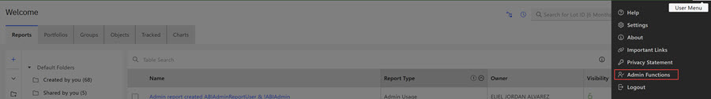
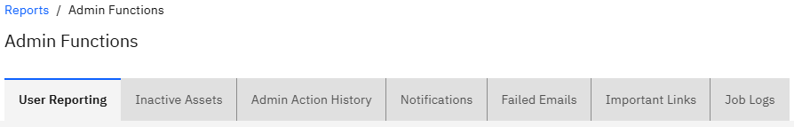
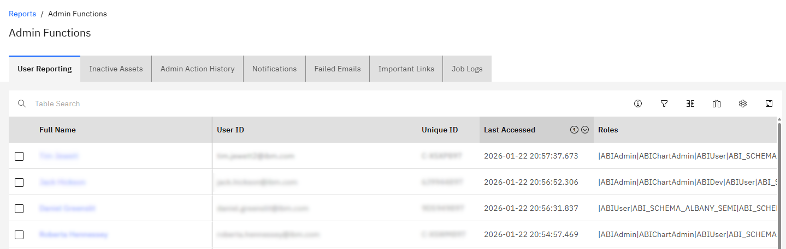
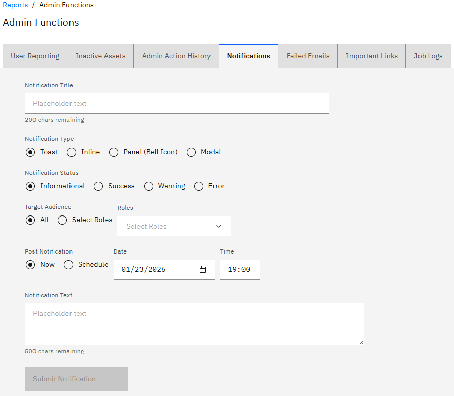
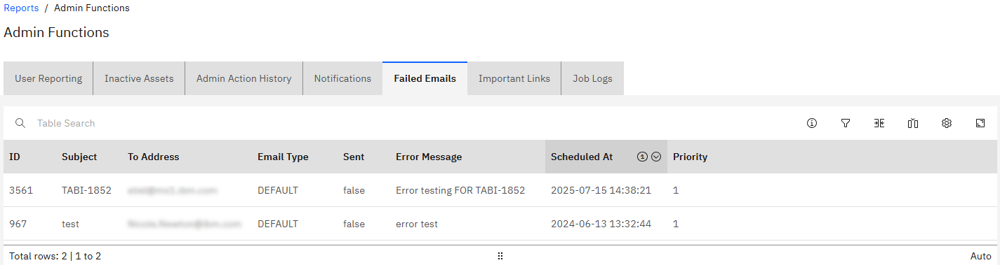
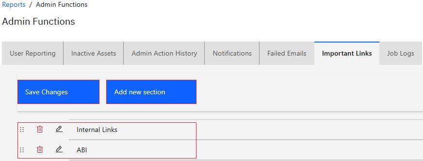
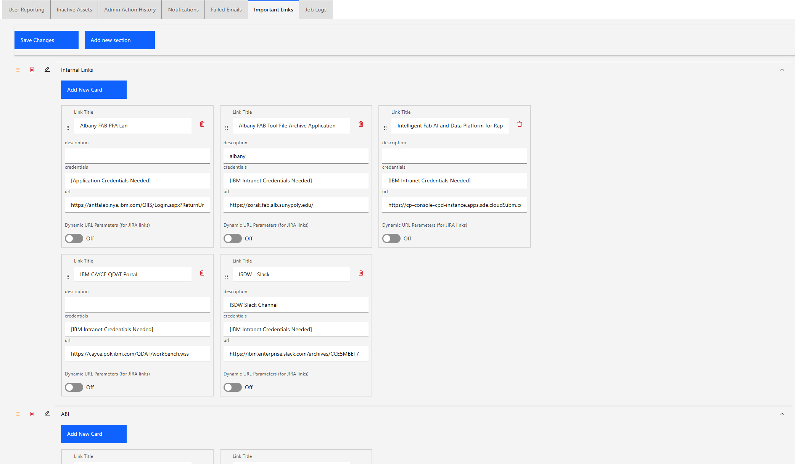
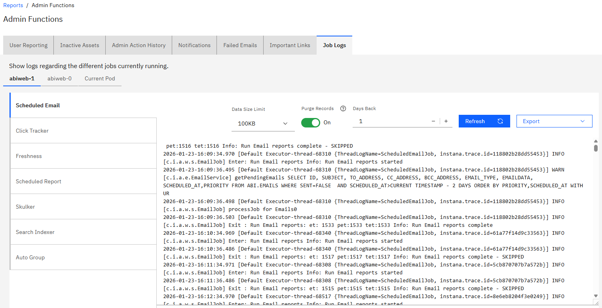

# Admin Functions

Administrative Functions in the ABI application give administrators access to view and monitor the ABI application functions and user activities within the application. Administrators can see application email failures, user activity, historical administrative actions, and inactive ABI assets. Administrators can also compose and send informational and warning notifications.

**Note:** You must have the **Administrator User Permission \(UserAdmin\)** to view any administrative content, including the menu options in the **Admin User** icon drop down menu. Within IBM, request that your managers \(Bob Halstead\) add you to the ABIAPP\_ADMIN\_TEST bluegroup.

Clicking the **Admin User icon** in the ABI application menu bar opens access to the Admin Functions.

The **Admin Function** menu options are described in the following list.

|Function|Description|
|--------|-----------|
|Help|Help links to the ABI User Guide|
|About|Notes current build information for the ABI application.|
|Settings|Settings links directly to[Global User Preferences.](abi_ug_preferences.md)|
|Important Links|Quick Access to Internal and ABI sites.|
|Privacy Statement|ABI application privacy statement. Users must agree to the Privacy Statement during login.|
|Admin Functions|Opens the Admin Functions Configuration options.|
|Logout|Clicking **Logout** logs you out of the ABI application and displays this message **You are logged out**.|

**Note:** In the following Admin Function screen captures, personally identifiable information \(PII\) is masked.

Click **Admin Functions** to view the Admin Functions Page. The Admin Page opens on the **User Reporting** tab.

The following list outlines the Admin Functions in the ABI application. Clicking each tab opens a different Admin Function. The information within each Admin tab opens in table format.

-   **Note:** You can click the **Manage Columns** icon in any table to change which columns display in the table and in what order. See [Configuring Table Columns and Activating the Favorites Icon](abi_ug_table_operations.md) and [Customizing Table Columns](customizing_report_table_columns.md). Column sorting is available on all columns.

**User Reporting**

On the **User Reporting** tab, the table shows user activity within the ABI Application. Information for each user is categorized according to column headers. Column headers identify the User's Name, ID \(email address\), Unique ID, Last Accessed, and Role.

**Inactive Assets**

On the **Inactive Assets** tab, the table shows assets that have been inactive for 30 days. Information for each asset is categorized according to column headers. Column headers are Asset Type, Asset ID, Asset Name, Description, Owner ID, Owner, and Date of Creation.

**Admin Action History**

On the **Admin Action History** tab, the table lists actions Administrators took on assets. Information for each individual action is categorized according to column headers. Column headings are ID, Action, Entity Type, Entity ID, Description, Unique ID, and Rc Ts timestamp.

**Notifications**

On the **Notifications** tab, Administrators can configure notifications. Administrators can select a notification type that defines how the notification displays \(Toast, Inline, Panel - bell icon, and Modal\). Inline notifications display when the scheduler runs, and panel notifications display under the bell icon and show only when you click the bell icon. Other configuration options include notification Status \(Informational, Success, Warning, and Error\), Target Audience \(All or Selected Roles\), Post Notification Date \(Now or Schedule\), and Notification text.

**Note:** You must include a text for the notification **Submit** control to become actionable.

**Failed Emails**

On the **Failed Emails** tab, Administrators can view failed emails that are sent from within the ABI application. Column headers are ID, Subject, To Address, Email Type, Sent \(status\), Error Message, Scheduled At, and Priority.

**Important Links**

On the **Important Links** tab, you can view, add, and edit important links and link sections for the ABI Application. Select a drop down arrow to view the links for each section.. Click **Add new section** to add a link section. The order of links, both by section and within, can be adjusted by clicking the six dot icon and dragging the links to reorder them. Links and Link sections can be deleted as well. Sections and Links can be deleted by clicking the red trash can icon. Deleting a section deletes all links inside it and does not require confirmation. Any change made to the internal links, be it adding a section, adding a link, editing a section or a link, or deleting anything, is not saved until the **Save Changes** button is pressed.

You can add or delete sections in either **Important Links** location. Presently, Important Links include platforms that are associated with the ABI Application and sites where the ABI Application is active. Each important link card contains information about the link such as a Link Title, Description, Credential Requirement, and a URL.

**Note:** The Important Link tab is also accessible from the [ABI Application Admin menu](#abi_ug_admin_functions) by clicking the **Important Links** control.

**Note:** Additional settings requiring Administrator access can be found in the [Global User Preferences.](abi_ug_preferences.md) .

**Job logs**

On the **Job Logs** tab, you can view logs pertaining to the different jobs that are running.

To view logs for a specific job, select the job name from the available choices. Then select the log that you want to view from the list. 

The following is an example of the logs that might be available for each job:

-   Scheduled Email
-   Click Tracker
-   Freshness
-   Scheduled Report
-   Skulker
-   Search Indexer
-   Auto Group
-   Generated Datasets
-   Generated Dataviews
-   Messages

You can limit the amount of log data that is retained by selecting a **Data Size Limit** from the list. You can also select to **Purge Records** that are older than the selected number of days in the **Days Back** list.

Click **Export** \> **PDF** to download a .pdf file of the log, or **Export** \> **TXT** to download a .txt file of the log.

**Parent topic:**[Error and User Action Messages](../ABI_User_Guide/abi_ug_error_msg.md)

