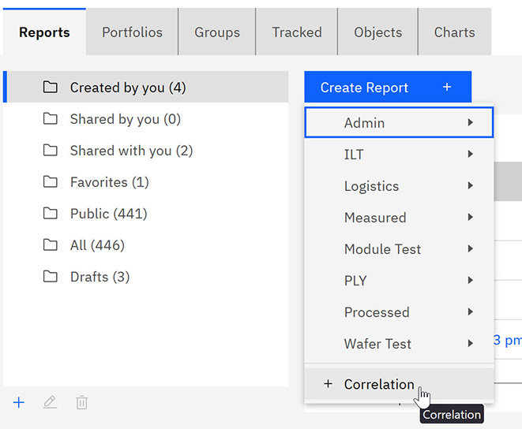
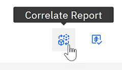
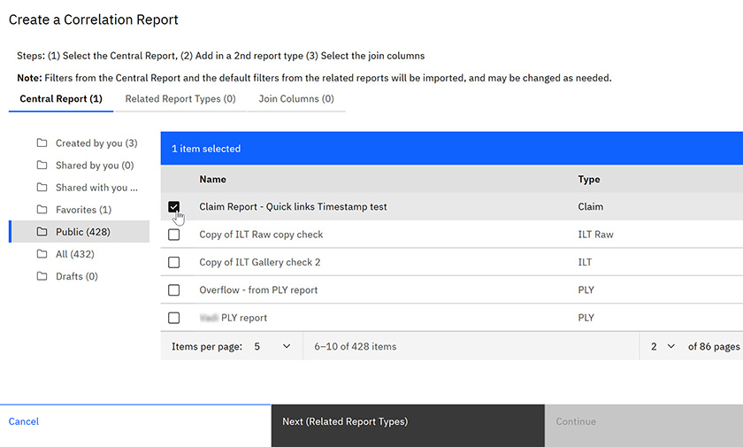
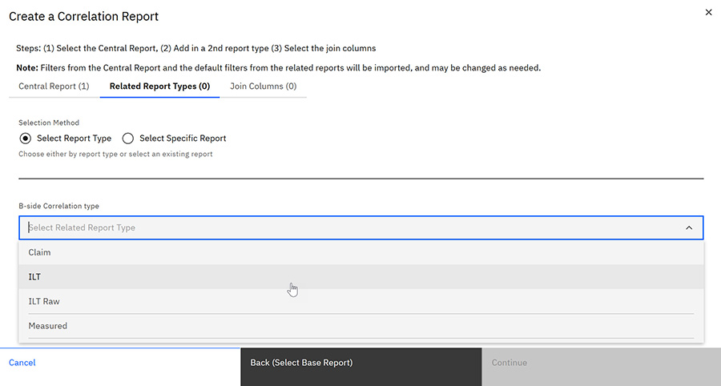

# Creating Correlation Reports

Correlation reports in the ABI application are reports that correlate data from disparate Datasets.

The ABI application uses the concept of DataView, which defines filters, sorts and columns for a named Dataset. The Dataset instance defines the universe of tables/columns available for any implementing DataView. A single DataView uses a single Fact table, and is designed for a specific purpose, such as ILT, ILTRaw, PLY, PLYRaw, etc. There are times when it is interesting to correlate data from these disparate Datasets. This is what the Correlation Report does.

A Correlation Report compares 2 reports of different types, such as PLY and ILT, and defines how to correlate those reports by specifying Join Columns. You select the Join Columns from a list of columns that exist in both of the selected Datasets, such as `wafer_id` and `lot_id`. You can also specify to correlate down to an area, zone, or specific location

On the Reports section of the ABI application, you can create a correlation report and define the parameters for that report. Like other ABI reports, you can designate visibility \(public or private\) and you can share your report.

1.  Click the **Reports** tab and then click the drop down arrow on the **Create Reports** control to select the **Correlation Report.**

    

    The Create a Correlation Reportpage opens.

    **Tip:** You can also create a Correlation Report from a Report Details page by clicking the **Correlate Report** icon. The report you are viewing becomes the Central report.

    

2.  Navigate the folders to select the Central report to use for correlation, and then click **Next**.

    

3.  Select one of the following options:

        |**Select Report Type**|Select a report type to compare from the drop-down list.|
    |**Select Specific Report**|Navigate the folders to select one or more specific reports to compare.|

    

4.  Click **Next**.

5.  Select the join columns you want to include in the correlation and click **Continue**.

    The Basis Summary for the report is displayed.

    **Note:** You can manually add more parameters to the Basis for the report before saving.

6.  Click **Create** to save the report, or **View Results** to see the report results without saving.

**Parent topic:**[Reports - Creating and Managing](../ABI_User_Guide/abi_ug_wip_reports.md)

