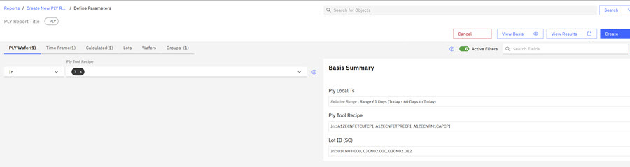
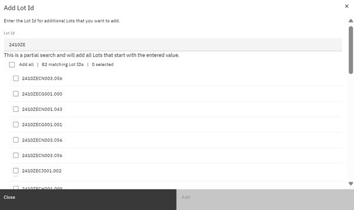
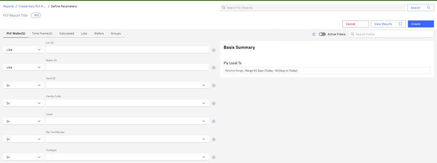
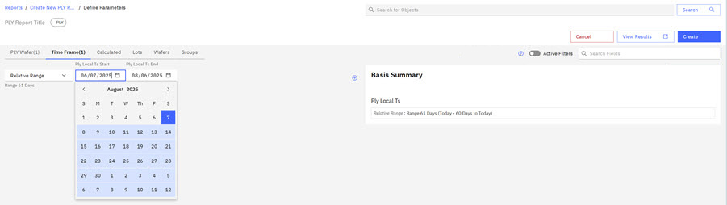

# Creating PLY Reports

Process Limited Yield \(PLY\) Reports are a reporting feature of the Analytics and Business Intelligence \(ABI\) application that are used to track issues that are related to defects during the fabrication process. You can configure your PLY Reports to track specific parameters, save the PLY Reports to your categorized folders, and add the PLY Reports to your portfolio. You can view the parameters \(basis\) for each saved PLY Report, share the Report, and export the Report to .csv, .xlts, or .pdf formats.

On the Reports section of the ABI application, you can create a PLY report and define the parameters for that report. If you designate the visibility of your report as Private, you are the only person who can see this Report. You can also change sharing options for PLY reports you create.

**Note:** Folders on the ABILanding page are accessible throughout the ABI application. When you create a new report, you designate a folder location for your report. See [Creating and Organizing with Folders](abi_ug_folder_management_procedure.md) for more information on foldering.

1.  Click the **Reports** tab on the ABILanding page and then click the drop down arrow on the **Create Reports** control and click **PLY** to select a PLY report type.

    

2.  Click **Create with Basis \(Lot level\)**, **Create with Basis \(Lot& Wafer\)**, or **Create with Groups\)**.

    

3.  Define the PLY Report by selecting the parameters for the PLY report.

    

4.  Click **Add Lots** to open the Add Lots modal. To search for Lots, enter in the first numbers of a Lot group. Search results display a matching Lot List. Click a checkbox for each Lot to include it in your report. When complete, click **Add**. The Lots are validated and added to your PLY report.

    **Note:** Lot Field Validation is on by default. When you add a Lot, field validation confirms that the Lot ID is an existing Lot.

    

5.  Click the **PLY Wafer** tab and select the parameters for the PLY report. For each parameter, click the drop down arrow to select if the parameter is in or out, and then click the drop down arrow in the text box to select the specific parameter type. If the parameter is a numeric value, you can select how to include or exclude numeric values. Use the **+** symbol to add additional parameters for a specific type but with a different value set.

    

6.  Click the **Time Frame** tab. Click the drop down arrow and select a **Relative Time Type** . Relative Time Types available are: Recent time, Data Range, Relative Range, Equals, Greater Than, Less Than, Greater Than or Equal to, and Less Than or Equal to.

7.  Click **PLY local time to start** and use the calendar icon to enter a start date, and then click **PLY local time to end** and use the calendar icon to enter an end date.

    

    **Note:** Before creating a report, you can click the **View Results** control to view the number of rows that will generate for your report. You can change the report parameters before you generate your report, or you can click the **Hide Results** control to hide this information and proceed with creating the report.

8.  Click **Create** to create the PLY report.

    

    The PLY report is created. A notification briefly appears on the screen to confirm the report creation.

    

The report is created in DRAFT status, and can be found in the **Drafts** folder on the **Reports** tab. Draft reports will be deleted after a specified number of days. To permanently save a report, you must click **Save** on the report details page.

-   **[Reviewing PLY Reports Results](../ABI_User_Guide/abi_ug_ply_reports_results.md)**  
From the Report Landing page, you can view reports that you created and reports that are shared with you,
-   **[Changing PLY Defect Classifications](../ABI_User_Guide/changing_ply_defect_classifications.md)**  
ABI PLY Administrators can change the image defect classifications within the Image Gallery on PLY reports. PLY defect classifications can be changed one at a time or in a batch. See User Roles for information about the PLY Administrator Role.

**Parent topic:**[Reports - Creating and Managing](../ABI_User_Guide/abi_ug_wip_reports.md)

**Related information**  

[Transient objects \(Draft reports\)](draft_reports.md)

