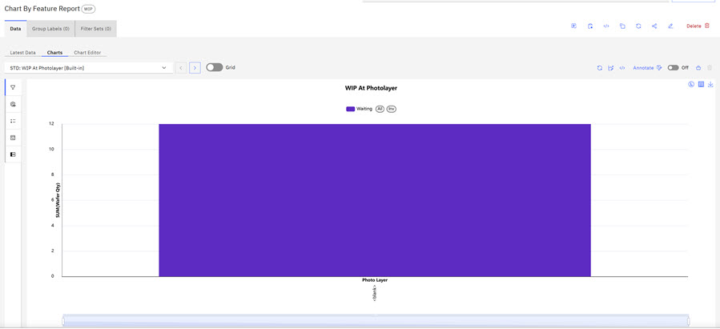
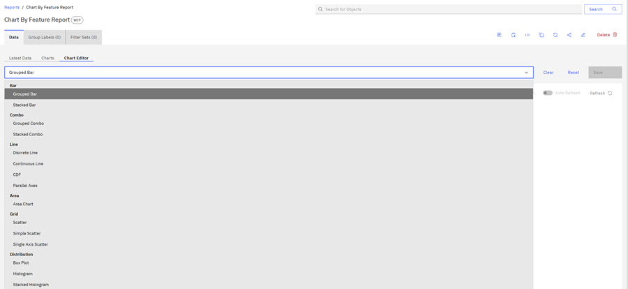
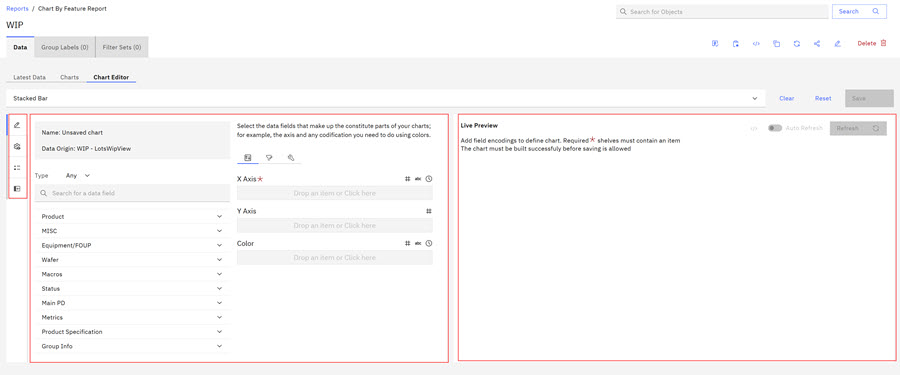
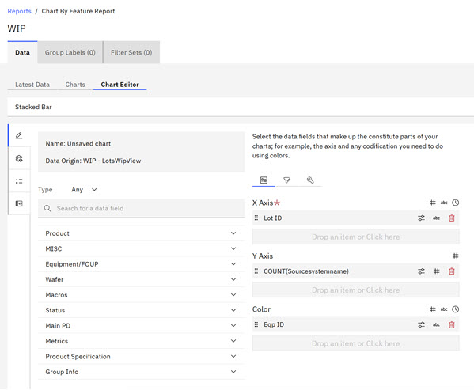
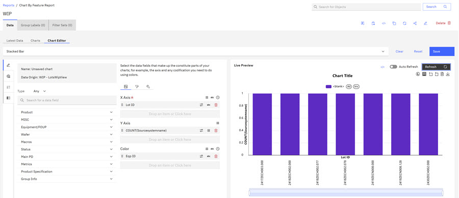
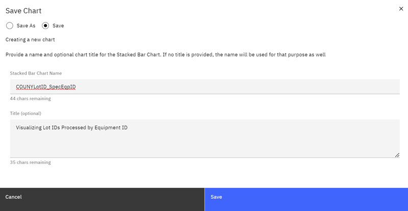

# Creating Report Charts

The ABI application supports different report types and each report type has a pre-defined set of corresponding default standard charts and an option to create customized report charts. Report charts differ from global charts in that global customized charts are created independently from actual, live reports and use values that correspond to a particular report type.

Only Chart Admistrators are authorized to create global customized charts. Report charts differ in that report charts are created within live reports. User-created charts are considered private to the users who create them.

**Note:** When editing a report chart, you can apply filters without issue to further downselect data from the report \(e.g. specific parameters from a measurement\), but saving the chart does not save the filters.

After reports are created, ABI users can create default standard or customized report charts. The following procedure first demonstrates how to create a standard chart and then a customized chart for a WIP report.

1.  **Click** on a WIP report to open it and click the **Charts** tab. The Charts page opens showing the **WIP at Photolayer** chart, one of the standard default WIP charts. You can click the caret underneath the Charts tab to open the list of available reports. Use your mouse to scroll this list to select a chart type or click the scroll arrow to view and to select another available chart. The available report list includes two default, standard charts \(WIP at Photolayer and WIP at Tool\) and two customized report charts.

    

    The **WIP at Photolayer** chart visually demonstrates lot status: Waiting, Processed, and Processing.

2.  **Click** the scroll arrow on the list of available charts and **click** the **WIP at Tool** chart to open it. The **WIP at Tool** chart is a bar chart and is a visual representation of lots that are processing and waiting.

    

3.  Click the **Chart Editor** tab to open the Report Chart Editor Customization Page. The following screen capture is a list of available chart types. To learn more about chart types, see [Table 1](abi_ug_charts_overview.md#table_u2v_jtg_xdc) in Chart Overview.

    

    **Note:** When editing a report chart, you can apply filters without issue to further downselect data from the report \(e.g. specific parameters from a measurement\), but saving the chart does not save the filters.

4.  Click the **Stacked Bar Chart** to open the Chart Customization page for Stacked Bar Charts.

    

5.  **Design** your chart by selecting the report attributes that pertain to the information you want to visualize. If you want to see the status of wafers in lots, you can use the lot, wafer, and status attributes to build your chart.

    |Icon|Function|Description|
    |----|--------|-----------|
    ||Authoring|Authoring icon opens the default Chart Customization section.|
    |

|Controls|Opens various chart enhancements controls. You can toggle and off to invert or enable the X and Y axis, control the zoom sliders, set minimum and maximum X and Y axis, adjust symbol size, and enable auto scale, log scale, continuous line, and chart sizing. 

|
    |

|Legend|Opens two sections. **Legends** and a **Live Preview**.|
    ||Data|Opens the chart Data panel, where you can view and search the data used to create the chart.|
    |

|Collapse Control|Opens expanded **Live Preview** section.|

    The first column on the Chart Creation page is the report type attributes column that shows the attributes that correspond to the selected report type. In the following screen capture, the WIP report is the report type, and the column shows the attributes that correspond to the data fields in the WIP report. You use the attributes within each data field to create your chart. The second column on the Chart Creation page shows the configuration data fields for the X and Y axis and color chart attributes. You design your chart by selecting attributes for each data field. The third column is the **Live Preview** that shows a live preview of the attributes you configured for your chart when you select **Refresh**. The **Refresh** control is not active if no chart attributes are chosen.

6.  Click the **at** to open each data field to select the attributes for each data field of your chart. Each report attribute has a type designation icon that displays in the first column: alphabetic \(abc\), numeric \(\#\), or time \(time icon\). In the second column on the Chart Creation page, each chart data field lists a range of attribute type designations that the field accepts. The following screen capture shows that the **X-Axis** data field accepts alphabetic \(abc\), numeric \(\#\), or time \(time icon\) attributes. The **Y-axis** data field accepts only numeric \(\#\). The Color data field accepts alphabetic \(abc\), numeric \(\#\), or time \(time icon\) attributes.

    

7.  Click the **Lot ID** attribute and drag it to the X-Axis.

    

8.  Click the **SourceSystemName** attribute and drag it to the Y Axis. When you drag the Count, the Tool Modal opens. Because the data field wants a numeric in the Y Axis, the system prompts you and asks how to aggregate the data because it needs a numeric value. **Select** Aggregate by count \(so the system now recognizes it as a numeric\) and Sort by Ascending. **Click** Apply. The Count is now aggregated by Count and Sorts by Ascending.

    

9.  **Select** the Equip ID and drag it to the Color data field.

10. Click **Refresh** to generate a live preview of your chart. Use the scroll bar underneath the Live Preview to see a close up of the data in each Lot. You can also select the Filter icon to filter the data by using any of the report attributes.

    

    **Note:** During Chart creation, if the ABI application [New Data Available](abi_ug_error_msg.md) or the [Application Refresh](abi_ug_error_msg.md) notification displays prompting you to refresh, **Save** your chart before refreshing. ****Refreshing removes the data you have configured for your chart if the chart is not saved.

    Icons that display within a chart provide the following actions for users \(from left to right\): 

    -   Toggles the legend off and on \(Processing and Wait
    -   Expand the Chart Controls \(legend\) on the left side of the chart
    -   Download the chart as a .CSV file
    -   Open the Data view for a more detailed breakdown of the chart
    -   Download the chart as an Excel spreadsheet file
    -   Download the chart as an image
11. Click **Save** to save your customized report chart. The Save Chart Modal opens. Complete the fields Stacked Bar Chart Name and Title \(Optional\) in the Save modal. The Stacked Bar Chart Name is the Chart name you see in the ABI UI. The Title is the title of the chart just created.

    

12. Click **Save** to save your newly created chart.

    The Title noted in the Save Modal now displays above the Live Preview.

    

    The chart now displays within your report on the Chart tab with the Stacked Bar Chart Title

    

    **Note:** Chart creation tool icons are available for use on the completed chart. You can also use the following actions that are shown above the chart:

    -   Edit - Clicking **Edit** on a completed and Saved Chart re-opens the Chart Editor. Make editing changes to update the existing chart and re-save the chart.
    -   Copy Chart
    -   Elevate \(Restricted to users with **Administrator User Permission \(UserAdmin\)** privilege.
    -   Share
    -   Delete
    -   View SQL
    -   Annotate \(toggle on and off\)
    -   Add to Portfolio \(You must be a chart owner or designated owner.\)

**Parent topic:**[Charts Overview](../ABI_User_Guide/abi_ug_charts_overview.md)

