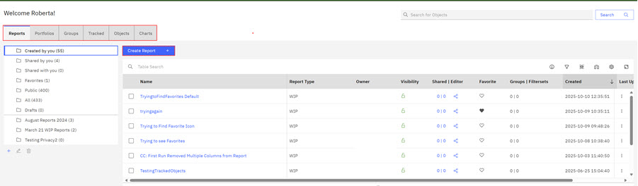
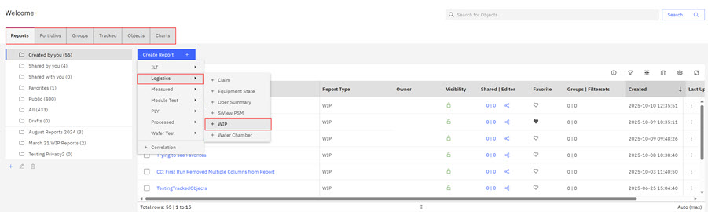
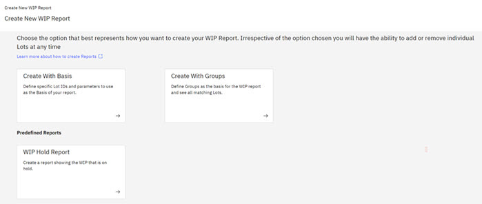
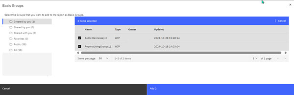
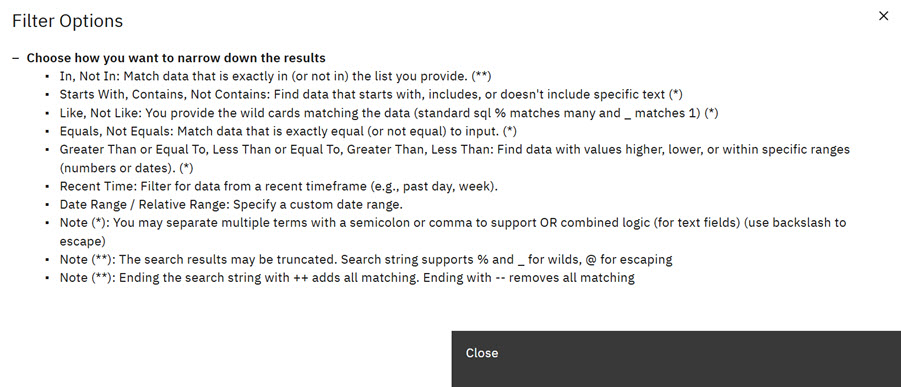
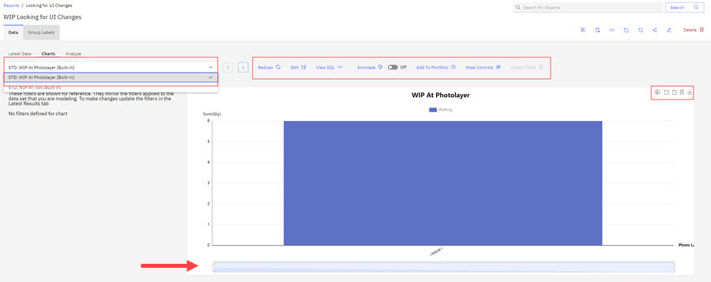
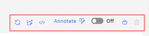
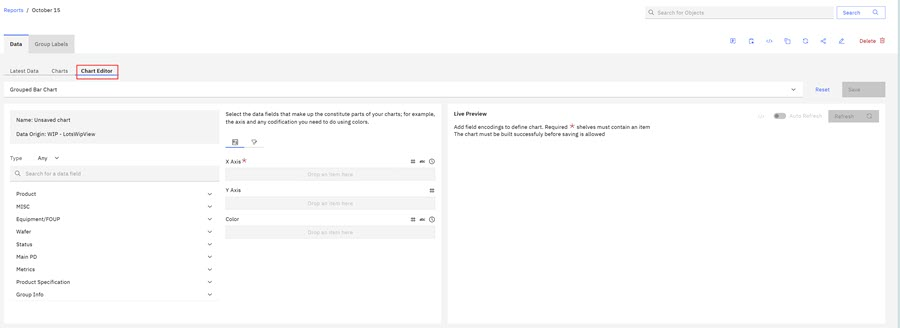

# Creating WIP Reports

Work in Progress \(WIP\) Reports are a reporting feature of the Analytics and Business Intelligence \(ABI\) application that is used to track Lots as they travel through the manufacturing process. WIP is the current SiView operation state for all active lots in the FAB. You can configure your WIP Report to track specific parameters and save the WIP Reports to your categorized folders. You can view the parameters \(basis\) for each saved WIP Report, share the WIP Report, and export the WIP Report to csv, xlts, or pdf formats.

**Creating WIP Reports**

On the Reports section of the ABI application, you can create a report and define the parameters for that report. If you designate the visibility of your report as Private, you are the only person who can see this Report. You can also change sharing options for WIP reports you created.

**Note:** Folders that display on the ABILanding page are accessible throughout the ABI application. See [Creating and Organizing with Folders](abi_ug_folder_management_procedure.md) for more information on foldering.

You can design your reports in one of three ways. You can create a report with **Basis** where you define what Lots and Parameters to include, or you can create a report with **Groups** of Lots you are watching. Alternatively, you can create a predefined report with Lots in a **Hold** status. The type of report depends on your goals.

1.  Click the **Reports** tab on the ABILanding page and then click the drop down arrow on the **Create Reports** control to select a report type. See [Creating Reports - Step-by-Step](creating_reports_step_by_step.md) to learn more about report types.

    In the following example, the report type that is selected is a WIP report.

    

    

    The Create New WIP report page opens.

    

2.  Select the **Report Definition** option that you want to use to create your report.

    |Report Definition Type|Description|
    |----------------------|-----------|
    |Create with Basis|Use this option to define specific lots and parameters you want to track for your WIP report.|
    |Create with Groups|Use this option to select Groups to add to your report. Click [Creating Groups](abi_ug_creating_groups.md) to learn more about group creation.|
    |WIP Holds Report|Use this option to define and view WIP Reports on hold. When this option is selected, the Hold state column is added to the report.|

3.  Click **Create with Groups**.

    The **New WIP Report - Define Parameters \(groups\)** modal opens.

    

    Take the following actions:

    -   Enter a name for the WIP report in the **WIP Report Name** field.
    -   Click the arrow to choose Private or Public visibility in the **Visibility** field.
    -   Click a folder for the WIP report in the **Choose Folder** control.
    -   Enter additional information about this WIP report.

        **Note:** If no named folders exist, **Created by You** is the default folder.

4.  Click **Next**.

    The WIP Report configuration page opens. The configuration page hosts Report and parameter configuration options. Selections on the right of the configuration page are configurations that you can make before you create the WIP Report.

    

    |Options|Description|
    |-------|-----------|
    |Cancel|Clicking **Cancel** stops the WIP Report Creation process and returns you to the WIP Report Page.|
    |View Results|Click **View Results** to view the default Lot IDs. Click **Hide Results** to return to the WIP Creation Page.|
    |Create|Click **Create** to create a WIP Report.|
    | | |
    |Click Lots Parameter \(Menu Option\)|To View the **Import Lots** and **Add Lots** functions. You can import or add lots using these controls. Lot IDs must have the.csv extension but can be in a .csv or text file.|
    | | |

5.  The WIP Report Configuration Page opens. Select the **Groups** tab and then select the **Add Basis Groups** control. The Basis Group modal opens. Check the check boxes for the groups that you want to add and then click **Add**. In this instance, you are adding two groups so the control states **Add 2**.

    

    The Basis Group modal opens. Check the check boxes for the groups that you want to add and then click **Add**. In this instance, you are adding two groups so the control states **Add 2**.

    

    The groups are added to your report and the groups tab shows **groups \(2\)**.

6.  Select the parameters that you want to include in your WIP Report by selecting each tab individually. Each tab on the WIP Report configuration page represents a parameter type. See the following table to see the categories within each parameter type. Parameters and their categories represent information columns that are contained in FACT and Dimension \(DIM\) tables in the Data Warehouse \(Data Warehouse\). When you click a parameter tab, the category selection opens and you can use the down arrow to view menu selections. Menu selections for each Parameter are: In, Not In, Starts With, Contains, Does Not Contain, Like, Not Like, Equals, and Not Equals.

    |Parameter|Description|
    |---------|-----------|
    |Product|Product category contains parameters such as assets owners, Cur Tech ID, and associated parameters. Although not all are available currently, these parameters are contained in the Dimension \(DIM\) Product table in Data Warehouse.|
    |Status|Status refers to the status of the Lot. Some parameters include things like HOLD status of Lots, Location IDs, and Job Class.|
    |Main PD|Main PD contains parameters that are related to a wafer's Main PD ID, its photo layer, its OPE Number, and other parameters.|
    |Equipment FOUP|The Front Opening Universal Pod \(FOUP\) holds silicon wafers securely and safely in a controlled environment. FOUPs hold and transfer wafers between equipment for processing or measurement. Parameters for this category include Cast ID, Cast State, and Equipment ID.|
    |Product Spec|The product Specification contains parameters that are related to part number information.|
    |MISC \(Miscellaneous\)|Miscellaneous category parameters contain bank information, source information, and user IDs. A bank in the semiconductor manufacturing process is a place to release, prepare for shipment, or hold product.|
    |Time Frame|Time Frame options offer selections for Last Claim Local and Plan End Ts Local.|
    |Lots|Lots contain groups of wafers that are being processed as a batch. Lot IDs identify Lots. Click **Add Lots** to add or search for Lots to add to your WIP report. Field validation is on by default. If you add Lots to your WIP Report, field validation confirms that the Lot ID is an existing lot.|
    |Groups|Select the **Add Basis Groups** control to open the Basis Group Modal.|

7.  Click the **Help** Icon next to the **Active Filters** control as you select the report parameters. The **Filter Options** modal opens. The **Filter Options** provides information on selection values when selecting parameter filters for your WIP Report.

    

    Other available options on the WIP Report with Groups Landing page are shown in the following table.

    |Available Actions|Descriptions|
    |-----------------|------------|
    |Active Filters Toggle|Toggle the Active Filters to view the filters you defined within each parameter category.|
    |Search|In the Search box, you can search in the report for fields present in the default WIP Report.|
    |View Basis|Click **View Basis** to view the Basis parameters overlay.|

8.  Click **Import** to import Lots IDs into your WIP report. Browse to the Lot IDs in csv format. Select them and click **Open** to import the Lot IDs into your WIP report.

    **Note:** Before creating a report, you can click the **View Results** control to view the number of rows that will generate for your report. At this point, you can change the report parameters before you generate your report, or you can click the **Hide Results** control to hide this information and proceed with creating the report.

9.  Click **Create** after you define all the parameters for the WIP report.

    When the **WIP Report** creation completes, the newly created WIP report displays.

    **Note:** Because this report was created with groups, the **Group** column now displays next to the Lot ID for groups contained in this report. Clicking the group number in the column displays a modal that shows Matching Groups in that lot.

    The newly created WIP report also displays on the **Reports & Portfolio** tab of the ABI application, in the folder that was specified in the Defined Parameters modal during WIP Report creation.

    In the newly created WIP report, table headers \(and columns\) represent each parameter that was selected for the report. Selecting the hyper linked Lot ID opens a view of the Lot. See [Lot View](abi_ug_lot_view.md) to learn more about what information is available.

    Select the **Chart Editor** tab. On the Chart Editor page that you can build a customized chart.

    

10. Select the **Charts** tab to view the available Report charts. Use the drop-down arrow to view the charts. Use your mouse to move the Axis Zoom bar \(indicated by the red arrow\) to view the Report Data more closely.

    

    Controls preceding the chart within the Chart area give you access to the following options:

    -   **Redraw** - Redraws the open chart.
    -   **Edit**- Open Chart Editor tab.
    -   **View SQL**- Opens the SQL modal and shows Chart execution SQL commands that are used to retrieve the data for this report. You can download the SQL as a text file.
    -   **Annotate** - The toggle turns annotations off and on. When set to on, you can author and view existing annotations. Hover over each annotation tool to see and use its function.

        

        **Note:** After you make annotations, click the **X** to close the annotation toolbar. Closing the annotation toolbar saves the annotation with the annotated chart. You can upload the annotated chart to the portfolio or download as a .png file. When report data refreshes, report data updates but **annotations remain fixed**.

    -   **Manage Chart** - Makes the chart structure available as a template.
    -   **Add to Portfolio** - Opens a modal where you can select a destination portfolio for the chart.
    **Note:** To learn more about Chart viewing options, see [Creating Report Charts](abi_ug_create_report_chart.md)

    Icons that display within a chart  provide the following actions for users:

    -   Toggle the legend off and on \(Processing and Waiting Indicators\)
    -   Zoom
    -   Zoom reset
    -   Data view \(Click close to exit data view\)
    -   Download the existing chart as an image
11. Select the **Chart Editor** tab. On the Chart Editor page you can build a customized chart. For detailed information on building customized charts, see [Creating Report Charts](abi_ug_create_report_chart.md).

    

the report is created in DRAFT status, and can be found in the **Drafts** folder on the **Reports & Portfolios** tab. Draft reports will be deleted after a specified number of days. To permanently save a report, you must click **Save** on the report details page.

-   **[Reviewing WIP Reports Results](../ABI_User_Guide/abi_ug_wip_reports_results.md)**  
From the Report Landing page, you can view the existing reports that you created and shared.

**Parent topic:**[Reports - Creating and Managing](../ABI_User_Guide/abi_ug_wip_reports.md)

**Related information**  

[Reviewing WIP Reports Results](abi_ug_wip_reports_results.md)

[Transient objects \(Draft reports\)](draft_reports.md)

