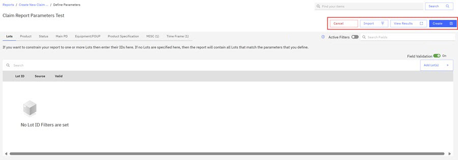
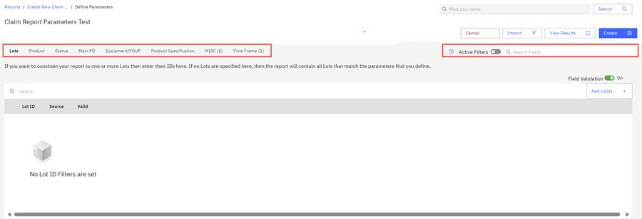
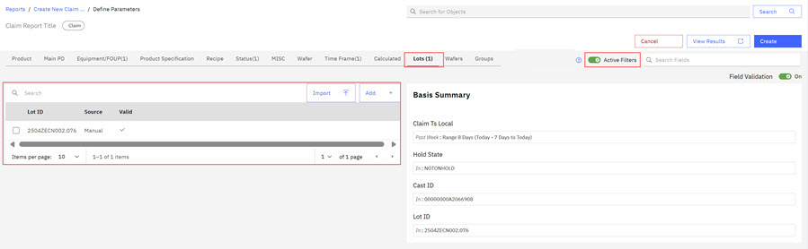
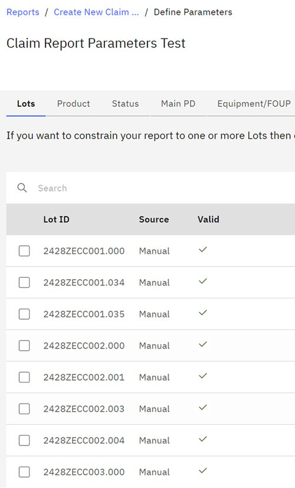
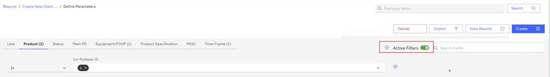

# Creating a Claim Report - Define Lots ＆ and Parameters

This topic shows users how to create a Claim Report using the Report Definition **Define Lots & Parameters**.

On the Reports section of the ABI application, you can create a claim report and define the parameters for that report. If you designate the visibility of your report as Private, you are the only person who can see this report. You can also change sharing options for the reports you create.

Claim reports are created using one of two Report Definitions, **Lot & Parameters** or **Claim Completes**. Using Report Definitions you define the information that you want in your report. This topic focuses on creating claim reports using the **Lot & Parameters** Report Definition.

**Note:** Folders on the ABIlanding are accessible throughout the ABI application. When you create a new report, you designate a folder location for your report. See [Creating and Organizing with Folders](abi_ug_folder_management_procedure.md) for more information on foldering.

1.  Select the **Report Definition** option that you want to use to create your report. For this procedure, click **Define Lots & Parameters**. Use this option to define lots and parameters for your report.

    The **Define Lots & Parameters** modal opens.

    

    Take the following actions:

    -   Enter a name for the Claim report in the **Claim Report Name** field.
    -   Click the arrow to choose Private or Public visibility in the **Visibility** field.
    -   Click a folder for the Claim report in the **Chosen Folder** control.
    -   Enter additional information about this Claim report in the description field.

        **Note:** If no named folders exist, **Created by You** is the default folder.

2.  Click **Next**.

    The Claim configuration page opens. The configuration page hosts Report options and parameter configuration options. Selections on the right of the configuration page are configurations that you can make before you create the Claim Report.

    

    |Options|Description|
    |-------|-----------|
    |Cancel|Clicking **Cancel** stops the Claim Report Creation process and returns you to the Create Report Page.|
    |Import|Click **Import** to add a list of Lots to your Claim Report configuration. You can add a List of Lots. Lot IDs must have the .csv extension but can be in a .csv or text file.|
    |View Results|Click **View Results** to view the default Lot IDs that are presently configured for your report. Click **Hide Results** to return to the Report Creation Page.|
    |Create|Click **Create** to create a Claim Report.|

3.  Select the parameters for the new Claim Report in each of the categories that display on the Claim Report Creation Page. Parameters represent data tables and columns that are contained in the Dimension \(DIM\) tables in the Data Warehouse \(Data Warehouse\).

    

    |Parameter Type|Description|
    |--------------|-----------|
    |**Product**|Product category contains parameters such as assets owners, Cur Tech ID, and associated parameters. Although not all are available currently, these parameters are contained in the Dimension \(DIM\) Product table in Data Warehouse.|
    |**Main PD**|Main PD contains parameters that are related to a wafer's Main PD ID, its photo layer, its OPE Number, and other parameters.|
    |**Equipment FOUP**|The Front Opening Universal Pod \(FOUP\) holds silicon wafers securely and safely in a controlled environment. FOUPs hold and transfer wafers between equipment for processing or measurement. Parameters for this category include Cast ID, Cast State, and Equipment ID.|
    |**Product Specification**|The product Specification contains parameters that are related to part number information.|
    |****Recipe****| |
    |**Status**|Status refers to the status of the Lot. Some parameters include things like HOLD status of Lots, Location IDs, and Job Class.|
    |**MISC \(Miscellaneous\)**|Miscellaneous category parameters contain bank information, source information, and user IDs. A bank in the semiconductor manufacturing process is a place to release, prepare for shipment, or hold product.|
    |**Wafer**||
    |**Time frame**|Time frame options offer selections for Last Claim Local and Plan End Ts Local.|
    |**Calculated**||
    |****Lots****|Lots contains groups of wafers that are being processed as a batch. Lot IDs identify Lots. Click **Add Lots** to add or search for Lots for your claim report.|
    |****Wafers****| |
    |****Groups****| |
    |****？****|Click the **？** icon in the configuration page menu bar to open the Filter Options window. See [Step 4.](#step_u1q_x5q_tcc)|
    |**Active Filters toggle**|You toggle the Active Filters to view the filters you defined within each parameter category. See the following the [Note.](abi_ug_creating_a_claim_report_define_lots_parameters.md#note_ygl_ttq_tcc)|
    |**Search**|In the Search box, you can search for fields present in the default Report.|
    |**View Basis**|Click **View Basis** to view the parameters that are used as the basis for the default Claim Report.|

4.  Click ？ Icon. The Filter Optionswindow opens. Here you can configure your filter options. The **Filter Options** provides information for selecting parameter filters for your Claim Report.

    

    **Note:** During report configuration, you can toggle the **Active Filters** to onto view each filter you have configured in each parameter category. In the following image, the filter selected for the Lot ID parameter displays when the Lot ID parameter is selected. You can view the specifics for each parameter in your report by selecting the parameter and toggling the **Active Filters** to on. The **Basis Summary** displays all the parameters selected for the report.

    

    **Note:** Lot Field Validation is on by default. When you add a Lot, field validation confirms that the Lot ID is an existing Lot.

5.  Click **Add Lots**. The Add Lots Modal opens. As you enter the Lot IDs, the system searches for the Lot IDs that match the values you enter in the **Lot ID** field. The system notifies you how many matching Lot IDs were found. You can select the Lot IDs that you want or select them all, and then click **Add**.

    

    The Lot IDs are added to your Claim Report with a notation on how they were loaded and a checkmark to indicate the Lot IDs are valid and exist in the database.

    

6.  Click **Import** to import Lots IDs into your Claim report. Browse to the Lot IDs in .csv format. Select them and click **Open** to import the Lot IDs into your Claim report.

7.  Define all the parameters for your claim report. You can toggle Active Filters to review your current configuration choices as you define your report parameters.

    

    **Note:** Before creating a report, you can click the **View Results** control to view the number of rows that will generate for your report. You can change the report parameters before you generate your report, or you can click the **Hide Results** control to hide this information and proceed with creating the report.

8.  Click **Create** to create your Claim Report.

    The Claim Report is created and opens.

    

    You can also view the Claim Report in the designated folder on the ABILanding page.

    

**Parent topic:**[Creating Claim Reports](../ABI_User_Guide/abi_ug_create_claim_reports.md)

