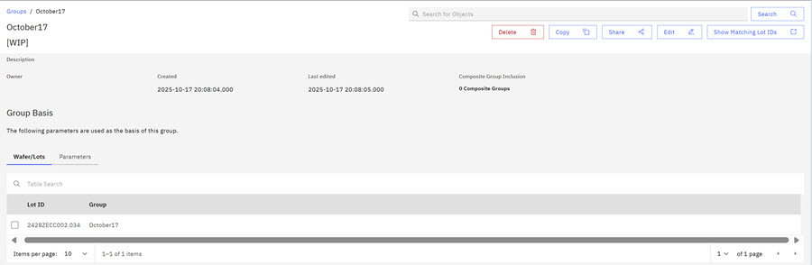
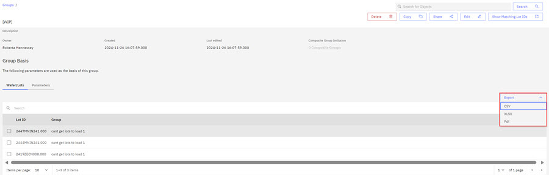

# Creating and Using Groups

You create groups in the ABI application and associate those groups with reports to establish the parent-child relationship. The parent-child relationship is not a contained relationship.

1.  Browse to the **Groups** tab on the ABI Landing page.

2.  Click the drop down arrow on the **Create a Group** control and click the report type that you want to associate with your group.

    In this example, the WIP report is chosen.

    The New WIP Group Parameters Modal opens.

    

3.  Complete the fields in the modal.

    -   WIP group name.
    -   Accept the Default visibility of the Public.
    -   Choose a folder.
    -   Complete the description field.
    If no named folders exist, **Created by You** is the default folder.

4.  Click **Next**.

    The Group-Define Parameters configuration page opens. The upper right of the page has important controls for group creation.

    

    |Options|Description|
    |-------|-----------|
    |Cancel|Clicking **Cancel** stops the Group creation process and returns you to the Reports and Portfolios Tab.|
    |View Results|Click **View Results** to view the default Lot IDs that are presently configured for your group. Click **Hide Results** to return to the Group Creation Page.|
    |Create|Click **Create** to create a Group.|

5.  Select the available parameters in each category for the new WIP Group Report. Basis Summary provides a quick visual view into the group parameter configurations as you select them.

    |Parameter Type|Description|
    |--------------|-----------|
    |**Product**|Product category contains parameters such as assets owners, Cur Tech ID, and associated parameters. Although not all are available currently, these parameters are contained in the Dimension \(DIM\) Product table in Data Warehouse.|
    |**Status**|Status refers to the status of the Lot. Some parameters include things like HOLD status of Lots, Location IDs, and Job Class.|
    |**Main PD**|Main PD contains parameters that are related to a wafer's Main PD ID, its photo layer, its OPE Number, and other parameters.|
    |**Equipment FOUP**|The Front Opening Universal Pod \(FOUP\) holds silicon wafers securely and safely in a controlled environment. FOUPs hold and transfer wafers between equipment for processing or measurement. Parameters for this category include Cast ID, Cast State, and Equipment ID.|
    |**Product Specification**|The product Specification contains parameters that are related to part number information.|
    |**MISC \(Miscellaneous\)**|Miscellaneous category parameters contain bank information, source information, and user IDs. A bank in the semiconductor manufacturing process is a place to release, prepare for shipment, or hold product.|
    |**Wafer**|Define wafer variables.|
    |**Time Frame**|Time Frame options offer selections for Last Claim Local and Plan End Ts Local.|
    |**Calculated**| |
    |**Lots**|Lots contain groups of wafers that are being processed as a batch. Lot IDs identify Lots. Click **Add Lots** to add or search for Lots to add to your WIP report.|
    |**Wafers**|Add and Import Wafers on this tab.|

    

    As you select the parameters for your group report, you can select the Help Icon

    

    to open the Filter Options modal to learn more about using the Filtering Options.

    Use the Parameter Type-Description table to learn more about report group parameters.

    **Note:** During report configuration, you can toggle the **Active Filters** to view each filter you have configured in each parameter category.

    In this example, in the following image two filters are selected in the Equipment/FOUP Category and display in the Basis Summary section.

    **Note:** In addition to viewing the Basis Summary, you can toggle the **Active Filters** to on to view the selected filters.

6.  Select the **Create** control to create your Report Group. The report group opens.

    

    **Not sure if the above screenshot is correct or if I configured it incorrectly.**

    

    When a Group Report is created, you can also export the Group Report to .csv, .xslx, or .pdf format.

**Parent topic:**[Groups](../ABI_User_Guide/abi_ug_creating_groups.md)

