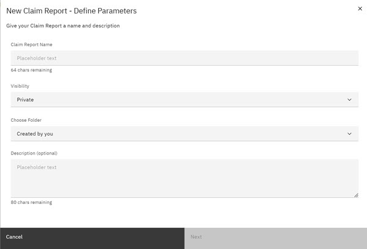
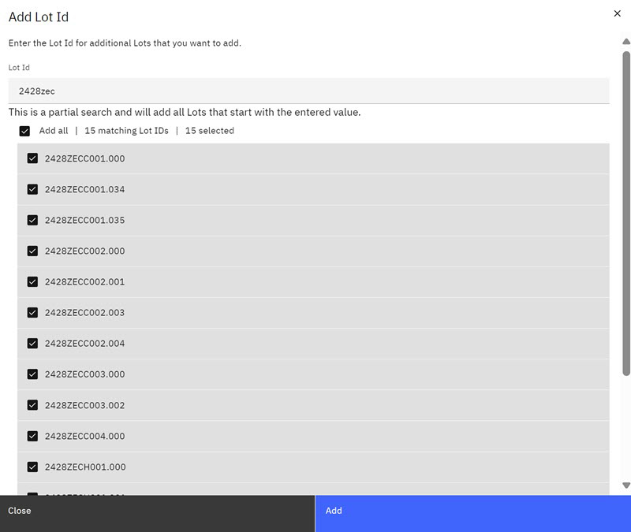
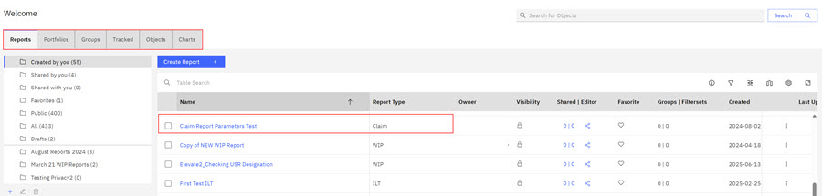

# Creating Claim Reports - Claim Completes Report

**Claim Completes Report** use the specific OPE variables, **ForceComp** and **OperationComplete** when creating a claim report.

On the Reports section of the ABI application, you can create a claim report and define the parameters for that report. If you designate the visibility of your report as Private, you are the only person who can see this report. You can also change sharing options for the reports you create.

**Note:** Folders on the ABIlanding are accessible throughout the ABI application. When you create a new report, you designate a folder location for your report. See [Creating and Organizing with Folders](abi_ug_folder_management_procedure.md) for more information on foldering.

1.  Select the **Report Definition** option that you want to use to create your report.

    |Report Definition Type|Description|
    |----------------------|-----------|
    |Define Lots & Parameters|Use this option to define lots and parameters for your report.|
    |Claim Completes Report|The Claim Completes Report can track all Lots that pass through a specific Equipment Tool. Some filters that might be used in these reports might be a set time frame or a specific category of Lots that have a status of Complete.|

2.  Click **Claim Completes Report**.

    The **Claim Completes Report** modal opens.

    

    Take the following actions:

    -   Enter a name for the Claim report in the **Claim Report Name** field.
    -   Click the arrow to choose Private or Public visibility in the **Visibility** field.
    -   Click a folder for the Claim report in the **Chosen Folder** control.
    -   Enter additional information about this Claim report in the description field.

        **Note:** If no named folders exist, **Created by You** is the default folder.

3.  Click **Next**.

    The Claim configuration page opens. The configuration page hosts Report options and parameter configuration options. Selections on the right of the configuration page are configurations that you can make before you create the Claim Report.

    

    |Options|Description|
    |-------|-----------|
    |Cancel|Clicking **Cancel** stops the Claim Report Creation process and returns you to the Create Report Page.|
    |Import|Click **Import** to add a list of Lots to your Claim Report configuration. You can add a List of Lots. Lot IDs must have the .csv extension but can be in a .csv or text file.|
    |View Results|Click **View Results** to view the default Lot IDs that are presently configured for your report. Click **Hide Results** to return to the Report Creation Page.|
    |Create|Click **Create** to create a Claim Report.|

4.  Select the parameters for the new Claim Report in each of the categories that display on the Claim Report Creation Page. Although not all parameters are available, categories represent columns that are contained in Dimension \(DIM\) tables in Data Warehouse.

    

    |Parameter Type|Description|
    |--------------|-----------|
    |**Lots**|Lots contain groups of wafers that are being processed as a batch. Lot IDs identify Lots. Click **Add Lots** to add or search for Lots to add to your Claim report.|
    |**Product**|Product category contains parameters such as assets owners, Cur Tech ID, and associated parameters. Although not all are available currently, these parameters are contained in the Dimension \(DIM\) Product table in Data Warehouse.|
    |**Status**|Status refers to the status of the Lot. Some parameters include things like HOLD status of Lots, Location IDs, and Job Class.|
    |**Main PD**|Main PD contains parameters that are related to a wafer's Main PD ID, its photo layer, its OPE Number, and other parameters.|
    |**Equipment FOUP**|The Front Opening Universal Pod \(FOUP\) holds silicon wafers securely and safely in a controlled environment. FOUPs hold and transfer wafers between equipment for processing or measurement. Parameters for this category include Cast ID, Cast State, and Equipment ID.|
    |**Product Specification**|The Product Specification contains parameters that are related to part number information.|
    |**MISC \(Miscellaneous\)**|Miscellaneous category parameters contain bank information, source information, and user IDs. A bank in the semiconductor manufacturing process is a place to release, prepare for shipment, or hold product.|
    |**Time Frame**|Time Frame options offer selections for Last Claim Local and Plan End Ts Local.|
    |**Help Icon**|Click the **Help** icon to open the Filter Options window.|
    |**Active Filters toggle**|You toggle the Active Filters to view the filters you defined within each parameter category. See the following Note make the cross reference.|
    |**Search**|In the Search box, you can search for fields present in the default Report.|
    |**View Basis**|Click **View Basis** to view the parameters that are used as the basis for the default Claim Report.|

    **Note:** During report configuration, you can toggle the **Active Filters** to view each filter you have configured in each parameter category. For example, in the following image four filters are selected in the Equipment/FOUP Category. When you click the Equipment/FOUP Category and toggle the **Active Filters** to on, the filters you see the selected filters.

    

5.  Click **Help** Icon. The **Filter Options** window opens. The **Filter Options** provides information for selecting parameter filters for your Claim Report.

    

6.  Toggle the **Field Validation** to the on position \(the toggle turns green\) and click **Add Lots**. The Add Lots Modal opens. As you enter the Lot IDs, the system searches for the Lot IDs that match the values you enter in the Lot ID field. The system notifies you how many matching Lot IDs were found. You can select the Lot IDs that you want or select them all, and then click **Add**.

    

    The Lot IDs are added to your Claim Report with a notation on how they were loaded and a checkmark to indicate the Lot IDs are valid. The valid checkmark indicates that the Lot ID exists in the database.

    

7.  Click **Import** to import Lots IDs into your Claim report. Browse to the Lot IDs in csv format. Select them and click **Open** to import the Lot IDs into your Claim report.

    **Note:** Before creating a report, you can click the **View Results** control to view the number of rows that generate for your report. You can change the report parameters before you generate your report, or you can click the **Hide Results** control to hide this information and proceed with creating the report.

8.  Define all the parameters for your claim report. You can use the **Active Filter** toggle to review your selections. Click **Create** to create your Claim Report.

    Your claim report is created and is now displays on the Reports page in the folder you designated.

    

The report is created in DRAFT status, and can be found in the **Drafts** folder on the **Reports & Portfolios** tab. Draft reports will be deleted after a specified number of days. To permanently save a report, you must click **Save** on the report details page.

**Parent topic:**[Creating Claim Reports](../ABI_User_Guide/abi_ug_create_claim_reports.md)

**Related information**  

[Transient objects \(Draft reports\)](draft_reports.md)

