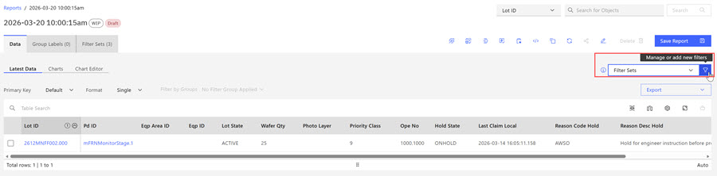
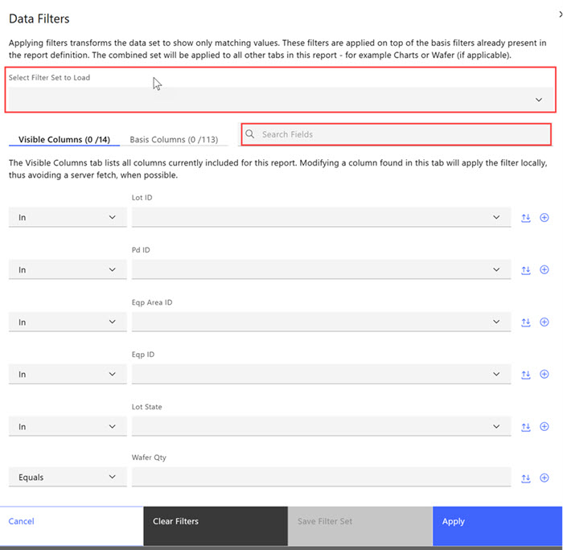
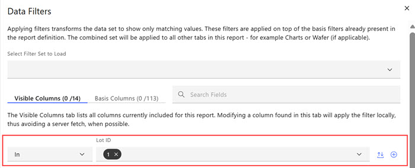
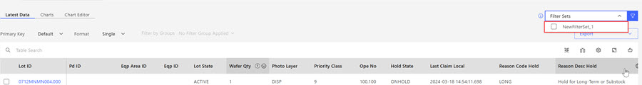

# Creating Filter Sets

Filter Sets can be used to create various report level filters that can quickly and repeatably filter and sort data.

Filter Sets are created during the process of filtering a report and are accessible from a Filter Set control in the user interface above **Reports**, **Charts**, and **Gallery** views. Hovering over the filter icon, hover text displays **Manage or add new filters.**. Applying filters transforms the data set to show only matching values. These filters are applied on top of the basis filters already present in the report definition. The combined filter sets are applied to all other tabs in this report - for example, Charts or Wafer \(if applicable\).

1.  When viewing a report, click the **Filter Data** icon. The **Data Filters** modal opens. On the **Data Filters** modal, two options display above the visible/basis columns section. The first option has a drop-down menu where users can select existing filters sets to load into the report. The second option is a search field that searches for fields within the report. The Visible Columns section lists all the columns in the report, and the Basis Columns lists all the Basis Columns in the report. Users can adjust any of these column fields, by using the drop-down options for any of the column items. For example, in the first column, users can select any of these options \(In/Not In, Starts With/Contains, /Does Not Contain, Like/Not Like, Equals/Not Equals\) for the values in the second column, in this case the Lot ID. Each second column has arrows for scrolling through selections in that column and a **plus** symbol to add additional values.

    

    When column selections are complete, users can select **Cancel**, **Clear Filters**, **Save Filter Sets** or **Apply**.

    In the following example, the Lot ID is selected to be **In** this filter set.

    

2.  Click **Save Filter Set** to save the selected Filter Set, and enter a name for the filter set and click **Save**. The saved filter set name is listed in the Filter Set Modal,

    

    **AND** is mirrored as a filter option in the filter set above the table.

    

    **Note:** When a filter sets are created and saved, they display above the report table and are accessible in a static form in the **Filter Set** tab as shown in the following image. Filter Sets can be **Imported** and **Deleted** using the **Filter Set** tab.

    Use the drop-down selector on the Filter Sets Control to select and use a saved filter to use in the report. You can select more than one filter set to use in a report, but the combined filter set is not a savable option.

    

**Parent topic:**[Filter Sets](../ABI_User_Guide/abi_ug_filer_sets.md)

