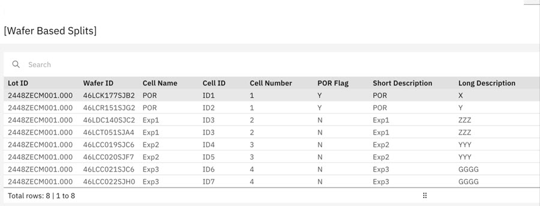
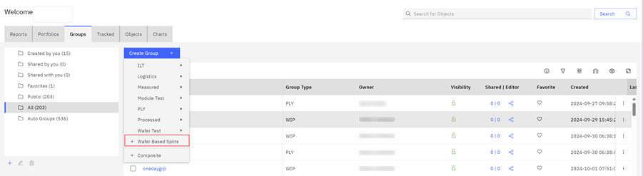
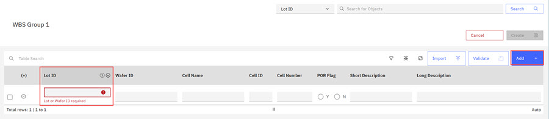
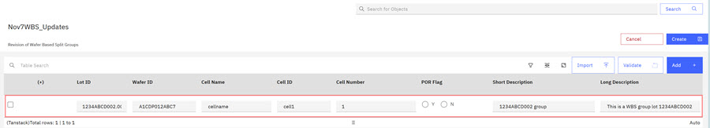

# Creating Wafer-Based Split Groups

**Wafer‑Based Split** \(WBS\) Groups are a mixed grain group and can be composed of three different grains at the same time: Lot based, Wafer Based, and Lot and Wafer based. WBS Groups can be created directly in the ABI application, by importing an Excel spreadsheet, or importing a comma-separated text file that contains group parameters \(fields\) for a data view. Importing the spreadsheet or text file injects the data into the query. Each of the rows in a WBS group definition must be unique for the LotID/WaferID pairs, and at least one of the two needs to have a nonempty value. WBS groups cans be used to track processing outcomes by identifying associated experiments in the short and long description fields in imported spreadsheets.

The Parameter fields outlined in the following table must be included in any WBS Group you create.

|Spreadsheet Field Names|Spreadsheet Field Entries|
|-----------------------|-------------------------|
|Lot ID|Enter a single LotID|
|Wafer ID|Enter a single Wafer ID|
|Cell Name|Enter the cell name as one word|
|Cell ID|Enter the Cell ID as one word|
|Cell Number|Enter the Cell Number as an integer value|
|POR Flag|Enter the Plan of Record \(POR\) Flag|
|Short Description|Use descriptive text. Might contain experiment identifiers.|
|Long Description|Use descriptive text. Might contain experiment identifiers.|

From the ABI landing page, you can create **Wafer-Based Split** groups by defining the group parameters.

WBS Groups can be created directly in the ABI application and associated with an ABI Report. When creating a WBS Group, include the fields that are shown in the [Table 1](#table_yrp_yp1_v2c) table, with Short and Long Description being the only optional fields.

1.  Click the **Groups** drop down control, and scroll and click the **Wafer-Based Splits** selection.

    

    The Wafer-Based Split Modal opens.

    

    Complete the fields in the modal.

    -   Enter a name for the **Wafer-Based Split Group**.
    -   Click the arrow to choose Private or Public visibility in the **Visibility** field.
    -   Click a folder for the Group report in the **Choose Folder** control.
    -   Enter additional information about this Wafer Based Split Group.

        **Note:** If no named folders exist, **Created by You** is the default folder.

2.  Click **Next**. The WBS Group configurationpage opens.

    

3.  Click in the Lot ID field and click **Add**. Input the Lot ID number.

4.  Click **Validate** to validate the items in the WBS group. Validation checks that Lot IDs and Wafer IDs are present and that the group does not contain duplicate fields.

5.  Click **Validate** to check all the fields in the row. Click **Create** to create the new Wafer-Based Split Group.

    You can take any of the following actions on the newly created Group by using the Menu Controls:

    -   Delete
    -   Copy \(Input a new name for the copy in the copy modal.\)
    -   Share
    -   Edit
    -   Export \(Export as an xlsx, PDF file, or copy to the Clipboard.\)
6.  Click the **Groups** breadcrumb to return to the ABI dashboard and view the newly created group.

    **Note:** WBS groups can also be created using the **Import** function. Use the following steps to use **Import** to create WBS groups. +

7.  If you are using an import process to create a WBS group, prepare the spreadsheet that you intend to use to create the **Wafer-Based Split** groups. The spreadsheet must include the fields that are shown in the [Table 1](#table_yrp_yp1_v2c) table, with Short and Long Description being the only optional fields. Allowable formats for importing are .csv, .txt, and .xlsx. The following table is an example of how a template might be used to show which wafers passed through specific experiments by using the short and long description fields.

    **Note:** If you are importing WBS fields in a text format, use a text editor.

8.  Click **Import** and browse to your spreadsheet and click **Open**. The page refreshes and displays the imported data from the spreadsheet.

    

9.  Click **Validate** to validate the fields in WBS import.

10. Click **Save** to save the group.

**Parent topic:**[Groups](../ABI_User_Guide/abi_ug_creating_groups.md)

