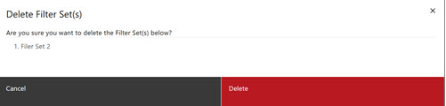

# Deleting Filter Sets

These instructions cover the process of deleting a Filter Set.

1.  When viewing a report, click the **Filter Sets** tab to open the Filter Sets access. The list of available filter sets displays.

    

2.  Click the checkbox for the Filter Set you want to delete.

3.  Click the **Trashcan Icon** next to the filter set to be deleted **OR** click **Delete** in the menu bar. A deletion warning displays.

    **Note:**

    

4.  Click **Delete** to Delete, **Cancel** to cancel the deletion.

    **Note:** Clicking **Delete** deletes only the filter set from this report. If the filter set exists in other reports, those filter sets still exist.

**Parent topic:**[Filter Sets](../ABI_User_Guide/abi_ug_filer_sets.md)

