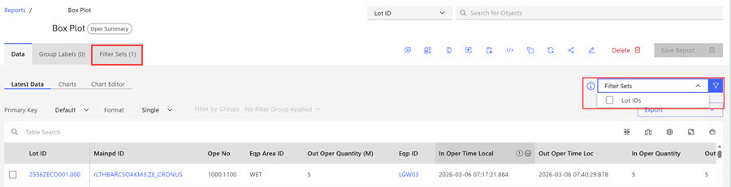
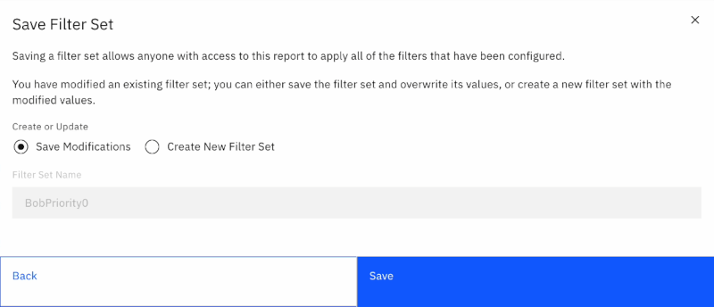
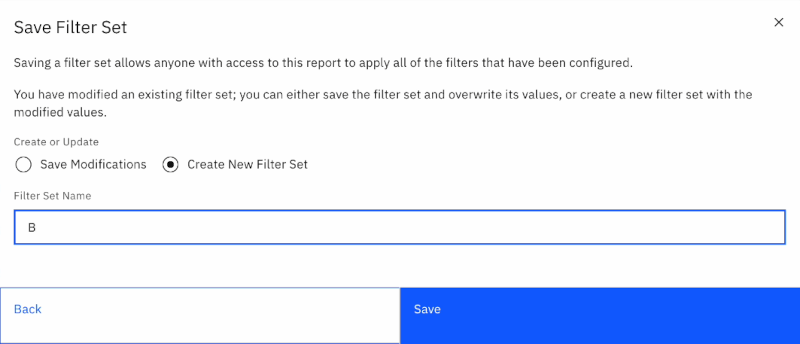

# Editing Filter Sets

Filter sets can be edited and saved as new filter sets. The same process can be used to save a new filter set.

1.  When viewing a report, click **Filter Data** icon to open the **Data Filters** modal or open the Filter Set menu and click a checkbox for a specific filter set.

    **Note:** When a filter sets are created and saved, they display above the report table and are accessible in a static form in the **Filter Set** tab as shown in the following image. Filter Sets can be **Imported** and **Deleted** using the **Filter Set** tab.

    Use the drop-down selector on the Filter Sets Control to select and use a saved filter to use in the report. You can select more than one filter set to use in a report, but the combined filter set is not a savable option.

    

2.  After making any needed changes, click **Save Filter Set**.

    

3.  Click **Create New Filter Set** and enter a new name into **Filter Set Name** to save as a new Filter Set.

    

4.  Click **Save** to save the changes to the Filter Set

**Parent topic:**[Filter Sets](../ABI_User_Guide/abi_ug_filer_sets.md)

