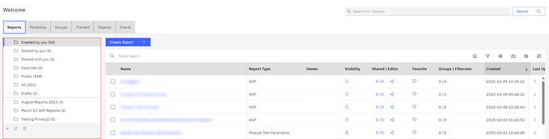
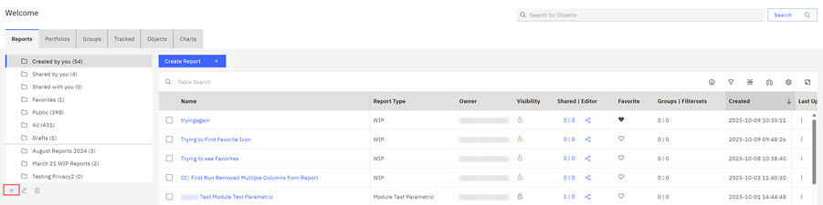
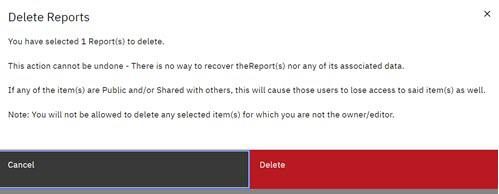

# Creating and Organizing with Folders

On the ABILanding page, you can use folder management to organize your work flow to meet your needs.

On the ABILanding page, you can use folder management to organize your reports, portfolios, groups, and tracked objects. You can create and name new folders, copy reports into folders, and delete folders.

**Note:** You cannot delete or change the name of any Special folder, including the Favorites folder. You can, however, delete the contents within the Favorites folder. Special folders are those folders that automatically filter reports such as Created by You, Shared by you, and Shared with You.

Foldering is available on the **Reports** tab for Reports, on the **Portfolios** tab for Portfolios, on the **Groups** tabs for Groups, and on the **Tracked** tab for Tracked Objects, on the **Objects** tab for Object, and **Chart** tab for Charts. Folders listed for each of these individual categories is a separate instances of folder sets and as such operate independently.

The following steps outline how to act on folders. You can use the same procedures for folders in Portfolios and Tracked Objects.

-   [Step 1](#step_dnc_1yy_pcc) explains the use of **Heart** icon and default folders.
-   [Step 2](#step_yyt_m1z_pcc) shows how to Create folders.
-   [Step 3](#step_k35_ycz_pcc) shows you how to Delete folders.
-   [Step 4](#step_zfl_cdz_pcc) shows you how to Add Reports to existing folders.
-   [Step 5](#step_kmz_tx1_qcc) shows you how to Edit folder names.

1.  On the ABILanding page, click **Reports**. The Reports folder management section lists the current report folders.

    

    When you initially access a report area, the Created by you is the default folder. When you are in a report area and select a folder and load the contents of that folder, it becomes the default folder for that report location. Each report location area has its own default folder. Default folders differ in each report area, **Reports** , **Portfolios**, and **Tracked**.

    Currently, the default available folders are listed in this table.

    |Reports|Portfolios|Groups|Tracked|Charts|
    |-------|----------|------|-------|------|
    |Created by you|Created by you|Created by you|All|Created by you|
    |Shared by you|Shared by you|Shared by you|Favorites|Shared by you|
    |Shared with you|Shared with you|Shared with you| |Shared with you|
    |Favorites|Favorites|Favorites| |Favorites|
    |Public|Public|Public| |Public|
    |All|All|All| |All|
    | | |Auto Groups| | |

    Clicking the heart option for a report in table view, automatically adds that report to your Favorites folder. The heart icon is available for **Reports**, **Portfolios**, and **Tracked**report views.

    **Note:** To learn how to add the heart icon to your **Reports**, **Portfolios**, and **Tracked** report views, See [Configuring Table Columns and Activating the Favorites Icon](abi_ug_table_operations.md).

    

    If you want to remove a report from the Favorites folder, click the heart icon and the report returns to its original folder location. To learn how to enable the heart icon for the Favorites folder in your report table views, see [Configuring Table Columns and Activating the Favorites Icon](abi_ug_table_operations.md)

2.  Click the plus **+** symbol beneath the folder column to create a new folder. Enter the name of your Folder and click **Create** to add the folder to the folder list. The new folder is now in the folder management section. Clicking a folder activates that folder and a blue line next to the folder name notes the active status. Reports contained within the selected folder display in the adjacent report listing. You can toggle between folders to view the reports in each folder.

    

3.  Clicking the checkbox for a report in the adjacent Report list activates a blue menu bar with three available actions: **Add To**, **Delete**, or **Cancel**. Click the checkbox for a report and then click **Delete** to delete the report. The **Delete Reports** modal opens. Click **Delete** to delete the selected Report.

    **Note:** You can **Delete** and **Add To** and all personally created folders. You cannot delete Special folders, only content within the special folder. Special folders are those folders that filter reports \(Shared by you, Shared with you\) and the Favorites folder.

    

4.  Click the check box for a report and then click **Add To** to initiate adding the report to a new folder. The **Add to Folder** modal opens. Click the arrow to select a folder and then click **Add to Folder**.

    

    **Note:** You can add only to the Favorites Folder or Folders you created. **Add To** copies the report to the new folder location in addition to its existing location.

5.  Click the check box for a report and then click the pencil icon. **** to edit an existing Folder. The **Edit Folder** modal opens. Enter in the new folder name. Click **Save**. You cannot edit the name of any Special folder, including the Favorites folder. Special folders are those folders that automatically filter reports such as Created by You, Shared by you, and Shared with You. The renamed folder is now in the folder management section.

    **Note:** You cannot edit the name of any Special folder, including the Favorites folder. Special folders are those folders that automatically filter reports such as Created by You, Shared by you, and Shared with You.

    

**Parent topic:**[Application elements](../ABI_User_Guide/abi_ug_navigation.md)

