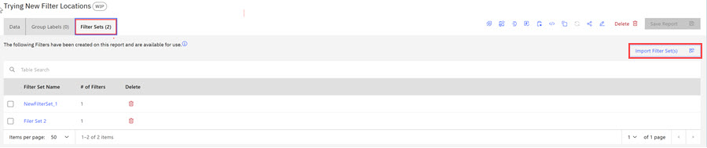
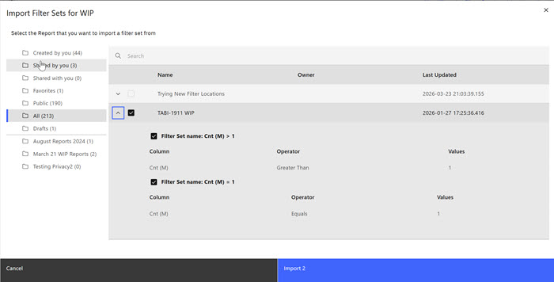
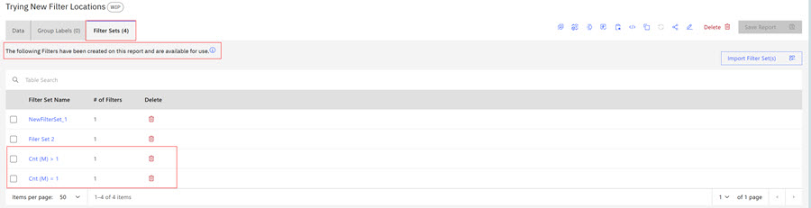

# Importing Filter Sets

How to move Filter Sets from one Report to another

Filter Sets can be imported from one report to another. Once imported, the Filter Sets are available to be used in both reports.

1.  When viewing a report, click **Filter Sets** tab to open the Filter Sets access.

    

2.  Click **Import Filter Set\(s\)** to open the Import Filter Sets modal. Each folder holds available filter sets. Browse to the folder that holds the filter set you want to import. Use the carat to open the filter set and check the check boxes for the filter set you want to import.

    

3.  Click **Import**. The Filter Sets are imported and are now available to be used in the current report, as shown on the **Filter Sets** tab. The **Filter Sets** tab increments and displays the number of filter sets available.

    

**Parent topic:**[Filter Sets](../ABI_User_Guide/abi_ug_filer_sets.md)

