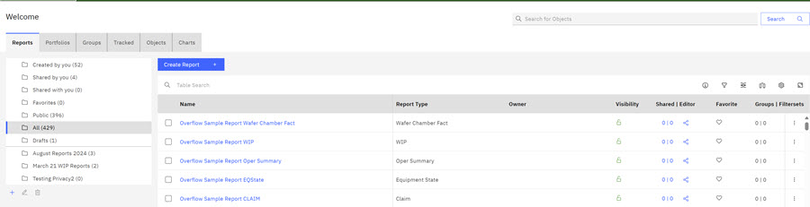
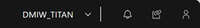
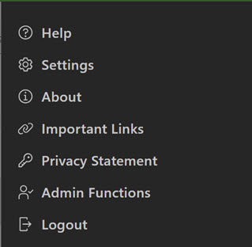
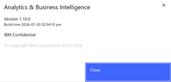

# ABI Landing page

When you log in to the ABI application, the ABIlanding page opens. It is the entry point into the ABI application. From the landing page, you can click the feature tabs to access different types of information from the Data Warehouse \(Data Warehouse\).

For example, on the ABILanding page, clicking any of these feature tabs give you different views of the information in the IC.

-   **Reports**
-   **Portfolios**
-   **Groups**
-   **Tracked**
-   **Objects**
-   **Charts** \(Access available only for **Chart Administrators**. The **Charts** tab is only visible for **Chart Administrators** unless configured as visible by your site administrator.

Clicking **Reports** \> **+** gives you the ability to create many types of reports and to view existing reports if sharing is enabled. The **Portfolio** tab gives the ability to create or view existing portfolios. The **Groups** Clicking **Tracked** gives you access to track assets within the application, and clicking **Objects** gives you access to view the assets presently being tracked in the application.

**Note:** Visibility and Access to the Top-Level Chart tab is only available to **Chart Administrators**.

See [Components of a Table](abi_ug_table_components.md) to learn more about how to view and access information in tables.

Application Menu Bar displays the Schema Type, the Bell Icon \(Notifications\), the Copy URL, and the User Menu icon.

The **User Menu**options are described in the following list.

|Function|Description|
|--------|-----------|
|Help|Help links to the ABI User Guide|
|Settings|Settings links directly to[Global User Preferences.](abi_ug_preferences.md)|
|About|Notes current build information for the ABI application. |
|Important Links|Quick Access to Internal and ABI sites.|
|Privacy Statement|ABI application privacy statement. Users must agree to the Privacy Statement during login.|
|Admin Functions|Opens the Admin Functions Configuration options. See [Admin Functions](abi_ug_admin_functions.md) to learn about Admin Functions.|
|Logout|Clicking **Logout** logs you out of the ABI application and displays this message **You are logged out**.|

**Parent topic:**[Application elements](../ABI_User_Guide/abi_ug_navigation.md)

