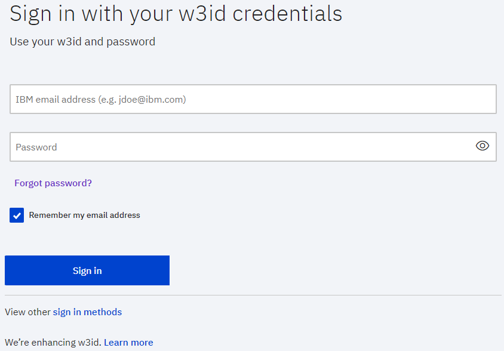

# Logging in

All ABI users must follow and complete the established protocols.

When an IBM user has secured a w3id and is added to the BlueGroup, they can log in to ABI.

1.  Navigate to the ABI login page here: [https://abi-test.apps.abi.pok.ibm.com/ABIWeb/mainpage/login](https://abi-test.apps.abi.pok.ibm.com/ABIWeb/mainpage/login).

    

2.  Navigate to the ABI login page here: [https://abi-test.apps.abi.pok.ibm.com/ABIWeb/mainpage/login](https://abi-test.apps.abi.pok.ibm.com/ABIWeb/mainpage/login).

3.  If you are not already logged in, type your w3idcredentials and click **Sign in**.

**Parent topic:**[Overview](../ABI_User_Guide/abi_ug_overview.md)

