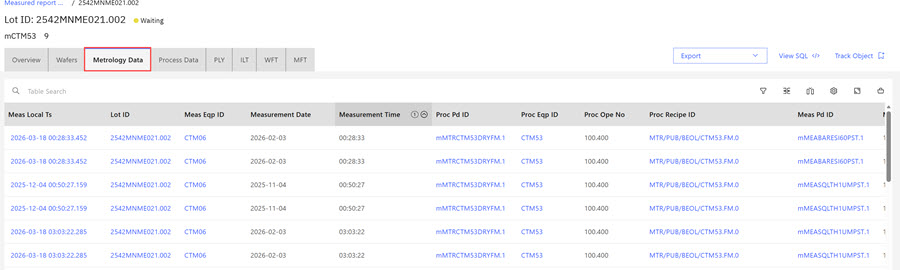
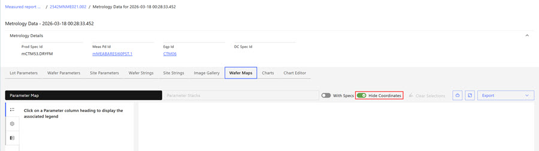

# Metrology Data

If there is any Metrology Data associated with the lot, the data is displayed on the **Metrology Data** tab. As wafers move through the fabrication process, there are several measurements that are taken to examine key features of the wafer, such as flatness. These measurements are stored in the Data Warehouse. ABI provides a graphical representation of this wafer data to assist engineers in evaluating the data. The unique nature of the wafer maps require the map displays to be developed as a custom solution, rather than by using an existing library.

**Viewing Metrology Data**

Click the measurement timestamp in the **Meas Local Ts** column to see the following Metrology Data for each measurement.

**Note:** Depending on each individual configuration, not all tabs that are listed here within **Meas Local Ts** will be populated.

-   [Wafer Maps](abi_ug_lot_wafer.md)
-   Lot Parameters
-   Wafer Parameters
-   Site Parameters
-   Wafer Strings
-   Site Strings
-   Image Gallery
-   Wafer Maps
-   Charts
-   Chart Editor

**Metrology Tab**

-   Clicking a Lot ID within a Metrology Tab opens the Metrology Tab View that displays detailed information.

    

-   Click the **Meas Local Ts** value to open more parameter values. On the **Site Parameters** and the **Wafer Maps** tabs, there is a toggle option to **Hide Coordinates**. When the toggle is set to **On** the XCoord and YCoord are hidden.

    

-   **[Wafer Maps](../ABI_User_Guide/abi_ug_lot_wafer.md)**  
The main goal of the Metrology wafer maps is to show all the measurement points on a wafer, which are measured by a measurement tool at a specific measurement timestamp.

**Parent topic:**[Lot view](../ABI_User_Guide/abi_ug_lot_view.md)

