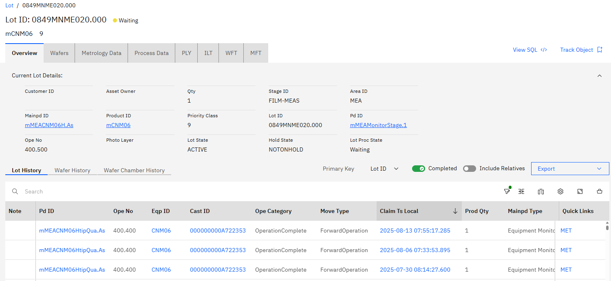

# Lot view

The Lot View displays key information including an overview of the current lot information, the history of transactions for the lot, the wafers in the lot and Metrology, Process, and PLY data associated with the lot.

To view data and history that is associated with a specific lot, access the Lot view by using one of the following methods:

-   From a WIP report, click the **Lot ID** to view the data and history that is associated with that lot.
-   On the **Objects** tab on the landing page, click the **Lot ID** in the **Lots** list.

**Note:** There is a delay in processing information from SiView, to the Data Warehouse and then to ABI, so the information displayed might not match the current information in SiView.

Next to the lot ID is an indicator of the status of the lot:

-   \(Green\) – Processing
-   \(Yellow\) – Waiting
-   \(Amber\) – On Hold
-   \(Red\) – Scrapped
-   \(Blue\) – Finished

The Lot View contains two components: a summary of the current lot information, and that shows the historical transactions that are associated with the lot displayed. The summary section includes multiple tabs:

-   The **Overview** tab, which includes lot details such as Customer ID, Asset Owner, Quantity, and Lot State.
-   The **Wafers** tab, which includes the ID of each wafer that is assigned to the lot, with the Cassette ID and Slot Number.
-   The **Metrology Data** tab, a list indicates the measurements made on each of the lots and contains links to the Wafer Maps that visually display the measurement data for each wafer. Click the measurement timestamp in the **Meas Local Ts** column to see the [Metrology Data](abi_ug_lot_metrology.md) for the wafers in this lot.
-   The **Process Data** tab, which lists the measurements that are made on each of the lots and links to the Wafer Maps that visually display the process data for each wafer. Click the process timestamp in the **Proc Local Ts** column to see the Process Data for the wafers in this lot.
-   The **Ply** tab
-   The **ILT** tab
-   The **WFT** tab
-   And the **MFT** tab

The history component contains 3 tabs:

-   **Lot History**
-   **Wafer History**
-   **Wafer Chamber History**

Lot view

Within the Lot View table for Claims Reports, the **Note** and the **Main PD Type** columns display OPE category indicators and Process Definitions \(Operation Status\) of items within the Lot. In the **Note** column, Orange letters indicate the status of the **Main PD Type**. In the following image, letters indicate the **Main PD Type** status.

-   **F** in the Note column represents the ope\_category of **ForceComplete**
-   **R** in the Note column represents states of **Rework**
-   **B** in the Note column represents the status of **Branch**

-   **[Metrology Data](../ABI_User_Guide/abi_ug_lot_metrology.md)**  
If there is any Metrology Data associated with the lot, the data is displayed on the **Metrology Data** tab. As wafers move through the fabrication process, there are several measurements that are taken to examine key features of the wafer, such as flatness. These measurements are stored in the Data Warehouse. ABI provides a graphical representation of this wafer data to assist engineers in evaluating the data. The unique nature of the wafer maps require the map displays to be developed as a custom solution, rather than by using an existing library.

**Parent topic:**[Objects](../ABI_User_Guide/abi_ug_objects.md)

