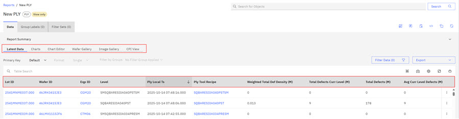
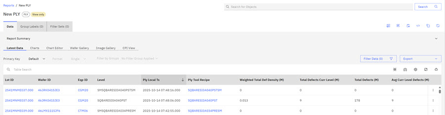
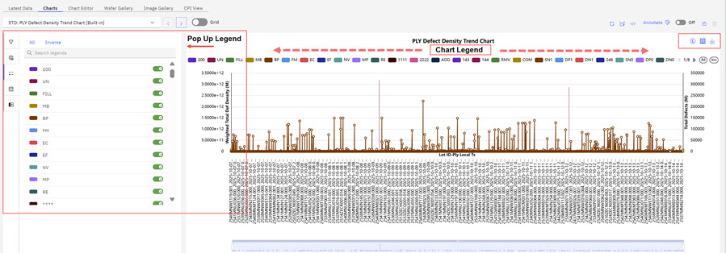
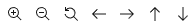
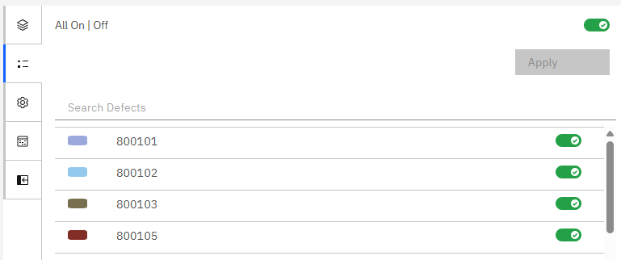
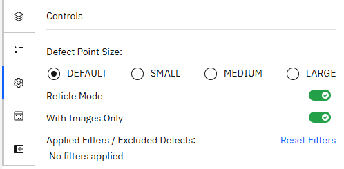
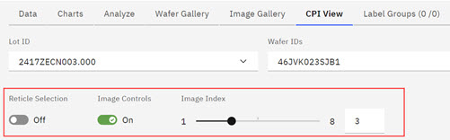
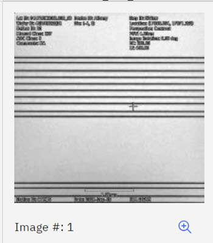
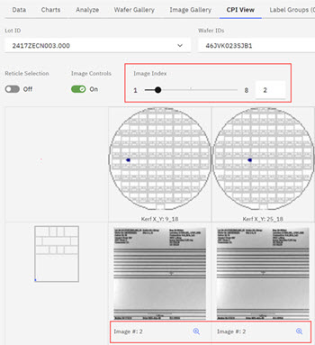

# Reviewing PLY Reports Results

From the Report Landing page, you can view reports that you created and reports that are shared with you,

When you create a report, the report displays on the **Reports & Portfolios** \> **Reports** tab of the ABI landing page, in the folder that was specified in the Define Parameters modal during WIP Report creation. If no folder was specified, the report displays in the default folder, **Created by you**. In the instance that follows, the PLY report is a shared report in the **Public** folder.

Clicking the Report opens the Report Results page displays the following tabs that offer detailed PLY Report information.

-   Latest Data
-   Charts
-   Chart Editor
-   Wafer Gallery
-   Image Gallery
-   Critical Point Inspections \(CPI\) View

The Report Results page also displays the PLY report configuration parameters.

Clicking one of the following tabs located on the Report Results page displays detailed PLY Report information.

|Report Tabs|Description|
|-----------|-----------|
|Latest Data|The Latest Data tab displays the configuration parameters that are used in the PLY report creation. Possible parameters include Lot ID, Eqp ID, Level, PLY local TS, PLY Tool Recipe, Total Weighted Def Density Metric, Total Defect Metric, and Num Wafers Metric. These items represent a sample of possible parameters that might be used to create the PLY report. 

-   Clicking a Lot ID from the Lot ID list opens detailed Lot information related to PLY. See [Lot View](abi_ug_lot_view.md) to learn more about viewing Lot ID information.

|
|Charts|The Default Chart that is configured for this PLY report instance is the PLY Defect Density Trend Chard. This chart is a visual representation of defects that are captured over time - the system generates this chart based on the time ranges in the PLY report configuration. In the legend, each color in the chart represents a Total Weighted Def Density Metric. Not all metrics that are shown here are in every generated chart. Currently available Chart Types:

-   PLY Defect Density Trend
-   PLY Defect Density by Level Chart
-   EBI Trend by Test

To view a Density Metric in isolation in the chart, hover over the density metric color in the legend. The chart changes and displays only that metric in the chart. When you move your cursor off the metric color, the chart returns to its original view. Use your mouse and the horizontal scroll bar \(see red arrow in the following chart\) to expand the chart view. When you expand the chart, the chart expands to two pages. The scroll arrow appears at the end of the density metrics legend, which is outlined in red in the following image.

|
| |Use the PLY Chart drop-down control that precedes the chart to select an alternative chart type, such as the PLY-Density Defects by Lot, or Create a new chart.

Icons that display in the top row above the chart  provide the following actions from left to right, for users: -   **Redraw** - Redraws the open chart.
-   **Edit**- Open Chart Editor tab.
-   **View SQL**- Opens the SQL modal and shows Chart execution SQL commands that are used to retrieve the data for this report. You can download the SQL as a text file.
-   **Annotate** - The toggle turns annotations off and on. When set to on, you can author and view existing annotations. Hover over each annotation tool to see and use its function.

**Note:** After you make annotations, click the **X** to close the annotation toolbar. Closing the annotation toolbar saves the annotation with the annotated chart. You can upload the annotated chart to the portfolio or download as a .png file. When report data refreshes, report data updates but **annotations remain fixed**.

-   **Manage Chart** - Makes the chart structure available as a template.
-   **Add to Portfolio** - Opens a modal where you can select a destination portfolio for the chart.

Icons that display in the following row above the chart 

 provide the following actions from left to right, for users-   Toggles the chart legend above the chart off and on
-   Toggles the Pop Up Chart Legend \(to the left of chart\) open and closed
-   Download as an image downloads the chart as an image.

**Note:** To learn more about Configuring and Viewing Chart options, see [Charts Overview](abi_ug_charts_overview.md).

|
|Chart Editor|The Chart Editor tab gives you the option to build your own chart type, define the X and Y-axis elements, and then define the color and filtering schemes. During chart creation, you can select a specific dataset \(DIM and FACT table\) and then select columns within those tables to build a chart to track those variables.

 

|
|Wafer Gallery|The Wafer Gallery tab opens a view of defect data for entire wafers in a stacked view, top-down visual representation. From the Wafer Gallery, you can click **Add to Portfolio** and **Export**.

 The Wafer Gallery displays Wafers by Defect Type by default. Clicking **Defect Code**, **Care Area Group**, **Ply Test Number**, or **Macrosig** will display these values for the wafer instead.

 The following image shows a stacked wafer view in the Wafer Gallery. A stacked wafer map view can be used to analyze results from multiple wafers visually. Click the **Show Defect Table** icon \(shown outlined in red\) to view the Defect Table in the wafer image. Click **Expand Subtables** to show the Defect Tables for all wafers.

|
| |Click the Wafer to view a scaled view of the individual Wafer. The wafer can be added to your portfolio by clicking **Add to Portfolio** and the current wafer view can be exported to.png by clicking **Export**.

 

|
| ||Wafer Control|Description of Wafer Control|
|-------------|----------------------------|
||The Wafer Control drop down shows changes the information being shown for the currently selected wafer. For example, selecting **Care Area Group** shows defects color coded by their Care Area Group codes.

|
||From left to right, use the controls to: -   Zoom out
-   Zoom In
-   Reset cursor position
-   Move left
-   Move right
-   Move up
-   Move Down

|
||-   Click the **Legend** icon to see the legend for the current Wafer View.
-   Each Defect type can be toggled on or off via the toggle by their name, or in bulk with the **All On \| Off** toggle at the top of the legend.
-   Click **Apply** to update the current Wafer View

|
||-   Click the **Settings** icon to see the legend for the current Wafer View.
-   The defect point size control adjusts the defect size on the wafer. If defects are too close together to view well, use the defect size control to adjust the size of the defects on the wafer.
-   The **Reticle Mode** toggle controls whether or not the Wafer overlay appears. If Reticle Mode is on, the overlay is not shown
-   The **With Images Only** toggle controls whether defectswithout associated images are shown. When the toggle is on, only defects with images appear
-   The Applied Filters setting shows what filters, if any, are active on the wafer. Clicking **Reset Filters** removes any applied filters.

|

|
| |Use the controls or scroll with your mouse to enlarge your view of the wafer, and then click an individual defect within that wafer and view detailed UNC and PLY wafer data. Any images associated with the selected defect will also be shown.

|
|Image Gallery|The Image Gallery tab opens a detailed view of defect data in each Wafer. When the Image Gallery tab opens, PLY Lots display in a list format. Each PLY Lot contains multiple Lot IDs. Images in Lot IDs are categorized by Wafer IDs and then further categorized into Classcodes. 

Click the plus **+** symbol for the Lot ID to open and view all the wafer images within that Lot ID.

Click the plus **+** symbol for a Wafer ID to open and view all the wafer images within that Wafer ID. Click the plus **+** symbol for a classcode to open and view wafer images within that classcode. 

|
| |Within this view, you can click **Copy Classification** to copy the classification code specifics and you can click the **Magnifier** icon for each image to open the PLY spec details modal for that image. Click the hyperlink in the modal to: -   Copy the classification to your clipboard
-   Email the image and classification \(the ABI app recognizes your login and sends the email to you\)
-   Download the image
-   Download PDF \(downloads the classification code and thumbnail of the image\)

Click **Close** to close the modal

|
|CPI View|Clicking the Critical Point Inspection \(CPI\) tab opens a view of a row of wafers within a Lot ID contained in the PLY report. Multiple columns for each individual wafer show images of the PLY Defects on that wafer. The following image shows only one PLY Defect Image column for each wafer due to space restrictions. Generally, multiple columns of PLY Defect Images display for each individual wafer. 

 A row of controls \(drop-down selectors\) precedes and accompanies the CPI wafer and PLY Defect Image view.

Using the drop-down arrow in each category, you can refresh the CPI wafer and PLY Defect Image view by selecting different values for:

-   Lot ID
-   Wafer ID
-   PLY Local TS
-   PLY Local Recipe
-   Equipment ID

Within the CPI view, the controls **Reticle Selection**, **Image Control**, and **Image Index** offer interactive viewing options.

|
| |Toggle **Reticle Selection** control to on to add a Reticle from the **Add Reticle** drop-down menu.

|
| |Toggle **Image Control** to on to view Image information and the **Magnifier** icon. Select the **Magnifier** icon to view the PLY Defect Image modal.

 Slide the **Image Index** control to view more wafer images. In this instance, the slider informs us of the number of sets of images available to view \(2\).

|

**Note:** A **Last Refreshed** message displays in the user interface that indicates the data freshness of the data in the **Report Results** table.

**Parent topic:**[Creating PLY Reports](../ABI_User_Guide/abi_ug_create_ply_reports.md)

