# Portfolios

The Portfolio feature is an organizational tool that can be used to compile and organize ABI assets in the ABI application. Assets within the application include reports, charts, objects, and tracked objects. Each asset that you put into a portfolio contains source content. For example, a report gathers multiple sources of information \(source content\) and presents that information in a structured display. If the source content of an asset changes or is updated outside of the portfolio, the source content in the portfolio updates. The only exception to this rule is the standard chart asset because standard chart assets are copied into the portfolio.

**Note:** Portfolios and the assets within them are not static - assets within Portfolios refresh when the original asset content refreshes.

When you create and name a Portfolio, it appears in the Portfolio tab on the ABI landing page. If you create your Portfolio as private, only you can view and access it. Portfolios are Private by default but you can also designate them as Public. The visibility column within the table displays lock icons for the Portfolio's status, locked \(Private\) or unlocked \(Public\). On the Portfolio Landing Page, you can click the shared editor icon 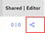 in the table to open the [Sharing Modal](#fig_l11_gff_3cc) where you can designate sharing options and click **Save** if you are the portfolio creator \(owner\).

**Note:** The following portfolio information describes viewing the portfolio in **Table View**. You can view portfolios in two different formats: **Table View** and **Grid View**.

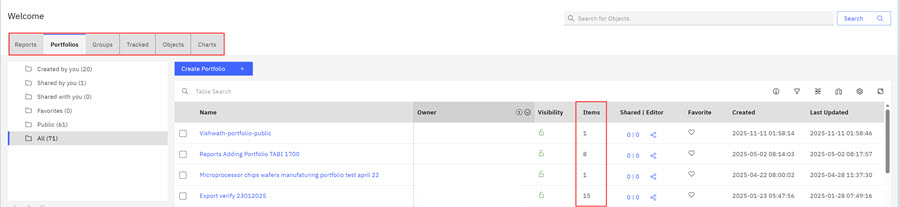

**Note:**

-   You can create and access folders on the Portfolio tab in the portfolio listing table. You can also scroll and view existing Portfolios in the listing table if the lock icon is open indicating it is a public portfolio.

    

-   The **Item** column in the portfolio listing table displays the number of items within each portfolio.

Use the search bar in the table view to search for a particular Portfolio, or click any portfolio name to view its contents if the visibility icon is set to public. In the following example, clicking the **Trying Visibility of Portfolio** portfolio opens the Portfolio page where you can view the portfolio's contents. When the Portfolio Page opens, the name of the asset displays on the portfolio page. The table view lists all the Lot IDs in the WIP Report asset that you are viewing. You can use search to search for a particular Lot ID and you can click any Lot ID to view details about the Lot.

Within the portfolio in Table View, you can use the scrolling arrows next to the **Pages** control to view other assets within the Portfolio.

For example, by using the Pages drop-donwn arrow or the scrolling arrows that you can view other assets that are contained within the portfolio. In the following screen capture, the viewed asset is the **WIP: Advanced Chart Features**. The Pages scrolling arrow becomes disabled when you reach the end of viewable assets within the portfolio.

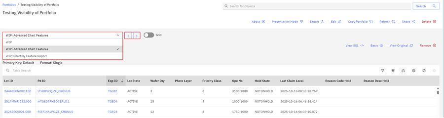

Other available controls on the Portfolio page are listed in the following table.

|Feature|Description|Overlay or View|
|-------|-----------|---------------|
|About|About contains the date and timestamp of the portfolio creation, dates of most recent edit, Description, Access Type, and Visibility - Private \(not Shared\) or Public \(Shared\).|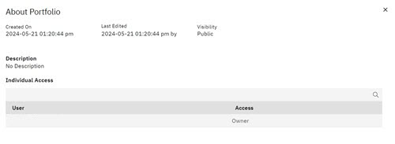

|
|Override|Select a function and Lot ID or IDs to temporarily override assets in the portfolio. Clicking the X by the Override icon to revert to displaying the original assets.|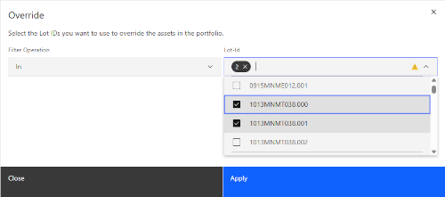|
|Presentation Mode|Click **Presentation Mode** to view the Portfolio without internal controls in the UI. Click **Exit Presentation Mode** to return to Portfolio View.|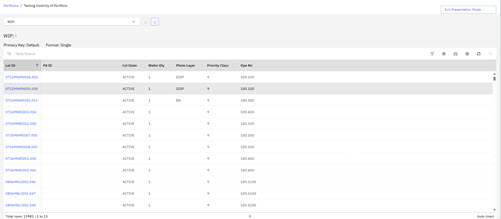

|
|Export|Click **Export** to save the current portfolio as a compressed folder. Only Portfolios can be exported this way while in Table View.| |
|Edit|Click **Edit** to open the Edit Portfolio Modal where you can change the display order of assets or select an asset for removal. Click **Update** to save your changes.|Edit Portfolio is ONLY visible and available if the user has edit permissions for the portfolio. 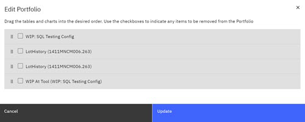|
|Copy Portfolio|Click **Copy Portfolio** to open the Copy Portfolio modal. You can rename the Portfolio and enter descriptive text in the modal. A copy of the portfolio is copied to your Created by Me folder and is listed in the portfolio table.|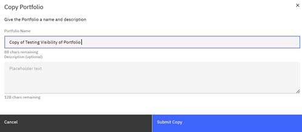

|
|Refresh|Clicking **Refresh** refreshes the content that is contained in the assets of the portfolio.| |
|Share|Clicking **Share** opens the Share modal where you can change the visibility of the portfolio and identify shared users.|Share Portfolio is ONLY visible and available if the user is the creator/owner of the portfolio. Shared portfolios might have restrictions to the shared person due to the nature of the portfolio contents. Shared portfolios might have edit restrictions if the source content is set to private. 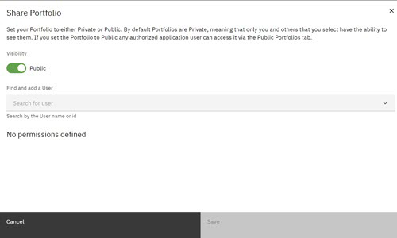

|
|Delete|Clicking **Delete**deletes the portfolio.|Delete is ONLY visible and available if the user is the creator/owner of the portfolio.|

**Note:** Viewing Portfolios. The two ways you can view the assets in your portfolio are using **Table View** and **Grid View**. See the following table to learn more about viewing portfolios.

|Portfolio Views|Description|View|
|---------------|-----------|----|
|Table|Displays assets in tables, with each asset on a separate page. Portfolio table view is the default view. Use the scroll arrow to view all assets.|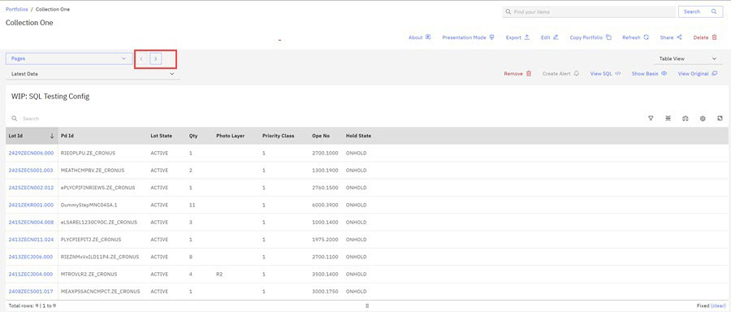

|
|Grid|The Grid view can display multiple portfolio assets simultaneously. Grid view mode offers 1, 2, or 3 assets wide in a grid view. Steps to enable grid view.

-   Toggle Grid View on. Click the down arrow to view the assets in the portfolio. Click the check boxes for the assets you want to view in grid mode.
-   Click the down arrow on the Grid view drop down and select the width of the grid view: 1 wide, 2 wide, or 3 wide. The Grid View displays in the selected width.
-   When viewing two or more assets in grid view, tools such as About, Basis, Comments, etc. are moved to a drop down menu accessible by clicking the blue carrot icon.

|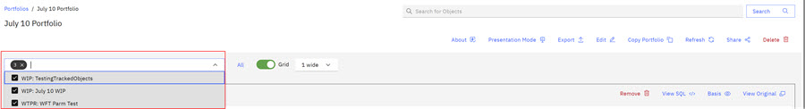

 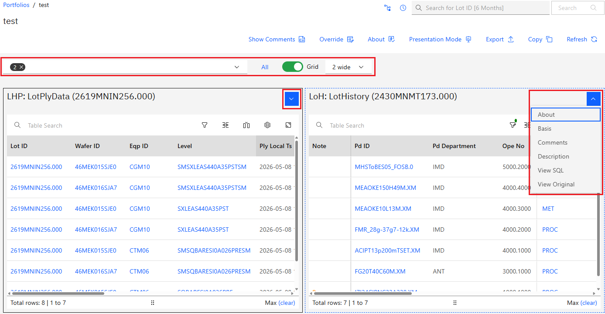

|

On the Portfolio View pages, clicking secondary controls gives you access to learn more about each individual portfolio. Select each individual portfolio to see the information that is directly related to that portfolio. The secondary control actions are outlined in the table that follows.

|Feature|Description|Overlay or View|
|-------|-----------|---------------|
|About|Click **About** to view details about the current asset. This can also be used to leave comments about the asset that can be viewed by others|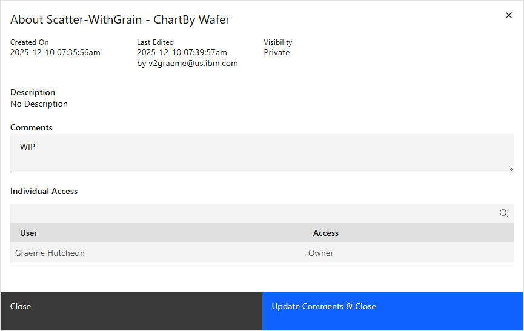

|
|View SQL|Click **View SQL** to view the SQL for each individual report or chart. Each asset has its own SQL.|

|
|Basis|Click **Basis**to view the Basis for each individual report or chart. Each asset has its own Basis.|

|
|View Original|Click **View Original** to open the original asset.|

|
|Remove|Click **Remove** to remove the report or chart from the portfolio.|If you are a portfolio owner, you can remove a portfolio's assets.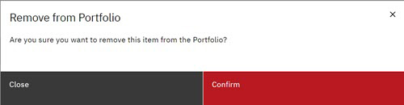

|

-   **[Creating a Portfolio - ABI Landing Page](../ABI_User_Guide/creating_a_portfoliio.md)**  
Using Portfolios, you can categorize and organize all of your ABI assets. Assets within the ABI application include reports, charts, objects, and tracked objects. You are the designer of your workflow and your portfolio can reflect that workflow. In a Portfolio, you can organize all your assets and as a Portfolio owner, share your portfolio with other ABI users, and remove assets that you own using the **Edit** control. You can create and add to portfolios in the ABI application in one of two ways. One way is to create a portfolio on the ABI Landing Page \(Portfolio\). An alternative method is to create and add to portfolios from within an asset: a report, a chart, a tracked object, or an object.
-   **[Creating a Portfolio - Within an ABI Asset](../ABI_User_Guide/creating_a_portfolio_within_an_abi_asset.md)**  
Using Portfolios, you can categorize and organize all of your ABI assets. Assets within the ABI application include reports, charts, objects, and tracked objects. In a Portfolio, you can organize all your assets and as a Portfolio owner, share your portfolio and assets within the portfolio with other ABI users, and remove assets that you own using the **Edit** control. You can create and add to portfolios from within an ABI asset; a report, a chart, a tracked object, or an object.

**Parent topic:**[Reports, Portfolios, and Groups](../ABI_User_Guide/reports_portfolios_and_groups.md)

