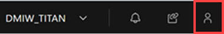
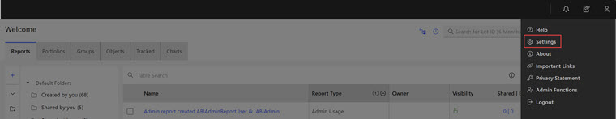
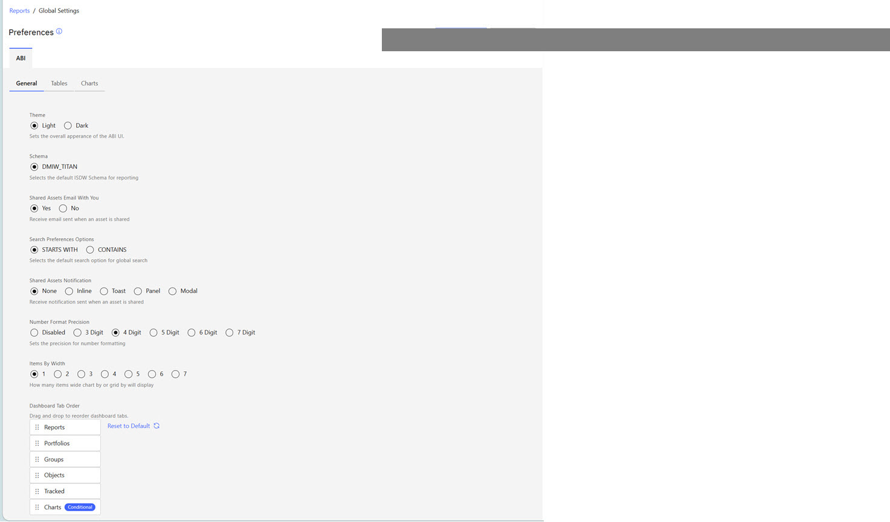
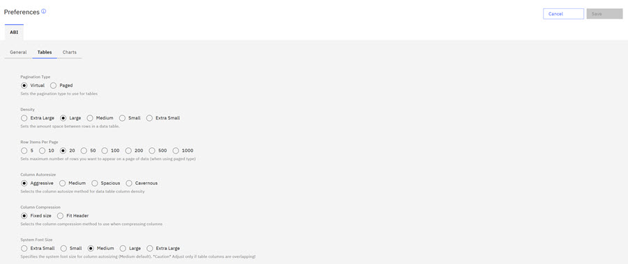
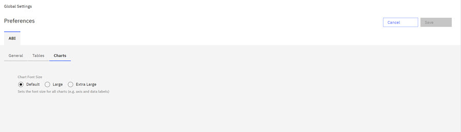

# Global User Preferences

Global User Preferences in the ABI application are preferences that users can select to expand or restrict their access in the application. There are several types of **Global User Preferences**: **General**, **Tables**, and **Charts**.

From anywhere within the ABI application, click the **User Menu Icon**

to open the **User Menu**.

Click **Settings** to open the **Global Settings**. Global Settings opens on the Preferences page. Preferences contain three general settings tabs: **General**, **Tables**, and **Charts**.

**Note:** Click the radio button for each user preference option that you want to change. Click **Save** to save any user preferences changes.

**General**

The General tab settings page controls user interface displays and interactions within the application. The table outlines the impact of the setting.

|General Preferences|Description|Options|
|-------------------|-----------|-------|
|**Theme**|The Theme controls the overall appearance of the ABI UI.|Click either the **Light** or **Dark** option.|
|**Schema**|The schema controls your access to database information within the Data Warehouse \(Data Warehouse\). Schemas control access and security.|Click **Schema Name**.|
|**Shared Assets Email with You**|Receive a notification when an asset is shared with you.|Click **Yes** to receive a notification when an asset is shared.|
|**Search Preferences Options**|Selects the Default Search Option for global search.|Click **Starts With** or **Contains** to select a default search option for global search.|
|**Shared Assets Notification**|Receive a notification sent when an asset is shared.|Click one of the following options. -   None
-   Inline
-   Toast
-   Panel
-   Modal

|
|**Number Format Precision**|Sets the precision for number formatting.|Click one of the following options. -   Disabled
-   3 digit
-   4 digit
-   5 digit
-   6 digit
-   7 digit

|
|**Items by Width**|Sets the number of items that display horizontally within a table row or in a UI display.|In the ABI application, users can set the number of items to display horizontally from one to seven.|
|**Dashboard Tab Order**|Drag and Drop to reorder dashboard tabs on the ABI Landing Page|User can rearrange the tab order of the ABI reporting areas on the ABI landing page by using drag and drop. Reordering displays only for the user initiating the change. Only **Chart Admins** Users can access or reorder the Chart Tab. Click **Default** to return to original tab order. Tab order preference persists across browser sessions and page refreshes.|

**Tables**

Click the **Tables** tab to view the **Table User Preferences** options.

The **Table** preferences are listed here in this table. Click an option to select it.

|**Table Preferences**|Description|Options|
|---------------------|-----------|-------|
|**Pagination Type**|Sets the pagination type to use for tables.|Click one of the following options. -   Virtual
-   Paged

|
|**Density**|Sets the amount of space between rows in a data table.|Click one of the following options. -   Extra Larger
-   Large
-   Medium
-   Small
-   Extra Small

|
|**Row Items Per Page**|Sets the maximum number of rows that you want to appear on a page of data when you are using Paged type.|Click one of the following options. -   5
-   10
-   20
-   50
-   100
-   200
-   5000
-   1000

|
|**Column Autoresize**|Selects the autosize density for data table columns.|Click one of the following options. -   Aggressive
-   Medium
-   Spacious
-   Cavernous

|
|**Column Compression**|Selects the column compression to use when compressing columns.|Click one of the following options. -   Fixed size
-   Fixed Header

|
|**System Font Size**|Select to indicate the font size your system is using. Adjust the size if table columns overlap in the UI. **Important:** This setting adjusts the column widths to accommodate the font used in your browser. Changing this setting when table columns are displaying properly can cause them to display incorrectly.

|Click one of the following options. -   Extra Small
-   Small
-   Medium
-   Large
-   Extra Large

|

**Charts**

Click the **Chart** tab to view the **Chart User Preferences** options.

The Current **Chart** preferences are listed here in this table. Click an option to select it.

|**Chart Preferences**|Description|Options|
|---------------------|-----------|-------|
|**Chart Font Size**|Applies the selected font size to the chart.|Click a radio button to choose a font size. -   Default
-   Large
-   Extra Large

|

**Parent topic:**[Application elements](../ABI_User_Guide/abi_ug_navigation.md)

