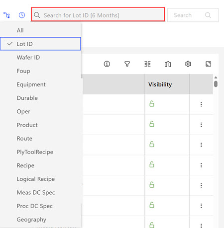
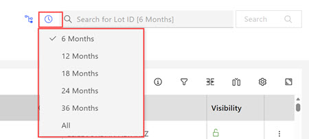
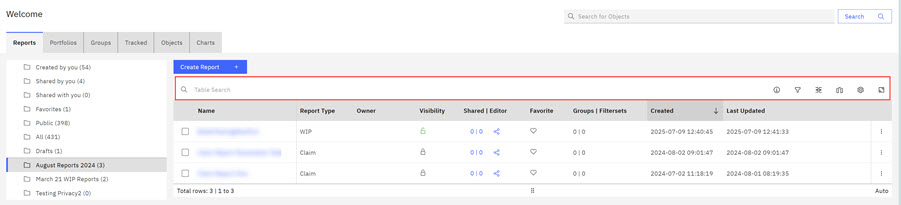
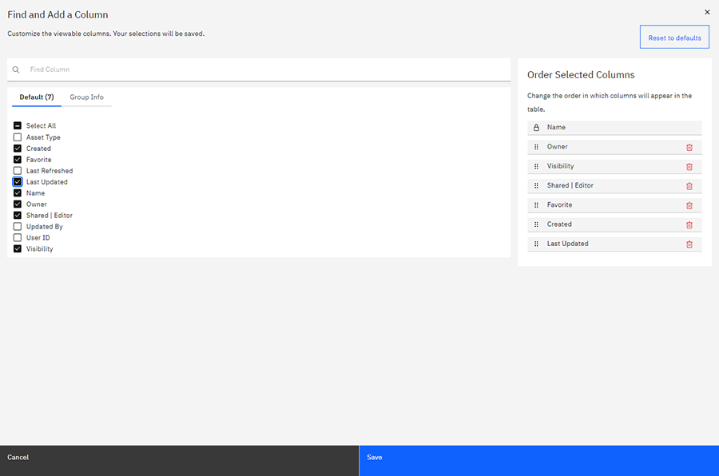
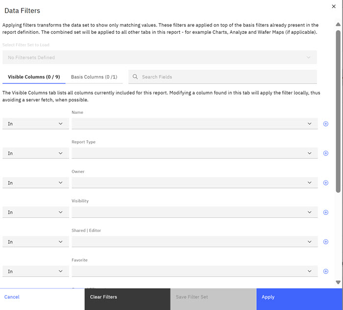

# Search bar

The Search Bars are useful tools for ABI users. Each search bar searches a designated area within the application. Search types are Global, Data Grid, and Column Search.

The **Global Search** bar is visible on every tab in ABI, and sits at the top level of the ABI application. The Global search function searches throughout the application and remembers the most recent twenty searches. Click in the Search Box to view the most recent searches.

Enter a string into the bar's text box and click **Search**. The search results open a new page with a list of matching strings.

**Note:**

Global Search now includes a **Scope Selector**, **A Case Insensitive Contains Operation**, and a **Time Frame** that links directly to the database that supports wildcarding.

The **Scope Selector** and the **Time Frame** selector works along with global search to focus search results and supports the **Case Insensitive Contains Operation**. **Wildcarding** is also supported.

Select the drop-down arrow in the scope selector to view potential focus options.

-   All
-   Lot ID
-   Wafer ID
-   FOUP
-   Equipment
-   Durable
-   Oper
-   Product
-   Route
-   PLY Tool Recipe
-   Recipe
-   Logical Recipe
-   Meas DC Spec
-   Proc DC Spec
-   Geography

**Wildcarding**

How it works. If a user wants to find lots using a Lot ID, use the **Lot ID** scope; if a user wants to find a PLY tool recipe, use the **PLY tool recipe** selector. There is a roll-up scope that is called **ALL** that applies all of the text that is provided in the search to all of the defined scopes. A main feature of this search is that it applies a case‑insensitive contains operation directly to the database that supports wildcarding. For example, to find a Lot that has specific characters, say 845 in it somewhere, the user can enter 845. If the Lot contained 845 and other characters, XYZ, the user might use 845%xyz as the % character \(%\) matches any number of characters \(so wild\), the underscore \(\_\) matches any single character and the AT sign \(@\) is an escape for the previous two characters \(% and \_\). So, 845%xyz matches any string containing 845 and then containing xyz somewhere later. However, the string 845@%xyz matches only 845%xyz, explicitly. The search is only focused on the item in the scope field, not across arbitrary columns. The **Time Frame** selector can also be used along with the preceding search scope.

In the following example, a **Wafer ID** is selected in the drop down and the specific string that is contained within the **Wafer ID** is entered into the search field. The search is going to match the string **46LW%SJA1** string to wafers within this report. User inputs the string and clicks search. The search returns the requested wafers.

The **Data Grid** searches within each different functional tab. All **Data Grid** searches support **Case Insesitive Contains Operation** as previously described. Selecting a functional tab such as **Reports**, **Portfolios**, **Groups**, **Objects**, **Tracked**, and **Charts** displays a search function for each functional area. For example, selecting **Reports** opens the Reports section and displays the Data Grid Search for Reports. You can input a search string and search for any data field within the Reports.

Column Search For both types of Search bar, the results can be further adjusted by using the Filter and Manage Columns options to the right of the search bar.

Clicking the **Manage Columns** icon on the table bar menu within any of the functional areas **Reports**, **Portfolios**, **Groups**, **Objects**, **Tracked**, and **Charts** opens the Find and Add a Column window. You can use the Find Column search to find the available columns within this functional area.

You can also add or remove Columns to the table. Check or clear the boxes and click **Save** to add or remove columns from the table. Any added columns are automatically searched for relevant results.

**Note:** Added and Removed columns are applied per sub tab but are preserved. To restore the default columns, click **Restore to Default** in the Find and Add a Column window.

Clicking the **Filter** icon on the table bar menu opens the Data Filters window.

Filters for each Column can be applied to further narrow down search results. Each Column has its own operators and selection options, like the date range, recency, and relative range options for the Created column. Setting a filter and clicking Apply adds those filters to the table. To see what filters are applied to the current table. click the number at the upper left of the table, and click Clear Filters to remove them. See [Filter Sets](abi_ug_filer_sets.md) for more information on filter sets.

**Note:** See [Components of a table](abi_ug_table_components.md) to learn more about **Sticki and Locked** columns. Results are only for the current functional area, and navigating away will null the search parameters and any filters.

**Parent topic:**[Application elements](../ABI_User_Guide/abi_ug_navigation.md)

