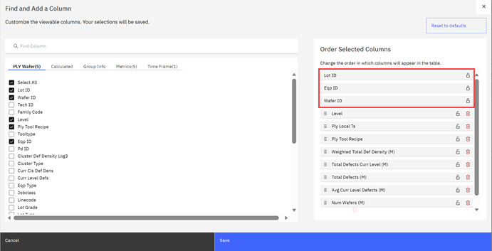
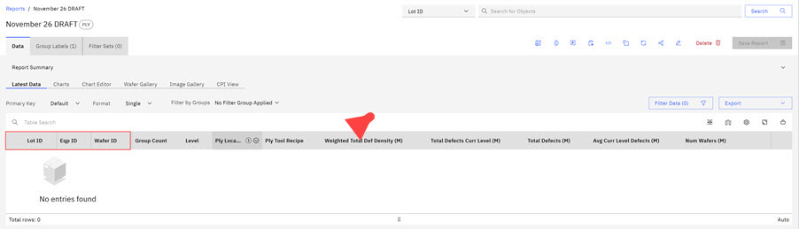
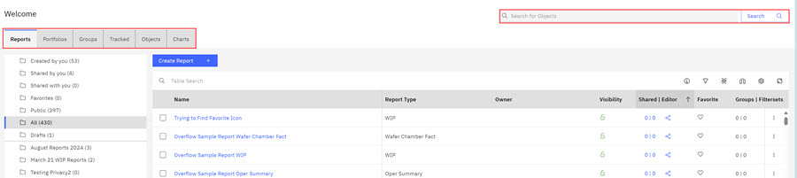
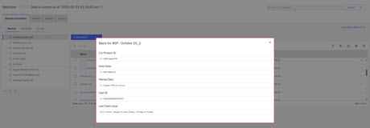

# Components of a table

On the ABILanding Page, tabs on the landing page represent the different query and organizing functions in the ABI application. **Reports**, **Groups**, **Tracked**, and **Objects**, are query functions within the application. **Portfolio** is an organizing function in the ABI application.

**Note:** If authorized and configured by your site administrator, a **Chart** tab is visible. See [Charts Overview](abi_ug_charts_overview.md) for more information.

**Reports - Sticki and Locked Columns**

**Sticki Columns**

-   Clicking a query function tab opens the information for that query tab in a table format. For example, clicking the **Reports** tab opens the report information in a table format. Report tables, however, have a **sticky column**. The **sticky column** remains visible at the edge of the screen as a user horizontally scrolls through the table columns.

-   For example, when creating a report that the query, returns the requested parameter values in a table format. In the following table, the **Lot ID** is the **sticky column**. A user can scroll horizontally to see all visible columns, with the **Lot ID** remaining stationary.

**Locked Columns**

-   ABI users can now use the **Locked Columns** feature in **Reports**, **Portfolios**, **Groups**, **Tracked**, and **Objects**. Using **Manage Columns**, users click the lock icon to lock or unlock a column. Locking a column positions the locked columns as the first column header in the report.
-   To lock a column, open any of the function tabs. This example shows a Report. Click the **Manage Columns** icon in the table header to open the **Find and Add a Column** modal.

    

-   Click the lock icon for the columns you want to lock. The lock icon changes from the unlocked icon to the locked icon. To unlock columns, click the locked icon to change the lock icon to unlocked.

    **Note:** The locked status of each column is independent and each column has its own default setting. If multiple columns are locked and you want to unlock one column, select only that column and unlock it.

-   Click **Save**.
-   The locked columns now display as the first columns in the table.

    

**Note:** The locking feature is only available in tables that have the single format. To learn more about table and data formats, see [Formatting Latest Data table in report results](reformat_table_data.md)

**Search Bar and Icons**

-   The following **Report** page is shown to demonstrate the search bar and icon locations.

-   A search box and a row of icons provide alternative table viewing options. You can use the Search box to search for specific Reports.

The following table outlines the functions of each of the icons in the menu bar, available for all columns in the table.

|Icon Images|Description|
|-----------|-----------|
|

|Clicking the information icon directs users to the Reports section in theABI User Guide where users can learn all about Reports, Portfolios, and Groups.|
|

|Clicking the **Filter** icon opens the Data Filter Modal. In the modal, you can select a filter options for any columns in the table. Click a drop-down arrow to select a filter option in the Visible column sections, complete the name field, and click **Apply**. The table is filtered by using the selected filters, in this case the report type. The following image shows **claimreport** as the selected filter and the table is filtered by this report type. If a filter is set on a table, a green dot displays next to the **Filter** icon. Click **Save Filter Sets** to save the filter set or **Clear Filters** to clear all filters.

See [Filter Sets](abi_ug_creating_filter_sets.md) to learn more about how to use filter set within ABI reports.

|
|

|Clicking the **Compress Columns** icon compresses the columns. Clicking the **Compress Columns** icon again returns the columns to the original size.|
|

|Clicking the **Manage Columns** icon opens the Find and Add a Column modal. To learn more about organizing your work, see [Manage Columns](abi_ug_table_operations.md). You can configure the **Favorite** heart icon and add columns using **Manage Columns**. See [Configuring Table Columns and Activating the Favorites Icon](abi_ug_table_operations.md) and [Customizing Table Columns](customizing_report_table_columns.md).

|
|

|Clicking the **Row Settings** icon opens the Row Setting modal. You can click row size: Extra large, large, medium, small, and extra small.|
|

|Clicking the **Maximize** icon maximizes the ABI UI to full screen. Reselecting the icon returns the UI to its original size.|

**Note:** You can **Reorder** any column within the ABI application by hovering over each individual column, and selecting the sort order, ascending or descending.

Tables in ABI consist of the following components that are shown in the following list.

-   Search Bar – allows for searching within the currently selected table
-   Items Per Page – controls how many rows are displayed on each page
-   Number of Items – Shows the total number of rows of data and which ones are displayed
-   Number of Pages – Shows the total number of pages and which page is displayed
-   Table Contents – the relevant data within the table
-   Icons
    -   Filter – customize the rows displayed based on a set of criteria
    -   Manage Columns – Control the order in which the columns are displayed
    -   Customize Columns – Select which columns of data are included in the table
    -   Row Settings – Select the preferred row height
    -   Maximize Table – Maximize the table display area

On the ABILanding Page, a search bar displays where you can initiate a search across the entire ABI application. This search bar retains a list of recent searches.

**Note:** A vertical ellipsis displays at the end of each table row. Clicking the vertical ellipsis opens an action popup-labeled **Basis**. Click **Basis** to view the Report Basis. The **Basis** captures the parameters that are used to create reports. You can also view the **Basis** overlay within reports. See [Reviewing WIP Reports](abi_ug_wip_reports_results.md) for more information.

**Parent topic:**[Tables](../ABI_User_Guide/abi_ug_tables_container.md)

