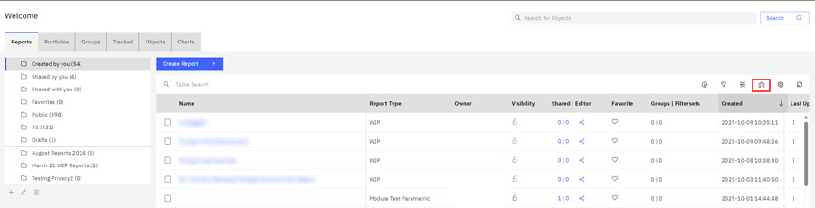
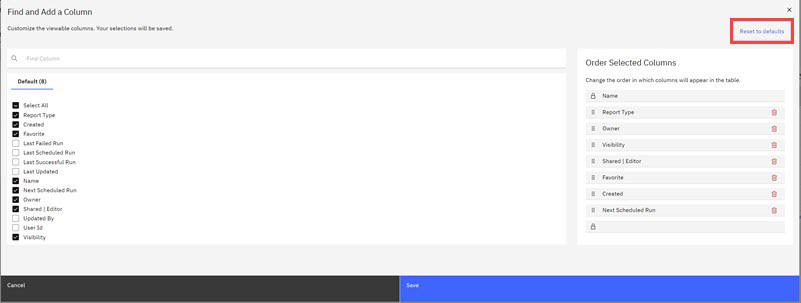
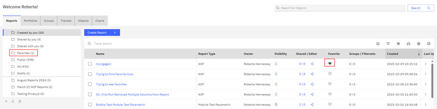

# Configuring Table Columns and Activating the Favorites Icon

Because the ABI application displays information in a table format, you can use the **Manage Columns** function to design a table column format that meets your needs quickly and efficiently. The **Manage Columns** control gives you control over which table columns display and the order in which they display in your tables. On the ABILanding page, or in any reports or portfolio table, click the **Manage Columns** icon to change the table column format.

-   **Note:** The **Manage Column** function is available for tables in **Reports**, **Portfolios**, **Groups**, **Tracked**, and **Charts**, and in the **Admin Function**. Each report area is considered a separate instance and tables in each report area must be configured separately.

The **Find and Add a Column** modal opens.

Columns presently visible in your table display are listed in the **Default** section with checked boxes. These same columns are listed in the **Order Selected Columns** section. Control visibility by selecting or deselecting a check box. Use your cursor to change the column display order. Click **Save** when your changes are complete. You can also click **Reset to Defaults** to restore the column defaults. Column order configured for a report is saved with that report and does not override default column order.

**Note:** To learn more about how ABI users can customize column views in Report tables. see [Customizing Table Columns](customizing_report_table_columns.md).

**Note:** **Favorites Heart Icon** The Favorites heart icon can be configured to be active in the report table views for **Reports**, **Portfolios**, and **Tracked**, and **Charts**.

When the heart icon is visible in a table, in a report or portfolio view, clicking it automatically adds that report \(or portfolio\) to your Favorites folder.

To remove the report from the Favorites folder, click the heart icon in the table report view and the report returns to its original folder location.

**Parent topic:**[Tables](../ABI_User_Guide/abi_ug_tables_container.md)

