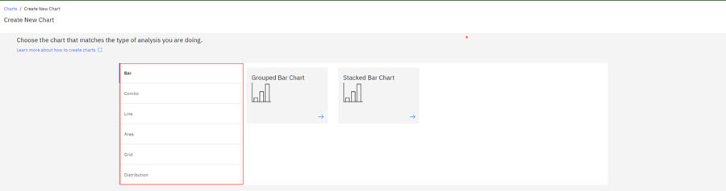
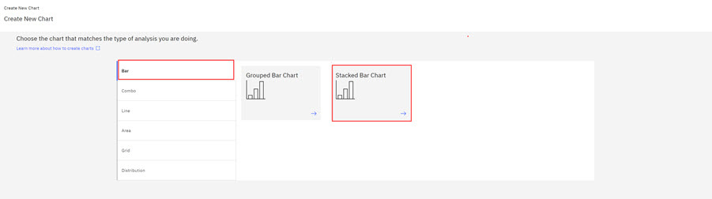
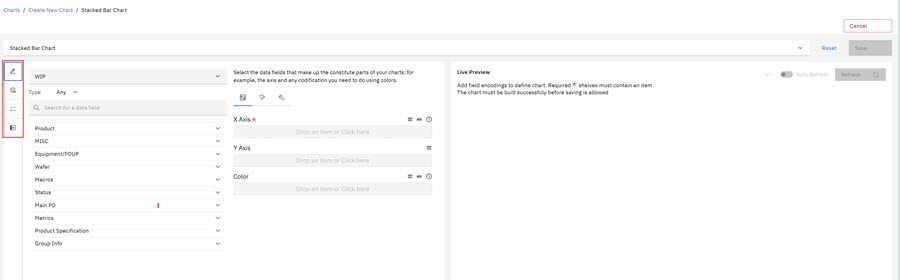
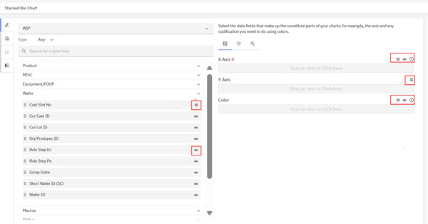
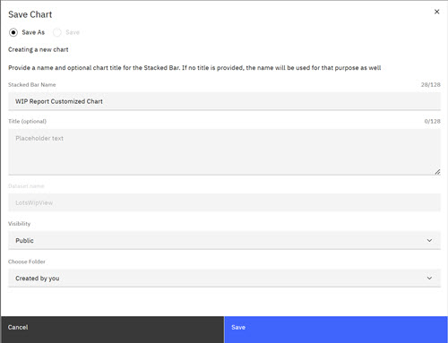

# Creating Global Customized Charts

Global customized charts are charts that ABI **Chart Administrators** can configure for any report in the ABI application. **Chart Administrators** can create, save, and elevate customized charts for global use in reports as standard charts and as templates.

Only **Chart Administrators** who own the charts can create and elevate **Global Customized** charts for template use in reports. Charts intended to be elevated **must be designated Public**.

chart admin can unelevate any chart.

1.  Click the **Create Chart** control on the Charts page. The Create New Chart page opens.

    

    The Chart Creation page shows the available chart types. See [Charts Overview](abi_ug_charts_overview.md) for information on chart types.

2.  **Select** the main chart type and a subtype if one is available. In the following image, the Stacked Bar chart is selected.

    

3.  Click the **Stacked Bar Chart** report type. The Stacked Bar Chart configuration page opens.

    **Note:** You can select a different chart type if necessary. Select the drop-down arrow on the chart type and select a different chart type.

    

    On the Stacked Bar Chart creation page, each vertical icon opens providing access to chart creation and viewing options. See the following table.

    

    |Icon|Function|Description|
    |----|--------|-----------|
    ||Authoring|Authoring icon opens the default Chart Customization section.|
    |

|Controls|Opens various chart enhancements controls. You can toggle and off to invert or enable the X and Y axis, control the zoom sliders, set minimum and maximum X and Y axis, adjust symbol size, and enable auto scale, log scale, continuous line, and chart sizing. 

|
    |

|Legend|Opens two sections. **Legends** and a **Live Preview**.|
    ||Data|Opens the chart Data panel, where you can view and search the data used to create the chart.|
    |

|Collapse Control|Opens expanded **Live Preview** section.|

4.  Click the **Pencil \(edit\)** icon to open the Chart Authoring Tools section.

    The first column on the Chart Creation page displays the report type and the data field categories that correspond to the selected report type. The default report type is WIP in the following image, but you can select another report type from the drop-down arrow. The second column on the Chart Creation page shows the configuration columns for the X and Y axis and color chart attributes. The third column is the **Live Preview** that shows a live preview of the attributes you configured for your chart when you select **Refresh**. The **Refresh** control is not active if no chart attributes are chosen.

    

    You **Design** your chart by selecting the report attributes from the data categories that map to the information you want to visualize. For example, to see the status of wafers in lots, select the corresponding attributes from the appropriate categories and add those attributes \(Lot ID, lot, wafer, and status\) to build your chart. In the following image, the Product, Misc, Equipment/FOUP, are all category types related to WIP Reports. You design your chart by selecting attributes for each configuration column. The third column is the **Live Preview** that shows a live preview of the attributes you configured for your chart when you select **Refresh**. The **Refresh** control is not active if no chart attributes are chosen.

5.  Click the **caret** to open each data field section to select the attributes for your chart. Each attribute has a type designation icon that displays in the first column: alphabetic \(abc\), numeric \(\#\), or time \(time icon\). In the second column on the Chart Creation page, each chart data field lists a range of attribute type designations that the field accepts. Click a data field to view its attribute type.

    

    The following screen capture shows that the **X-Axis** data field accepts alphabetic \(abc\), numeric \(\#\), or time \(time icon\) attributes. The **Y-axis** data field accepts only numeric \(\#\). The Color data field accepts alphabetic \(abc\), numeric \(\#\), or time \(time icon\) attributes.

    

6.  Click the **caret** on the Product data field to open the attributes. Click the Lot ID attribute and drag it to the X Axis.

    

    Click the **caret** on the Wafer data field and click the Wafer ID attribute and drag it to the Y Axis. When you drag the Wafer ID, the Tool Modal opens. Because the data field wants a numeric in the Y Axis, the system prompts you and asks how to aggregate the data because it needs a numeric value. **Select** Aggregate by count \(so the system now recognizes it as a numeric\) and Sort by Ascending. **Click** Apply. The Wafer ID now aggregates by Count and Sorted by Ascending.

    

7.  Click the **caret** on the Status data field, click the Status Hold State Attribute, and drag it to the Color data type.

8.  Click **Refresh** to generate a live preview of your chart. Use the scroll bar underneath the Live Preview to see a close up of the data in each Lot.

    Icons in the second column of the Create Chart page are:

    -   Channel Encoding - Click this icon to open the configuration shelves for the chart values. Configuration shelves accept attributes of number, string, and timestamps attributes within data types.
    -   Filters - Select filters \(attributes\) to use as a filter to generate a temporary alternative chart visualization. Filter fields accept attributes of number, string, and timestamps. This chart visualization is **TEMPORARY** and is not saved when the chart is saved and is intended to be a visual aid only.
    -   Chart By Setting - Select columns \(attributes\) from the data type attributes. When a report generates, these attributes become the columns in the report. See [Viewing Report Charts - Advanced Options](viewing_charts_advanced_options.md) to learn more about the Chart By Setting.
    **Note:** You can select the **Filter** icon and select attributes to generate a temporary alternate chart visualization. Filter fields accept attributes of number, string, and timestamps. This temporary chart visualization is **NOT** saved when the chart is saved and is intended to be a visual aid only.

    

    **Note:** During Chart creation, if the ABI application [Application Refresh](abi_ug_error_msg.md)notification displays prompting you to refresh, **Save**, your chart before refreshing. If you refresh, this action refreshes \(removes\) the data you configured for your chart if the chart is not saved.

9.  Click **Save**. The Save Chart modal opens offering a **Save** and **Save As** option. Complete the fields in the modal. The **Chart Type Chart Name** is the name that displays on the ABI dashboard, the **Title \(required\)** field is the Chart Title that you want to display above your chart. Select the **Visibility** type for your chart \(Private or Public\) and select the folder location for your chart. Chart intended to be elevated **must be designatied Public**.

    

    The newly created chart displays.

    

    Chart creation tool icons are available for use on the completed chart. You can also use the following actions that are shown above the chart:

    -   Edit
        -   Clicking **Edit** on a completed and Saved Chart re-opens the Chart Editor. Make editing changes to update the existing chart and re-save the chart.
    -   Copy Chart
    -   Elevate \(Restricted to users with **Chart Admin User Permission** privilege.
    -   Share
    -   Delete
    -   View SQL
    -   Annotate \(toggle and off\)
    -   Add to Portfolio \(You must be a chart owner or designated owner.\)
    **Note:**

    Icons that display within a chart provide the following actions for users \(from left to right\): 

    -   Toggles the legend off and on \(Processing and Wait
    -   Expand the Chart Controls \(legend\) on the left side of the chart
    -   Download the chart as a .CSV file
    -   Open the Data view for a more detailed breakdown of the chart
    -   Download the chart as an Excel spreadsheet file
    -   Download the chart as an image
10. Click the **Charts** in the bread crumb to return to the Charts dashboard and your chart is in the folder location you designated. If no folder is designated, the Chart is saved in the default folder, **Created by you**.

    

-   **[Elevating Global Customized Chart](../ABI_User_Guide/elevating_global_customized_chart.md)**  
ABI users with **Chart Admin** user permission, **Chart Administrators**, and can create and save charts as stand-alone templates or elevate the saved charts as default report charts for expanded use in ABI reports. Use the following steps to create a template for stand-alone use or for elevation.

**Parent topic:**[Charts Overview](../ABI_User_Guide/abi_ug_charts_overview.md)

