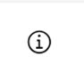
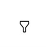
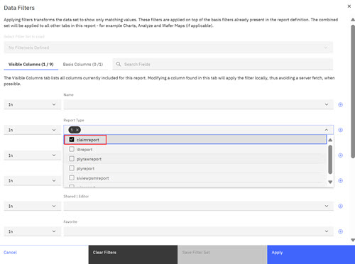
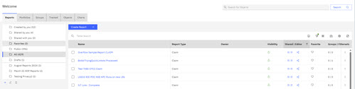
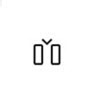
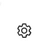
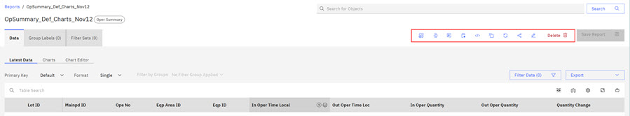
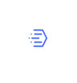
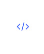

# Reports - Creating and Managing

On the ABI Landing page, you can create and configure interactive reports to track the manufacturing of wafers throughout the manufacturing process. Using these reports you gain access to data from the Data Warehouse \(Data Warehouse\) as wafers are being processed. Users can create, save, and review reports. During report creation, **Field Validation** validates lots that are chosen for the report against existing lots in Data Warehouse to verify data integrity.

Reports in the ABI application monitor, review, and collect data on chips at different stages during the manufacturing process. Each report category gives users the ability to gather different types of information at different manufacturing phases. Report categories provide access to a subset of related reports that give ABI users the ability to create reports that focus on different manufacturing and measurement data within that category. The following table lists the report categories, and the report types associated with each category.

|Report Name|Description| |
|-----------|-----------|--|
||Admin Usage|The Admin Usage report provides a summary of user access to the application in a specified period of time. The report includes user names, email addresses, login count, page views, and last date and time of access. **Note:** Only Admin users can create and view Admin Usage reports.

|
|**ILT**| | |
| |ILT|The ILT Report provides Inline Electrical Test data summary reporting - Wafer level yield data and their summaries.|
| |ILT raw|The ILT Raw Report provides Inline Electrical Test data that is captured at the site for which it was tested enabling Geography analysis.|
|**Logistics**| | |
| |Claim|Claim reports retrieve the logistic Claim history for the set Basis, which might be pieces of equipment, a set of lots or lots through and operation.|
| |Equipment State|Equipment State reports track the Equipment E10 states to enable review of how long a tool spends in Production vs Standby|
| |Operation Summary|The Operation Summary report provides a single row summary for a lot at an operation once the lot has completed the PD\_ID.|
| |SiView PSM|The SiView PSM Report is a comprehensive report that focuses on SiView Plan Split Merge \(PSM\) information to show which Wafers were part of which Cell for an experiment.|
| |WIP|WIP Reports present the current logistics \(SiView\) information about the lots in the manufacturing line. A single row is returned with the most current position for the lots in the Basis.|
| |Wafer Chamber Fact|The Wafer Chamber Fact Report tracks and lists the data from the **WAFER\_CHAMBER\_FACT** table that shows the details of how a wafer moved through a piece of process equipment and chambers, if applicable.|
|**Measured**| | |
| |Measured|The Measured Report contains measurements recorded on a measurement tool between processing steps. The report focuses on the data that is collected across the lot and wafer.|
| |Measured Raw|The Measured Raw Report contains access to the data collected at a raw number / site level. Multiple measurements are collected per Wafer and tied to a Geography key to allow spacial analysis.|
| |Measured String|The Measured String Report extracts the nonnumerical data that is collected at a measurement step.|
| |Measured Raw String|The Measured Raw String Report extracts the nonnumerical site data that is collected at a measurement step.|
|**Module Test**| | |
| |Functional Raw|Functional Raw Report provides PASS / FAIL results that are recorded at the chip level for tests that exercise chips logic.|
| |Parametric|The Parametric Report provides wafer summary statistics of the Raw parametric data, which is calculated to the Wafer level for bulk report reviews.|
| |Parametric Lot Summary|The Parametric Lot Summary Report provides a whole lot summary that combines all of the modules in the tested lot.|
| |Parametric Raw|The Parametric Raw Report provides parametric measurement data at the chip level that is collected to understand the functions of the parts, currents, voltages, and related data.|
| |Sort Lot Summary|The Sort Lot Summary Report provides the Sort bin counts for all the modules in the tested lot.|
| |Sort Raw|The Sort Raw Report provides detailed Results to the Chip Level of the SORT assigned to each chip, the SORT providing the type of PASS or FAIL assigned to that chip.|
| |Sort Yield|The Sort Yield Report is one of the most important wafer test reports. Provides an Overall Lot or Wafer Yield review from the SORT data that is collected for the products of interest.|
|**PLY**| | |
| |PLY|PLY Reports enable the review of PLY defect data summaries of key metrics and provide high-level standard analysis tables and charts.|
| |PLY Raw|The PLY Raw report enables retrieval of defect counts of PLY wafers, notes the PLY recipe, and focuses on the Defect Count Metric.|
| |PLY Human Fine|The PLY Human Fine Report extracts the ClassCode summaries for the distributed Unclassified Defects, which are used in the Weighted Defect Density-stacked bar chart.|
|**Processed**| | |
| |Processed|The Processed Report focuses on the data that is collected at a Process Step. This view enables access to that data collected for the Lot or the Wafer.|
| |Processed Raw|The Processed Raw Report contains access to the data collected at a raw\_number/site level. Multiple process parameters measurements can be collected per Wafer and tied to a Geography key to allow spacial analysis.|
| |Processed String|The Processed String Report extracts the nonnumerical data that is collected at a process step.|
| |Processed Raw String|The Processed Raw String Report extracts the nonnumerical site data that is collected at a process step.|
|**Wafer Test**| | |
| |Functional Raw|Functional PASS / FAIL results that are recorded at the chip level for tests that exercise chips logic.|
| |Parametric|Wafer summary statistics of the Raw parametric data, which is calculated to the Wafer level for bulk report reviews.|
| |Parametric Raw|The Parametric measurement data at the chip level that is collected to understand the functions of the parts, currents, voltages, and related data.|
| |Sort Raw|Detailed Results to the Chip Level of the SORT assigned to each chip, the SORT providing type of PASS or FAIL assigned to that chip.|
| |Sort Yield|Most important wafer test report. Overall Lot or Wafer Yield review from the SORT data that is collected for the products of interest.|
|**Correlation**|Correlation Report|Correlation Reports give ABI users the ability to correlates \(compare\) dataviews for two different report types and presents the information in a column view.|

The ABILanding page offers you various methods to investigate data in the Data Warehouse. You can easily categorize your reports by using foldering options. See [Creating and Organizing with Folders](abi_ug_folder_management_procedure.md).

For example, you can click any of the following tabs on the ABILanding page to access data within Data Warehouse.

|Tabs|Description|
|----|-----------|
|Reports|Reports track different aspects of the manufacturing process. Users can define which Lots and the parameters within those Lots they want to track and create a report that reflects the targeted information. Reports have their own separate, independent foldering sections.|
|Portfolios|Portfolios are an ad hoc construction of user-defined data points from various locations in the app, including but not limited to reports. The Portfolio feature is an organizational tool that can be used to compile and organize ABI assets in the ABI application. Assets within the application include reports, charts, objects, and tracked objects. Each asset that you put into a portfolio contains source content. If the source content of an asset changes or is updated outside of the portfolio, the source content in the portfolio updates. Portfolios have their own separate, independent foldering sections.|
|Groups|Groups are customized groupings of Lot IDs. Creating creating customized groups provides insights into wafer production during the manufacturing, claim, and PLY processes. Groups have their own separate, independent foldering sections.|
|Tracked|The tracked function allows users to manage sets of common objects and quickly access them by using tracking. Click **Track Object** on the object's details page. Selected objects appear on the Tracked tab in the ABI UI. Tracked has its own separate, independent foldering section.|
|Objects|Objects include a detailed data view of Lots, Wafers & Chip sets, Product IDs, Routes, Rapes, and PD IDs.|
|Charts|Charts contain a separate, independent foldering section and an Analyze section. In the Analyze section, ABI users can create customized chart templates. These customized chart templates can be created for any type of available chart and designated to be used with any ABI report type. Templates are stored for reuse in the Chart foldering section. Customized templates are available for use within the ABI application and can be accessed when users create reports and want to view report results in a chart view.

|

**Note:** Except for the **Information** and **Filter** icon, these icons outlined in this first table repeat above each report table. The information icon displays only on the ABI Report Page, and the Filter icon becomes a drop-down Filter selector within each individual report.

Clicking the Report tab, displays a row of icons that provide users additional features that can be used to change how table information displays.

|Icon Images|Description|
|-----------|-----------|
|

|Clicking the information icon directs users to the Reports section in the ABI User Guide where users can learn all about Reports, Portfolios, and Groups.|
|

|Clicking the **Filter** icon opens the Data Filter Modal. In the modal, you can select a filter options for any columns that are exposed in the table. Click a drop-down arrow to select a filter option in the Visible column sections, complete the name field and click **Apply**. The table is filtered by using the selected filters, in this case the report type. The following image shows **claimreport** as the selected filter and the table is filtered by this report type. If a filter is set on a table, a green dot displays next to the **Filter** icon. Click **Save Filter Sets** to save the filter set or **Clear Filters** to clear all filters.

See [Filter Sets](abi_ug_creating_filter_sets.md) to learn more about how to use filter set within ABI reports.

|
|

|Clicking the **Compress Columns** icon compresses the columns. Clicking the **Compress Columns** icon again returns the columns to the original size.|
|

|Clicking the **Manage Columns** icon opens the Find and Add a Column modal. To learn more about organizing your work, see [Manage Columns](abi_ug_table_operations.md). You can configure the **Favorite** heart icon and add columns using **Manage Columns**. See [Configuring Table Columns and Activating the Favorites Icon](abi_ug_table_operations.md) and [Customizing Table Columns](customizing_report_table_columns.md).

|
|

|Clicking the **Row Settings** icon opens the Row Setting modal. You can click row size: Extra large, large, medium, small, and extra small.|
|

|Clicking the **Maximize** icon maximizes the ABI UI to full screen. Reselecting the icon returns the UI to its original size.|

Clicking within each individual report a secondary menu row of icons is available that provides additional action and informational options. The icon actions are described in the following table.

|Icons|Description|
|-----|-----------|
|

|Clicking the Correlation Report icon opens the **Create a Correlation Report** modal where you can define the central and related report types for the Correlation Report. You can define which columns to join and create your correlation report. Clicking continue generates the Correlation Report. You can use the **View Results** and then proceed with creating the Correlation Report or click **Cancel**.|
|

|Clicking the **Manage Wafer Based Splits** icon opens the Manage Wafer Based Split Group modal. You can add, modify, and create a Wafer Based Split group for your report. Click **Create Group** to add this group to your report.|
|

|About contains the date and timestamp of the current report creation and any modification of the report \(Basis\), Description, Access Type, and visibility - Private \(not Shared\) or Public \(Shared\). Click the **Manage Sharing** control to open a modal with editing and sharing options \(Public or Private\). You can add new users and assign those users viewer or editor permissions in the **Manage Sharing** modal.|
|

|Basis displays all the parameters that were used to create the current Report. This information is helpful if you want to re-create a similar report in the future or edit the existing report. Basis reflects the configuration information that you see when you use **Active Filters**. This menu can be used to turn each basis off and on, and can be use to copy the filters for use in other reports.|
|

|**View SQL** opens a modal for the current report that shows the SQL query that is used to fetch the data for your report. You can use the **Download txt file** control to download the SQL query as a text file. Click the copy icon to copy the SQL.|
|

|**Copy** opens a modal where you can enter a name, description, and visibility for the copy of the report you are creating. Setting the **Visibility** toggle to public will make the copy visible to other users, otherwise the copy will remain private. When you click **Submit Copy**, the copied report is saved on the Report Page in the folder that is designated for your current report. If the copy is not renamed, the system appends **Copy of** to the original name of your current Report.|
|

|**Refresh** refreshes the data within the Lots that you selected for your current Report. If you customized the columns in the current view, clicking refresh refreshes only the data and retains your customization.|
|

|**Share** opens the Share Report modal. In the modal, enter the shared user's email, and the level of sharing \(Viewer or Editor\), and click **Save**. If the intended recipient selected **Yes** to Share Assets Email with You in [Global User Preferences](abi_ug_preferences.md), the URL to the shared report is sent to the intended recipient's email.|
|

|**Edit** directs you to Define Parameters where you can change or update parameters for the original report. When adjustments are complete, click **Update** to update and save the existing report. The edited Report retains the original Report name.|
|

|**Edit** directs you to Define Parameters where you can change or update parameters for the original report. When adjustments are complete, click **Update** to update and save the existing report. The edited Report retains the original Report name.|

**Tables**

Report information and results display in a table format. In some table displays, single letters in parentheses notations \(M\) are used to are used to indicate how some concatenated strings or numerical results were derived. Not all column content is manipulated.

-   \(C\) - Calculated column - can be any datatype \(timestamp, date, string, number, etc.\), that does not have any aggregation applied, and so does not compress the data \(group by\) manipulation of a column content
-   \(CV\) - Calculated Value - calculated value of a numeric IFDW field
-   \(M\) - Metric column - aggregation of a measurement
-   \(SC\) - Short Calculation - a shortened version of the data in a column
-   \(SM\) - Short Metric - truncation of the content of an IFDW field

To learn how to configure your tables to display the most relevant information for your queries, see [Tables.](abi_ug_tables_container.md)

-   **[Creating Reports - Step-by-Step](../ABI_User_Guide/creating_reports_step_by_step.md)**  
ABI Report creation uses a structured process. While each ABI report focuses on a different aspect of semiconductor manufacturing, each report follows a defined structural configuration. These steps describe the structural procedure at the center of each ABI report.
-   **[Transient objects \(Draft reports\)](../ABI_User_Guide/draft_reports.md)**  
When you create reports in ABI, they are temporarily saved in DRAFT status, and can be found in the **Drafts** folder on the **Reports & Portfolios** tab.
-   **[Creating WIP Reports](../ABI_User_Guide/abi_ug_create_wip_report.md)**  
Work in Progress \(WIP\) Reports are a reporting feature of the Analytics and Business Intelligence \(ABI\) application that is used to track Lots as they travel through the manufacturing process. WIP is the current SiView operation state for all active lots in the FAB. You can configure your WIP Report to track specific parameters and save the WIP Reports to your categorized folders. You can view the parameters \(basis\) for each saved WIP Report, share the WIP Report, and export the WIP Report to csv, xlts, or pdf formats.
-   **[Creating Claim Reports](../ABI_User_Guide/abi_ug_create_claim_reports.md)**  
Claim reports in the ABI application are reports that typically address quality factors that might occur during semiconductor manufacturing. Claim reports display the SiView Claim history for a lot including detailing which Process, Measurement, PLY and Electrical test steps the lot has been through with a timestamp. The details of each step are collected - the equipment used, the recipe and the operator who performed the action. The Claim reports can contain information on defects, process deviations, and any other factors that might impact wafer production. You can configure your Claim report to track specific parameters and save your claim reports to your categorized folders. You can view the parameters \(basis\) for each saved claim report, share it, copy it, and export the claim report to .csv, .xlts, or .pdf formats.
-   **[Creating PLY Reports](../ABI_User_Guide/abi_ug_create_ply_reports.md)**  
Process Limited Yield \(PLY\) Reports are a reporting feature of the Analytics and Business Intelligence \(ABI\) application that are used to track issues that are related to defects during the fabrication process. You can configure your PLY Reports to track specific parameters, save the PLY Reports to your categorized folders, and add the PLY Reports to your portfolio. You can view the parameters \(basis\) for each saved PLY Report, share the Report, and export the Report to .csv, .xlts, or .pdf formats.
-   **[Creating ILT Reports](../ABI_User_Guide/creating_ilt_reports.md)**  
Inline Electrical Testing \(ILT\) Reports are a reporting feature of the Analytics and Business Intelligence \(ABI\) application that is used to report on wafer yield data.
-   **[Creating the Operation Summary - QTime Report](../ABI_User_Guide/qtime_report.md)**  
ABI users can use the Operation Summary \(OS\) Report and ABI's **Managed Column** feature to create a Queue Time \(Qtime\) Report. Qtimes are defined as the time limits for a wafer lot to wait between two process steps. In the OS report, ABI users can select the Calculated column, Wait Time to view the Qtime. The Qtime /Wait Time is reported in hour units. The Wait Time \(C\) field can also be used for correlation work where the engineer can analyze if the duration of Wait Time \(C\) affects some measured or recorded parameter value. The Qtime report offers three standard stacked bar charts that display Wait Time by EquipArea, MainPD Output Quantity, and Wait Time by PD\_ID, all reported in hour units. The Operation Summary report now includes a **Quick Link** column to the **Process Details Page**.
-   **[Creating Wafer Based Split Group Reports](../ABI_User_Guide/creating_wafer_based_split_group_reports.md)**  
ABI users can use Wafer Based Split \(WBS\) Groups to create reports. WBS Groups are designed to track manufacturing experiments and ensure that processes follow an established Process of Record \(POR\). A POR includes the process recipes and parameters requirements that a chip must meet during the manufacturing process. Reports created with WBS groups are able to use charting to visually display manufacturing results.
-   **[Creating Admin Usage Reports](../ABI_User_Guide/creating_admin_user_reports.md)**  
ABI Admin users can create Admin Usage reports. Admin Usage Reports track the access of the Admin functions page over a set time range, showing such details as the name of each user accessing the admin page, time of access and number of times each user has accessed the page.
-   **[Formatting Latest Data table in report results](../ABI_User_Guide/reformat_table_data.md)**  
In addition to the universal formatting and sorting object for tables, you can reformat the **Latest Data** table in report results using Primary Keys, and aggregate or summarize data using Split or Group table formats.
-   **[Viewing Wafer and Image Galleries](../ABI_User_Guide/viewing_wafers_galleries.md)**  
ABI Wafer and Image Galleries offer detailed visual representations of wafers, including technical and defect information on an individual wafer. The Image Gallery provides a view into individual defects.
-   **[Creating Correlation Reports](../ABI_User_Guide/abi_ug_create_correlation_reports.md)**  
Correlation reports in the ABI application are reports that correlate data from disparate Datasets.
-   **[Defining and Using User-Defined Zones](../ABI_User_Guide/defining_and_using_user_defined_zones.md)**  
User-Defined Zones are Object Display Zones on wafers that users can create and copy to customize display zone definitions in wafers. When users created customized object displays, users can then copy the customized User-Defined Zones and use them as filters in other reports and charts. These object display filters give ABI users a visual way to compare and contrast the different manufacturing outcomes of chips in their reports.
-   **[Using Grain in Reports](../ABI_User_Guide/creating_reports_using_grain_and_box_plots.md)**  
Using Grain in an ABI Report Chart allows users to separate out data points for enhanced granularity. Putting a particular data field reformat the chart to show distinct nodes for each data point of that field.. The reports shown below are non exhaustive examples of how to use Grain when using the **Chart Builder**

**Parent topic:**[Reports, Portfolios, and Groups](../ABI_User_Guide/reports_portfolios_and_groups.md)

**Related information**  

[Reviewing WIP Reports Results](abi_ug_wip_reports_results.md)

[Creating WIP Reports](abi_ug_create_wip_report.md)

