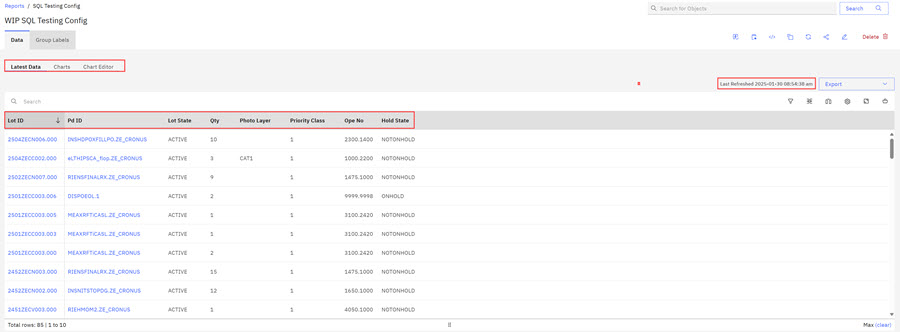
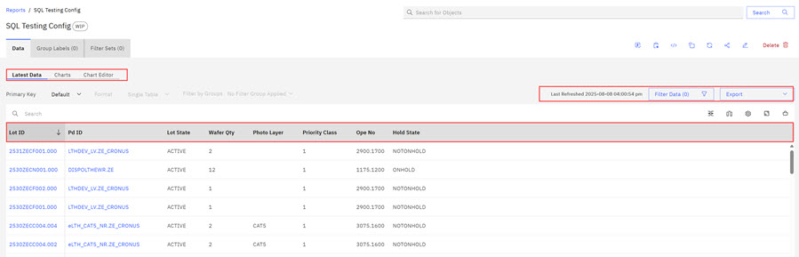
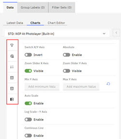
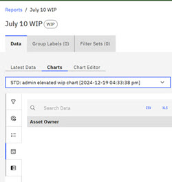
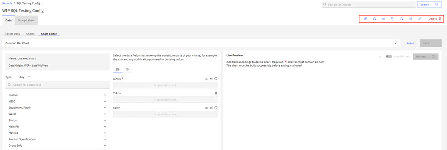
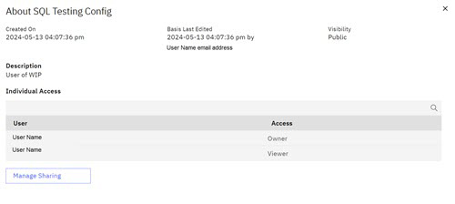
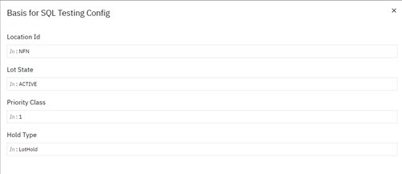
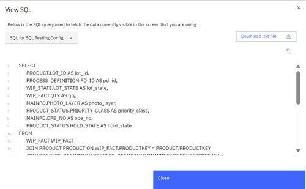
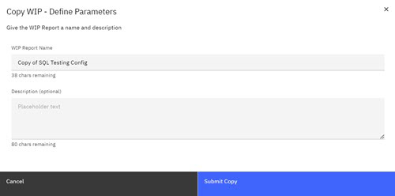
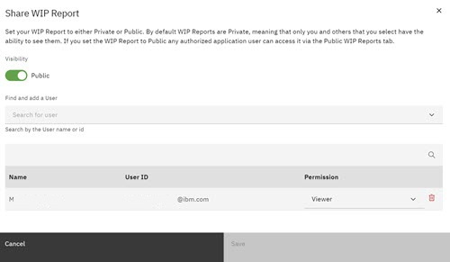

# Reviewing WIP Reports Results

From the Report Landing page, you can view the existing reports that you created and shared.

When you create a report, the report displays on the **Reports** tab of the ABIlanding page, in the folder that was specified in the Define Parameters modal during Report creation. If no folder was specified, the report displays in the default folder, **Created by you**.

The Report tab displays the Report table, and each table row identifies an individual report. A table row indicator \(outlined in red in screen capture\) shows how many reports are in the table. You can use the scroll bar to view all the reports in the table

Clicking the individual report opens the Report Results page. The Report Results page displays detailed information about the Lots in the Report. Details include information such as Lot ID, the Pd ID, Lot State \(Active or On Hold\), Qty, Photo layer, Priority Class, and the Ope Number.

The Report Results page also displays the following tabs that offer detailed WIP Report information:

-   Latest Data
-   Charts
-   Charts Editor

**Note:** A **Last Refreshed** message displays in the user interface that indicates the data freshness of the data in the **Report Results** table.

Clicking one of the following tabs on the Report Results page displays more information about the report.

|WIP Report Tabs|Description|
|---------------|-----------|
|Latest Data|Latest Data lists all the Lot IDs contained in the WIP Report. -   Clicking a Lot ID from the Lot ID list opens detailed Lot information: Overview, Wafers, Metrology Data, and PLY. See [Lot View](abi_ug_lot_view.md) to learn more about viewing Lot ID information.
-   For each Lot ID, columns display that represent all the parameters that are contained in the WIP report. You can use the adjacent toggle to show all columns in a WIP report if all variables are not visible.

|
|Charts|Within the Chart tab, you can choose to view the default standard charts by using the drop-down selector. Default standard charts are different for each report type. For WIP, the WIP At Tool and the WIP At Photolayer Tool are the defaults. The WIP At Tool displays by default. Click the down arrow and click WIP At Photolayer Tool to view this tool. These tools track the processing status of wafers within your selected report type. You can see which wafers are processing and which wafers are in a waiting state. Controls that display on the Charts Tab displays the following options:

-   A drop-down arrow on the Chart name list scrolls through the standard charts. Click a chart to select it. You can also use a scroll bar to the right of the standard chart list to scroll through the standard charts.
-   The **Grid** control is a viewing option. Select the charts that you want to see in Grid view and toggle **Grid** to on and select how many charts wide you would like to view.
-   Controls to the right of the chart are:
    -   **Redraw** - Redraws the open chart.
    -   **Edit**- Open Chart Editor tab.
    -   **View SQL**- Opens the SQL modal and shows Chart execution SQL commands that are used to retrieve the data for this report. You can download the SQL as a text file.
    -   **Annotate** - The toggle turns annotations off and on. When set to on, you can author and view existing annotations. Hover over each annotation tool to see and use its function.

**Note:** After you make annotations, click the **X** to close the annotation toolbar. Closing the annotation toolbar saves the annotation with the annotated chart. You can upload the annotated chart to the portfolio or download it as a .png file. When report data refreshes, report data updates but **annotations remain fixed**.

    -   **Add to Portfolio** - Opens a modal where you can select a destination portfolio for the chart.
-   Controls within the chart provide the following options \(from left to right\):

    -   Toggle the legend off and on \(Processing and Waiting Indicators\)
    -   Expand the Chart Controls \(legend\) on the left side of the chart
    -   Download the chart as a .CSV file
    -   Download the chart as an Excel spreadsheet file
    -   Open the Data view for a more detailed breakdown of the chart
    -   Download the chart as an image

Clicking **Expand** within the chart controls opens Collapsible Chart Controls Sidebar to the left of the chart. 

|
| |Opening Collapsible Chart Controls opens access to the following features. Clicking each control once opens the control, clicking again closes the control. 

-   Filters - Opens a view of filters that mirror the filters that are applied to the data set that you created in the ******Reports** \> **Latest Data**. You can update the filters on the **Latest Data** tab.
-   Controls -a
    -   

-   Legend - Opens and closes the Collapsible Chart Controls.
-   Data - Opens the Data tab to search and download \(csv or xls\) for chart-related data.

-   Show/Hide Sidebar - Clicking this control opens and closes the Collapsible Chart Controls.

|
|Charts Editor|The Charts Editor tab gives you the option to build your own chart type, define the X and Y-axis elements, and then define the color and filtering schemes. During chart creation, you can select a specific dataset attributes to build your chart. Available chart types. -   Group Bar/Stacked Bar
-   Group Combo/Stacked Combo Chart
-   Discrete Line/Continuous Line
-   CDF
-   Parallel Axis
-   Area Chart
-   Scatter
-   Simple Scatter
-   Single Axis Scatter
-   Box Plot
-   Histogram
-   Stacked Histogram
-   **Save Chart** - Use the annotation tools to draw and annotate. Click **Save** to save the chart with your existing WIP report.

|

You can click any of the overlay controls, which are shown here outlined in red in the following screen capture. Each overlay control opens an overlay that provides more report information or actions you can take regarding the report. The table that follows the image explains these options.

|Viewing \(Icon\) Options|Description|View of the Overlay|
|------------------------|-----------|-------------------|
|About|About contains the date and timestamp of WIP report creation and any modification of the WIP report \(Basis\), Description, Access Type, and visibility - Private \(not Shared\) or Public \(Shared\). A Manage Sharing control opens a modal with editing and sharing options \(Public or Private\). You can add new users and assign those users viewer or editor permissions in the Manage Sharing Modal.|

|
|Basis|Basis displays all the parameters that were used to create the WIP Report. This information is helpful if you want to re-create a similar report in the future or edit the existing report. Basis reflects the configuration information that you see when you use **Active Filters**.|

|
|View SQL|**View SQL** opens a modal for the current WIP report that shows the SQL query that is used to fetch the data for your report. You can use the **Download txt file** control to download the SQL query as a text file. Click the copy icon to copy the SQL.|

|
|Copy WIP Report|**Copy WIP Report** opens a modal where you can enter a name and description for the copy of your WIP Report. When you click **Submit Copy**, the copied WIP report is saved on the WIP Report Page in the folder that is designated for your current WIP report. If the copy is not renamed, the system appends **Copy of** to the original name of your current WIP Report.|

|
|Refresh|**Refresh** refreshes the data within the Lots that you selected for your current WIP Report. If you customized the columns in the current view, clicking refresh refreshes only the data and retains your customizations.| |
|Share|**Share** opens the Share WIP Report modal. In the modal, enter the shared user's email, and the level of sharing \(Viewer or Editor\), and click **Save**. If the intended recipient selected **Yes** to Share Assets Email with You in [Global User Preferences](abi_ug_preferences.md), the URL to the shared report is sent to the intended recipient's email.|

|
|Edit|**Edit** directs you to Define Parameters where you can change or update parameters for the original report. When adjustments are complete, click **Update** to update and save the existing WIP report. The edited WIP Report retains the original WIP Report name.| |
|Delete|**Delete** deletes the existing WIP Report. A confirmation modal requests your confirmation to delete a WIP Report. Deleted reports are not recoverable.| |

**Parent topic:**[Creating WIP Reports](../ABI_User_Guide/abi_ug_create_wip_report.md)

