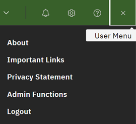

# Logging out

Users are automatically logged out after several minutes of inactivity.

1.  You can also manually log out by clicking the **User** icon in the and clicking **Logout** from the menu.

    

**Parent topic:**[Overview](../ABI_User_Guide/abi_ug_overview.md)

