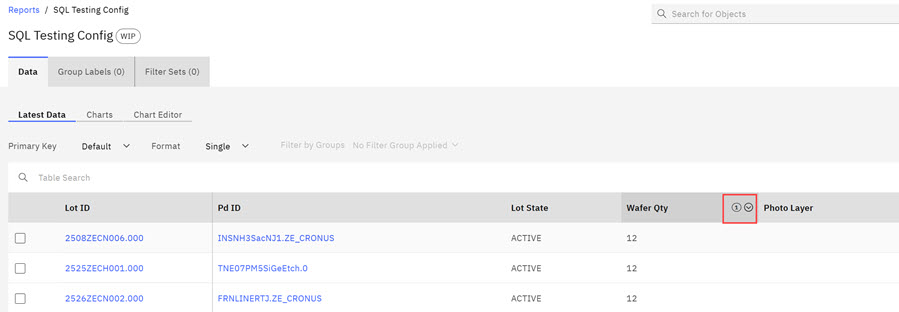
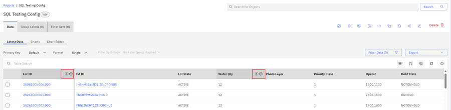
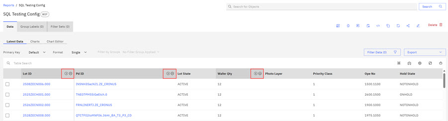
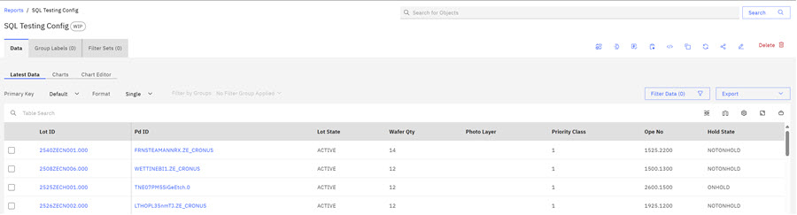

# Multi-Column Table Sorting

The ABI application now includes a multi-column sort feature for table columns in the ABI application.

Configuring the Tanstack table option enables multi-column sorting. The following scenario shows how multi-column sorting works. Multi-column sorting precedence is: multi-sort columns sort on the first column, then the second column, and then the third column. As columns are selected in multi-sort, an integer \(1, 2, or 3\) is appended to the column heading to indicate each column's sort precedence. Within the selected multi-sort columns, users can hold **Shift** on any of the selected columns and use the ascending or descending arrow to sort **within that column**. Multi-Column Sorting sorts as a group by using the first selected column as the primary sorting control, the second selected column as the secondary sorting control, and the third selected column as the tertiary sorting control.

1.  Within a report, click a column header to activate sorting for that column. An integer is appended to the column heading \(1\) and a sorting arrow displays. Selecting a descending or ascending arrow sorts that column. In the following image, the descending arrow is selected sorting the **Wafer QTY**.

    **Note:** Multi-Column Sorting sorts as a group by using the first selected column as the primary sorting control, the second selected column as the secondary sorting control, and the third selected column as the tertiary sorting control.

    

2.  Hold the **Shift** key to select a second column heading for multi-sorting. An integer is appended to the column heading \(2\) and a sorting arrow displays. Holding the **Shift** key and selecting descending or ascending arrow sorts within that column. In the following image, the ascending arrow is selected sorting the **Lot ID**.

    

3.  Hold the **Shift** key to select a third column heading for multi-sorting. An integer is appended to the column heading \(3\) and a sorting arrow displays. Holding the **Shift** key and selecting descending or ascending arrow sorts within that column. In the following image, the ascending arrow is selected sorting the **Pd ID**.

    

    **Note:**

    If Multi-Column table sort remains active, the content within the multi-sorted columns continues to sort as configured. In the following image, the **Wafer Qty** increased and the multi-sorted columns continued to sort as configured.

    

    To deactivate multi-column sorting, click twice on any column heading to remove multi-column sorting.

    

    .

**Parent topic:**[Tables](../ABI_User_Guide/abi_ug_tables_container.md)

