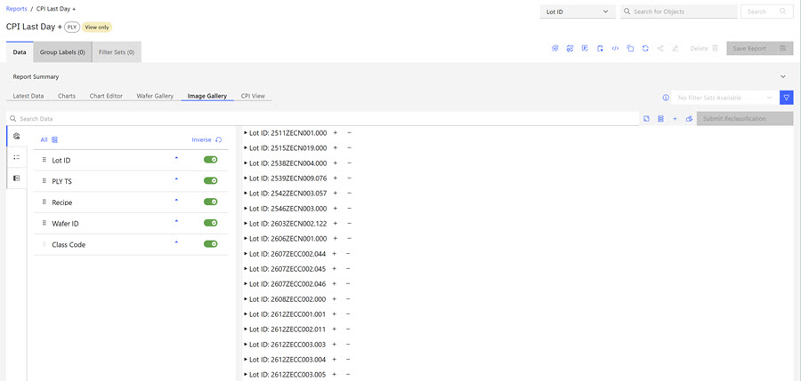
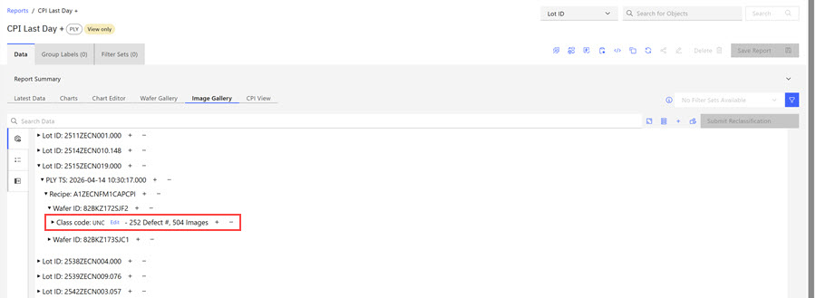
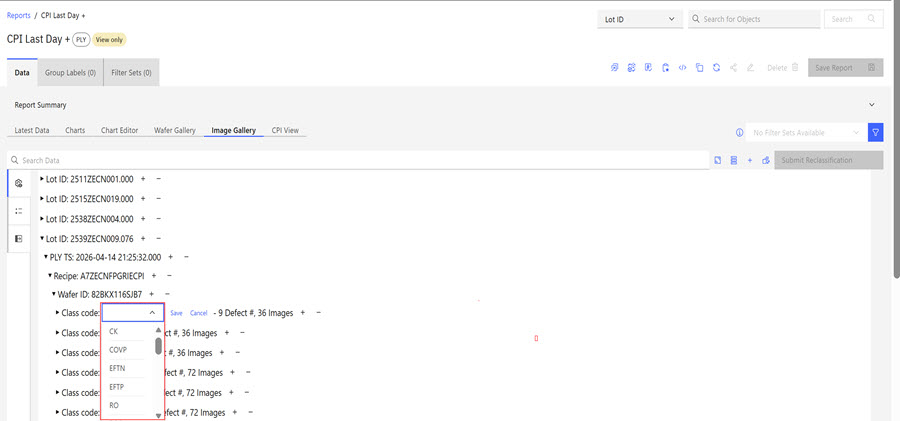
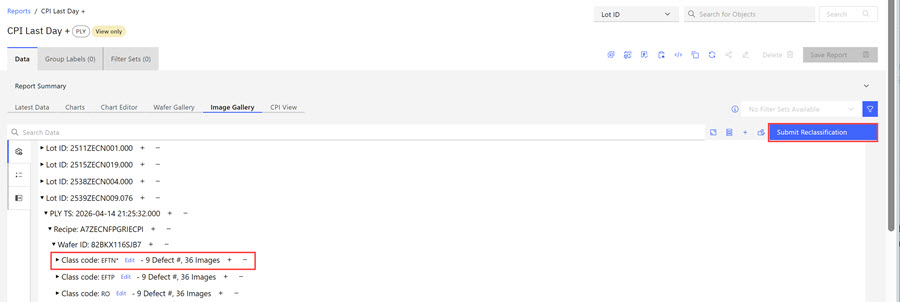
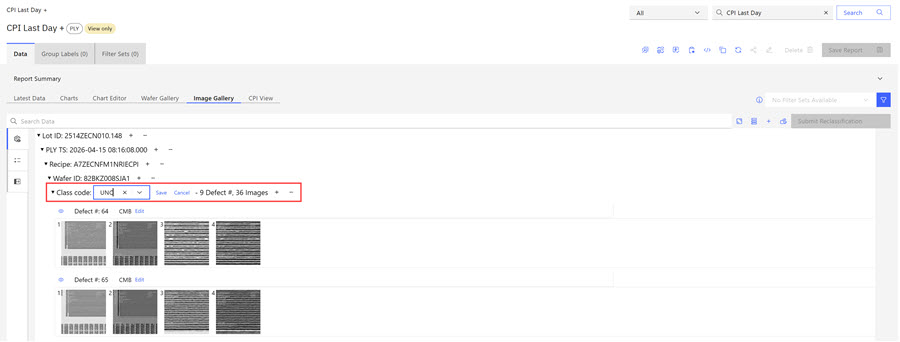
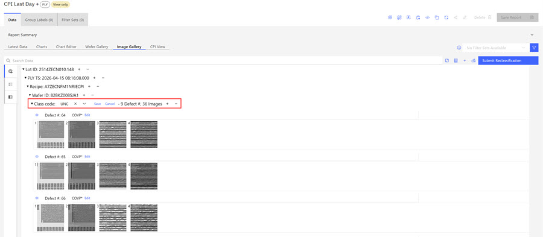
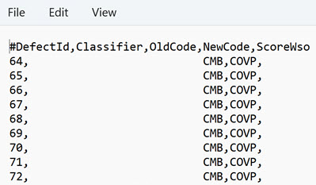

# Changing PLY Defect Classifications

ABI PLY Administrators can change the image defect classifications within the Image Gallery on PLY reports. PLY defect classifications can be changed one at a time or in a batch. See User Roles for information about the PLY Administrator Role.

PLY Administrators can change PLY image class code designations in PLY Image galleries. Class Code Reclassification can be done for individual defects or for batches of defects in the Image Gallery. To change the code classification for an **Individual** defect see Step [1](#step_jfq_nhm_y3c) through Step [7](#step_cld_15m_y3c). To change the code classification for a batch, see Step [8](#step_mgl_4sm_y3c) though Step [13](#step_fxk_rms_y3c).

**Note:** ABI users must be members of the **ABIAPP\_PLY\_ADMIN\_TEST** bluegroup to be designated the **PLY Admin** User Role. See [User Roles](user_roles.md).

1.  Click **Report** and browse to and open your PLY report where you want to change the defect classification.

2.  Click the **Image Gallery** tab.

    

3.  Click the **Control** in the left column and then click **Lot ID** \> **PLY TS** \> **Recipe** \> **Wafer ID** \> **Class Code**.

    

4.  Click **Edit** for each reclassification code you want to change.

    

5.  Click within the **Class Code**edit text box for each class code classification that needs to be edited. Remove the current classification code and click the drop-down arrow to select a new reclassification code from the drop-down menu.

    

6.  Click **Save**.

7.  Click **Submit Reclassification**.

    

    The system responds with a Download Text message that indicates the Reclassification was successful. Open the text message to view the specific details about the code reclassification.

    

8.  **Note:** The following steps outline how to change Image Reclassification for batches.

9.  Click **Report** and browse to and open your PLY report where you want to change the defect classification in batches.

10. Click the **Image Gallery** tab.

    

11. Click the **Control** in the left column and then click **Lot ID** \> **PLY TS** \> **Recipe** \> **Wafer ID** \> **Class Code**.

    

12. Click within the **Class Code**edit text box for the class code classification that needs to be edited. This Wafer ID includes multiple defects. Changing the class code here updates all the defect class codes. Remove the current classification code and click the drop-down arrow to select a new reclassification code from the drop-down menu. Taking this action causes an asterisk to be appended to the present class codes within the batch and activates the **Submit Reclassification** control.

    

13. Click **Save**.

14. Click **Submit Reclassification**. The system responds with a Download Text message that indicates the Reclassification was successful. Open the text message to view the specific details about the code reclassifications.

    

**Parent topic:**[Creating PLY Reports](../ABI_User_Guide/abi_ug_create_ply_reports.md)

