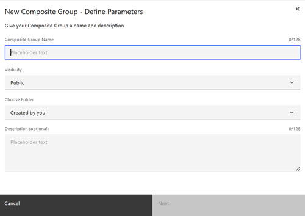
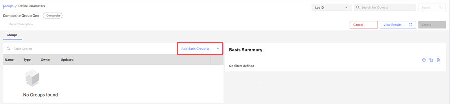
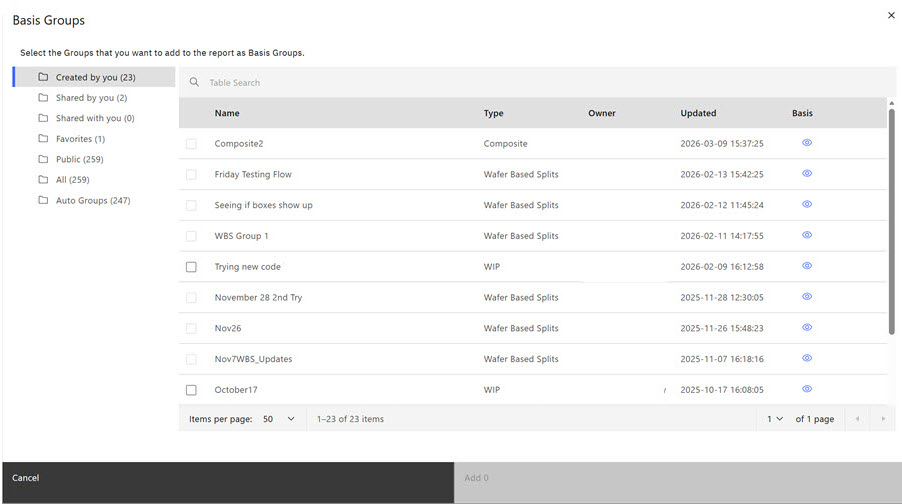
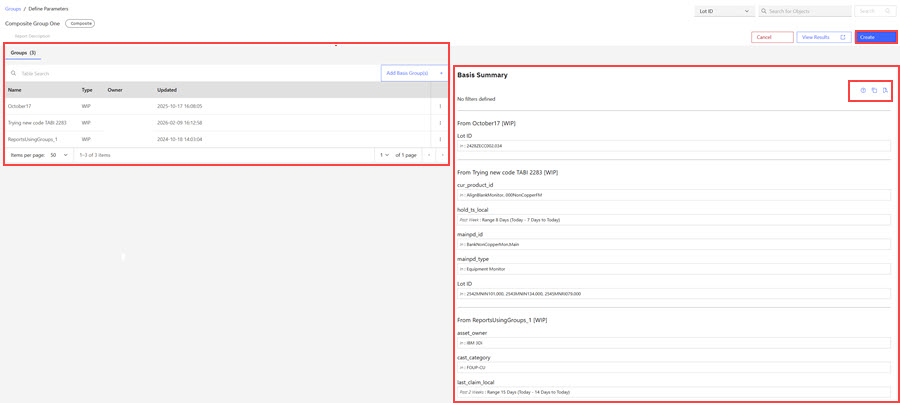

# Creating a Composite Group

Composite Groups are composed of one or more regular groups. The Composite Group represents the intersection of rows for each of the individual groups.

A Composite group contains multiple groups and represents the intersection of rows for each of the individual groups within the composite group.

**Note:** Composite groups and the groups within them are not static - groups within Composite Groups refresh when the original asset content refreshes.

1.  Browse to the Groups tabs on the ABI Landing page.

2.  Click the drop down arrow on the **Create a Group** control and click the **Composite**. The Composite Group modal opens.

    

3.  Complete the fields in the modal.

    -   Composite Group Name
    -   Visibility \(Composite groups are always public.\)
    -   Choose a folder.
    -   Enter a description.
    The Composite Configuration page opens.

    

4.  Click **Add Basis Groups**. The Basis Group Modal opens. Click a checkbox for each group you want to add to your composite group. Groups within folders that display with check boxes can also be added to the composite group. 

5.  **Basis Summary**

6.  Click **Add**. The Composite Group Basis Summary page opens. Groups added to the Composite Page display in a list format under the **Groups** section that lists the group name, group type, group owner, and last updated timestamp. The **Basis Summary** section lists the Basis Summary information for each newly added group.

    **Note:** Icons within the Basis Summary section offer options such as Show Filter Copy Help, Copy Filters, Paste \(and Import\) Filters.

    

7.  Click **Create** to create your composite group. The newly created Composite Group opens.

    Each group within the Composite Group is identified by the Group Name, Owner, and Description. On the Composite Group page, the following control actions are available about the group window such as **Delete**, **Copy**. **Share**, **Edit**, **Show Matching Lot IDs**.

    

    A **Show Description** toggle within the Composite Group, toggles to view or hide each group's description. At the bottom of the Composite Group page, the **Wafer/Lots** and **Parameter** controls open additional information about the Lot IDs and Parameters of each group in the Composite Group.

    

**Parent topic:**[Groups](../ABI_User_Guide/abi_ug_creating_groups.md)

