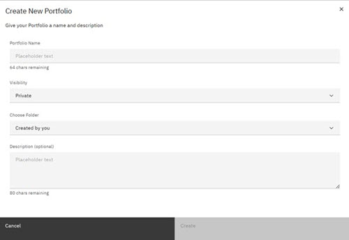
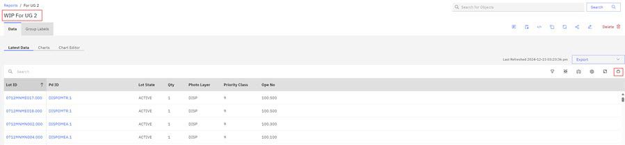
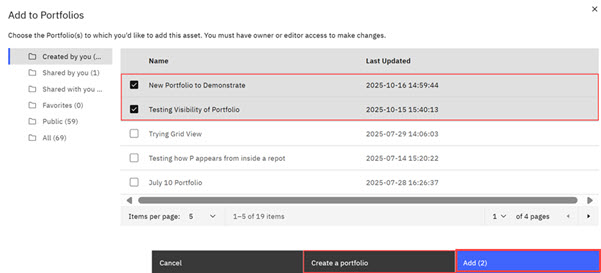

# Creating a Portfolio - ABI Landing Page

Using Portfolios, you can categorize and organize all of your ABI assets. Assets within the ABI application include reports, charts, objects, and tracked objects. You are the designer of your workflow and your portfolio can reflect that workflow. In a Portfolio, you can organize all your assets and as a Portfolio owner, share your portfolio with other ABI users, and remove assets that you own using the **Edit** control. You can create and add to portfolios in the ABI application in one of two ways. One way is to create a portfolio on the ABI Landing Page \(Portfolio\). An alternative method is to create and add to portfolios from within an asset: a report, a chart, a tracked object, or an object.

The following procedure outlines how to create a portfolio procedure on the ABI Landing Page. Click here [ABI Asset.](creating_a_portfolio_within_an_abi_asset.md) to learn how to create a portfolio from within an ABI asset.

**Note:** If you place a private ABI asset into a portfolio and then share that portfolio with an ABI user, the private asset is not viewable to the shared ABI user. By default, only Asset Owners and ABI Admins can view private assets.

Portfolios are private by default. In order for Portfolio assets to be visible to ABI users, Portfolio owners must set sharing options on both Portfolios **and** on each individual asset within the Portfolio.

Portfolios and the assets within them are not static - assets within Portfolios refresh when the original asset content refreshes.

1.  On the Portfolio tab on the ABI Landing page, click the **Portfolio** tab. The Portfolio landing page opens.

    

    The Portfolio landing page follows a similar format to the Report Page. Foldering options are available for your portfolios. See [Foldering](abi_ug_folder_management_procedure.md) to refresh your memory about using Folders.

    **Note:** The folders that are listed on the Portfolio page and the folders that are listed on the Reports page are **separate entities**. In other words, Reports are saved to folders on the Reports page and Portfolios are saved to folders on the Portfolio page. You cannot save Portfolios in a Reports folder.

2.  Click **Create Portfolio** to open the Portfolio modal.

    

3.  Complete the fields in the **Create New Portfolio** modal and click **Save**.

    In this example, the portfolio is named, **New Portfolio to Demonstrate**.

    The New Portfolio page opens. The portfolio is presently empty, but is ready for you to add your reports and charts.

    

4.  Click the **Portfolio** breadcrumbs to return to the Portfolio Landing page.

    

5.  Click the **Reports** tab.

6.  Click a Report to open the Report.

7.  Click the **Add to Portfolio** icon.

    

    The Add to Portfolio page opens.

8.  Click a checkbox to select a portfolio location for your report. You can add reports to multiple portfolios at the same time. Click **Add To**. Alternatively, you can click **Create A Portfolio** if you want to add this report to a new portfolio.

    **Note:** You can add to a portfolio only if you are the owner of the report or chart or a designated editor.

    

9.  Click **Add \(2\)** to add your report to these 2 portfolios. Use the breakcrumbs to navigate to the **Portfolio** tab and then click the **New Portfolio to Demonstrate**, you just added this reportt to this portfolio. Use the Pages scroll arrow to view your newly added Report.

    

**Parent topic:**[Portfolios](../ABI_User_Guide/abi_ug_portfolios_overview.md)

