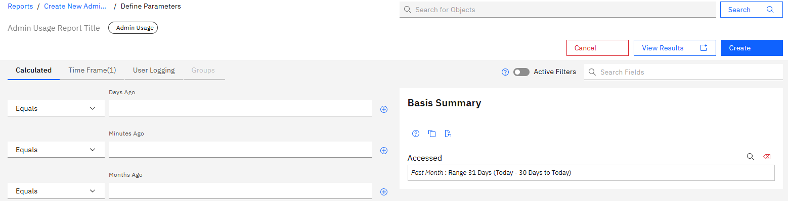
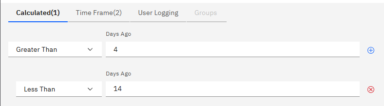
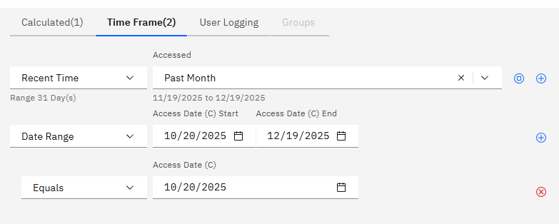
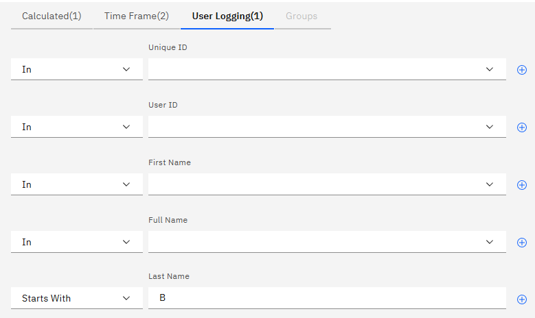
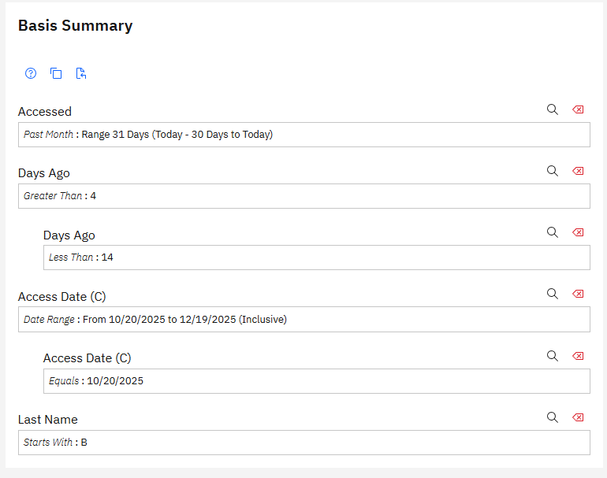
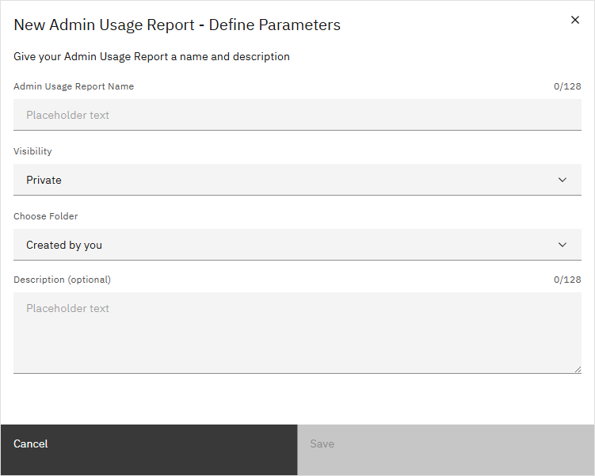

# Creating Admin Usage Reports

ABI Admin users can create Admin Usage reports. Admin Usage Reports track the access of the Admin functions page over a set time range, showing such details as the name of each user accessing the admin page, time of access and number of times each user has accessed the page.

1.  Click the **Reports** tab on the ABILanding page and then click the drop down arrow on the **Create Reports** control and click **Admin** to select an Admin report type.

    

2.  Click **Admin Usage** to bring up the Create new Admin Usage Report page.

3.  Select a favorite Admin Usage report or click **Select referenced reports** to open the **Define Parameters** page.

    

4.  On the **Define Parameters** page, there are several tabs. The **Calculated** tab can set specific time parameters to calculate around via operators and date ranges, such as including results greater than or less than a certain number of days prior, while excluding certain days.

    

5.  The **Time Frame** tab, which defaults to a selection of the past month, can be used to set results for a range of time, such as the past month, a specific day, a range of days, or other values.

    

6.  The **User Logging** tab is used to include or exclude users based on criteria like User ID, first name, last name, or other Unique ID.

    

7.  The **Groups** tab is used to include or exclude groups. This tab is only available if Groups have been created for the project.

8.  As conditions are added from the tabs, they appear in the **Basis Summary**. To ensure the selected conditions return a usable report, click **View Results** to see a preview of the report, and **Hide Results** to return to the **Define Parameters** page.

    

9.  Click **Create** to save the report to draft and immediately navigate to the Report Draft.

10. When viewing the report Draft, click **Save Report**. On the following screen, give the report a name. The folder visibility and destination can also be changed, and it can be given a 128 character description. When done, click **Save** to finish generating the report. If the report is not saved, it will remain in your Drafts folder until it is saved, deleted, or expires,

    

**Parent topic:**[Reports - Creating and Managing](../ABI_User_Guide/abi_ug_wip_reports.md)

