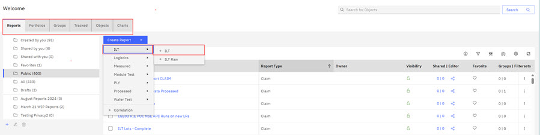
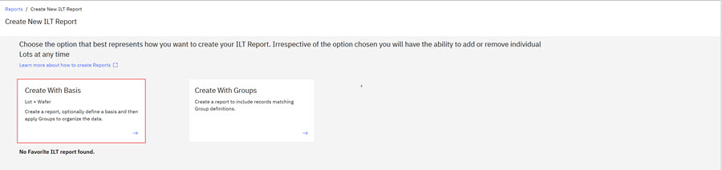
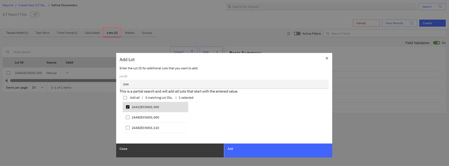
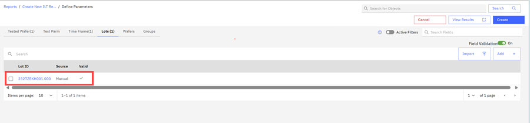
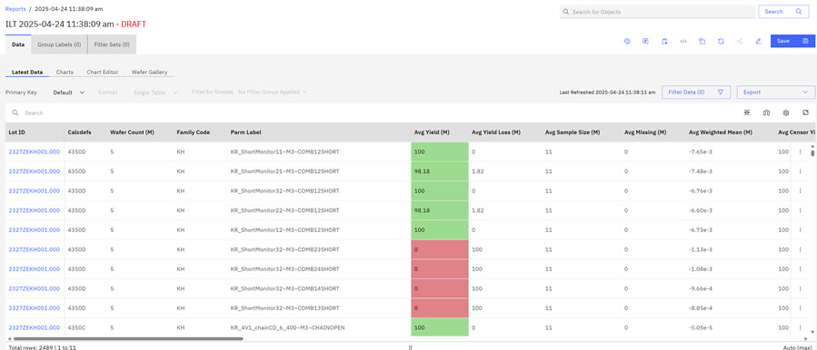
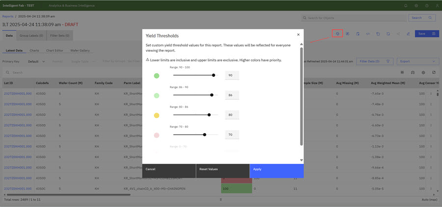
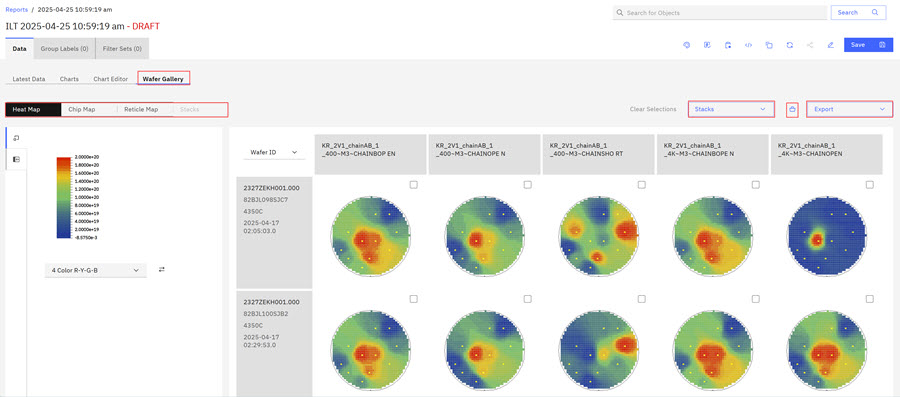
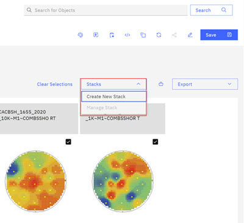
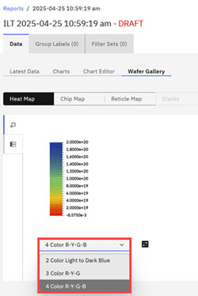

# Creating ILT Reports

Inline Electrical Testing \(ILT\) Reports are a reporting feature of the Analytics and Business Intelligence \(ABI\) application that is used to report on wafer yield data.

On the Reports section of the ABI application, you can create an ILT report and define the parameters for that report. You can create an ILT report by using Lot IDs or Wafer IDs. If you designate the visibility of your report as Private, you are the only person who can see this report. You can also change sharing options for the reports you create.

**Note:** Folders on the ABIlanding are accessible throughout the ABI application. When you create a new report, you designate a folder location for your report. See [Creating and Organizing with Folders](abi_ug_folder_management_procedure.md) for more information on foldering.

1.  Click the **Reports** tab on the ABILanding page and then click the drop down arrow on the **Create Reports** control and click **ILT** to select the ILT report type.

    

2.  Click **Create with Basis** on the Create New ILT Report Page. You can also select **Create with Groups**.

    

    **Note:** You can select the **ILT Report Parameters** on the resulting Define Parameters page for **Basis** or **Groups**, depending on which option you chose. Alternatively, you can create an ILT Report report that uses Lot IDs or Wafer IDs. The following sequence uses Lot IDs to create the ILT report and you can follow this same sequence if you use Wafer IDs.

3.  Click the **Lots** tab and then click the **Add+** control. The **Add Lot** modal opens.

    

4.  Type in a **Lot ID** number. The system searches and displays **Lot IDs** that match the entered number. Click the checkbox for each **Lot ID** you want in your report.

5.  Click **Add**. The **Lot ID** is added.

    

    **Note:** Before creating a report, you can click the **View Results** control to view the number of rows that will generate for your report. You can change the report parameters before you generate your report, or you can click the **Hide Results** control to hide this information and proceed with creating the report.

6.  Click **Create** to create the **Draft** report. Because the ILT report generally contains many data columns, use the scroll bar below the report to scroll through all the ILT report columns.

    

    **Note:** If you do extensive work on this **DRAFT** report, the content is only saved for three days. See [Transient Objects](draft_reports.md) for information on the **Draft** status.

7.  Click the table icon **Show Yield Color Range** to view the legend for the Average Yield column. Colors represent the yield percentages in the report. You can use this modal to set custom yield thresholds for this ILT report or reset the values and click **Apply** to apply the changes.

    

8.  Click the **Chart** and **Chart Editor** tabs to create and view charts based on this ILT report. The procedure that is outlined in [Creating Report Charts](abi_ug_create_report_chart.md) is similar but the data fields and attributes are different because the content and data fields are different for an ILT report.

9.  Click the **Wafer Gallery** tab. The **Wafer Gallery** tab contains the **Heat Map**, **Chip Map**, **Reticle Map**, and **Stacks** sections. The maps visualize:

    -   Heat Map - All measurements across the wafer.
    -   Chip Map - Average measurements at the chip level.
    -   Reticle Map - Average measurements at the reticle level.
    -   Stacks - The measurement for one or more wafers that are stacked together.
    

    You can add the Heat, Chip, Reticle, and Stack Maps to a Portfolio using the **Portfolio icon** or export the map using the **Export** control shown outlined in red in the preceding screen capture.

    Double-clicking a wafer displays the single wafer, with a set of controls you can use to move within the wafer. In the single map view, you can use the drop-down menu \(shown outlined in red below\) to view the individual wafer in a Chip Map or Reticle Map.

    

    ||From left to right, use the controls to:     -   Zoom out
    -   Zoom In
    -   Reset cursor position
    -   Move left
    -   Move right
    -   Move up
    -   Move Down
|

    The Heat, Chip, and Reticle Maps display in a Wafer ID view. In any map view, you can use the drop down arrow on the **Wafer ID** to display the map in a **Lot ID** view.

    

    You can create a wafer stack from any of the map views.

    -   Click the checkbox for each wafer you want to include in the stack.
    -   Click the drop down arrow on the **Stacks** control and click **Create New Stack**.

        

        The **Create a Stack** modal opens.

    -   Complete the fields Stack Name and Description in the modal.
    -   Click **Save**. The New Stack displays on the Stacks tab in the Wafer Gallery.

        

    Use the drop down arrow below the Color Legend to change the color range on the maps. Changing the color on one map changes the color range on all the maps.

    

10. Click **Save** when you are satisfied with your ILT report and complete the text fields in the Save Modal.

**Parent topic:**[Reports - Creating and Managing](../ABI_User_Guide/abi_ug_wip_reports.md)

