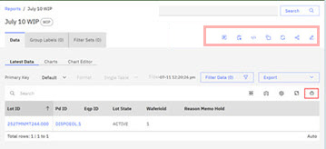
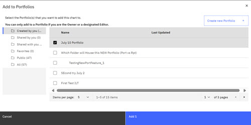
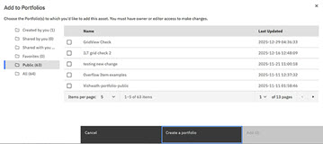
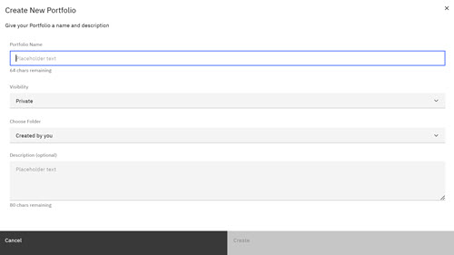

# Creating Reports - Step-by-Step

ABI Report creation uses a structured process. While each ABI report focuses on a different aspect of semiconductor manufacturing, each report follows a defined structural configuration. These steps describe the structural procedure at the center of each ABI report.

The following table outlines the common structure that is used to create reports.

|Steps|Step Description|
|-----|----------------|
|**1**|Determine what report type is going to give you the information you need. See [Table 1](abi_ug_wip_reports.md#table_xcq_4nv_qdc) **ABI Application Features - Report Types** and choose a report type. Click **Create Report** and click the **Report Type** that you want to create.

|
|**2**|Determine how you want to create your report, either with Basis or with Groups. See [Table 1](reports_portfolios_and_groups.md#table_prj_ns1_sfc) **ABI Application Features - Creating Report Types** and determine which method works best for your needs. Each particular report has a specific focus and its own respective set of basis parameters that support the report's focus. Select the report parameters.

Click **Create with Basis** or **Create with Groups**.

|
|**3**|You can click **View Results** to view the results of your parameters selection or click **Create** to create a draft report. **Note:** **Draft** reports are transient objects and remain in the ABI application for only 7 days from inception. See [Transient objects \(Draft reports\)](draft_reports.md) to Learn More. **View Results** remains available until a report is saved. **View Results** is not saved if you exit the active report creation page or the application.

Select **View Results** or the **Create** control.

-   Clicking **View Results** presents a temporary view of the report's results using the parameters that you chose. You can edit the existing parameters and click **View Results** to view the updated results or click **Hide Results** to return to the report creation page.
-   Clicking **Create** creates a draft report that is saved for 7 days. The labels **WIP \(Report Type\)** and **Draft** display above the report next to the timestamp. After viewing the results, you can click **Save** to save the report,

|
|**4**|Click **Save** on the report creation page to open the **Save** modal. Enter the **Report Name**, **Visibility \(Private or Public\)**, **Folder** location for the saved report, and enter text in the **Optional Description** text field. If no folder is designated, saved reports are saved in a folder that is titled, **Created by You**. Click **Save**. The report is saved. The saved report displays in the selected folder on the ABI Landing Page and the report type designation appears on the report page.

|
|**5 \(optional\)**|The ABI portfolio feature is an organizational tool where users can compile their saved reports and charts. From inside the newly created report, you can put your report directly into an existing portfolio you own, or into one you have editor privileges to edit, or create a new one. **Existing Portfolio Option** From inside the newly created report, click the **Portfolio** icon.

Click the checkbox to select a portfolio for your report. 

To add a report to an existing portfolio, click the checkbox for the portfolio, and click **Add 1**. The report is added to the portfolio and your report displays inside the selected portfolio on the [ABI Landing page](abi_ug_landing_page.md) page. 

**Create New Portfolio**

Click the **Portfolio** icon 

 To open the Create a Portfolio modal. 

|
| |Click **Create New Portfolio** to open the 

Complete the fields in the Create a New Portfolio modal. Portfolio name, Visibility \(Private or Public\), Folder location - where to save the new portfolio, and optional description. Click **Create**. The report is added to this newly created portfolio and your report displays inside the selected portfolio on the [ABI Landing page](abi_ug_landing_page.md) page.|

-   **[Editing an Existing Report](../ABI_User_Guide/editing_an_existing_report.md)**  
ABI users can now edit their own reports using the editing options of **Export**, **Import**, **Copy**, and **Paste** for individual fields within a report. The **Import** function allows users to import .csv and .xlsx and **Export**, **Copy**, and **Paste** functions support the .csv format.

**Parent topic:**[Reports - Creating and Managing](../ABI_User_Guide/abi_ug_wip_reports.md)

