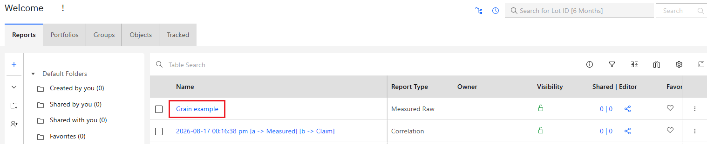
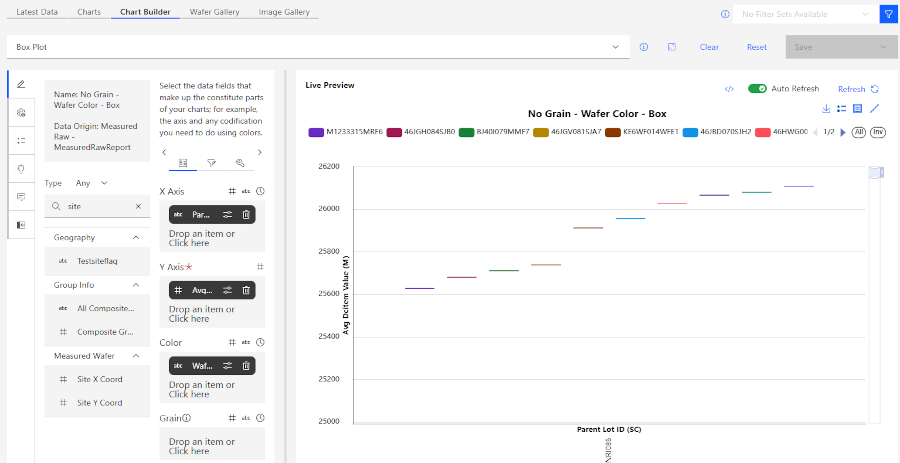
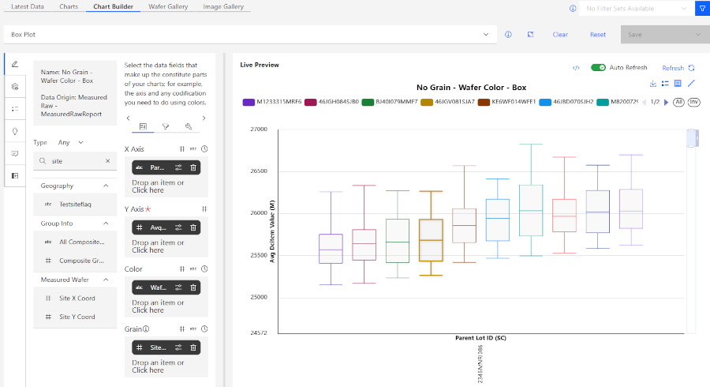
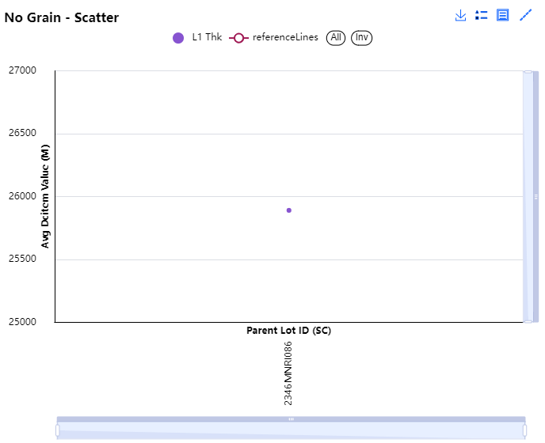
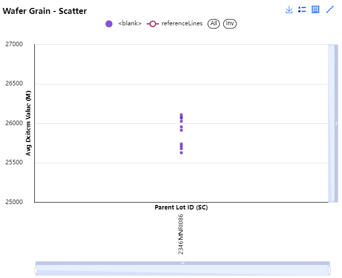
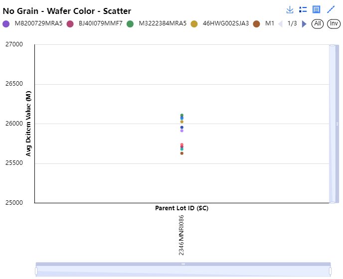

# Using Grain in Reports

Using Grain in an ABI Report Chart allows users to separate out data points for enhanced granularity. Putting a particular data field reformat the chart to show distinct nodes for each data point of that field.. The reports shown below are non exhaustive examples of how to use Grain when using the **Chart Builder**

1.  Click the **Reports** tab on the ABI Landing page, Create or Select a report. In this demonstration, an existing report, Grain Example, is used. Click the **Report Name** to open it..

    

2.  Once the report opens, click the **Chart Builder** tab. To use Grain, you will need to use the **Chart Drop down** to select a chart with access to Grain. Currently those are Grid and Distribution type charts. For this example, select a Box Plot chart. Populate the **X** and **Y**axis with Parent Lot ID \(SC\) and Avg Dcitem Value \(M\) Add Wafer ID to the **Color** field. Click **Refresh** to render the chart.

    

3.  Populate the Grain with Site X Coord and click **Refresh** again. The chart updates to show a more granular look based on the Raw Number and Wafer ID.-/

    

4.  Grain does not filter, change, or perform calculations on data. It takes each data point in the selected column and separates them out for better display. To demonstrate this. The same report is shown in a scatter plot, with no grain or color applied. It has been averaged to a single point.

    

5.  Here is the same chart with Wafer ID in the **Grain** field. Note that each wafer is displayed independently of the others.

    

6.  The **Color** field also has a similar function to **Grain**. Here is the same chart with Wafer ID in the **Color** field rather than **Grain**.

    

7.  **Grain** and **Color** can be used together for further separation, as shown in the Box Plot above.

**Parent topic:**[Reports - Creating and Managing](../ABI_User_Guide/abi_ug_wip_reports.md)

