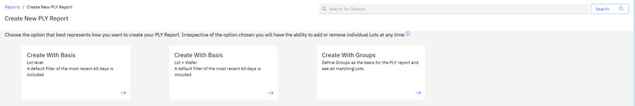
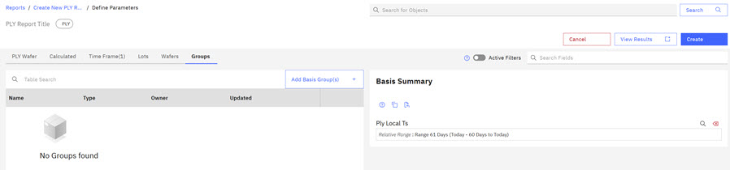
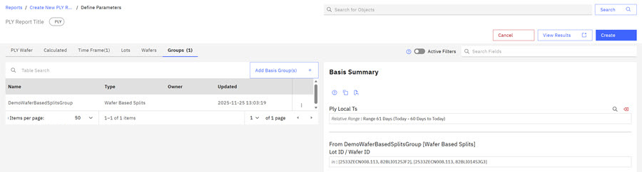
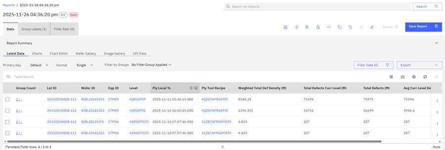
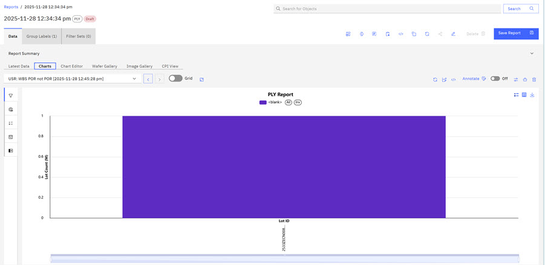
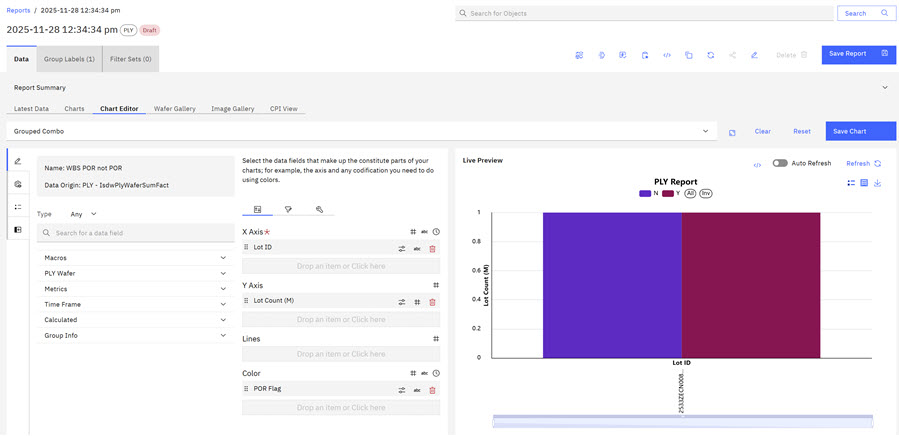

# Creating Wafer Based Split Group Reports

ABI users can use Wafer Based Split \(WBS\) Groups to create reports. WBS Groups are designed to track manufacturing experiments and ensure that processes follow an established Process of Record \(POR\). A POR includes the process recipes and parameters requirements that a chip must meet during the manufacturing process. Reports created with WBS groups are able to use charting to visually display manufacturing results.

1.  Click the **Reports** tab on the ABILanding page and then click the drop down arrow on the **Create Reports** control and click **PLY** to select a PLY report type.

    

2.  Click **Create with Basis \(Lot level\)**, **Create with Basis \(Lot& Wafer\)**, or **Create with Groups**.

    

3.  Click **Create with Groups**.

    

4.  Click **Add Basis Group** and select a **Wafer Based Split** group. Click **Add**.

    

    The selected group is added to the report.

    

5.  Click **Create** to create the report.

    

    **Note:** When the Report is created, you can change the key of the report using the **Default drop down**, you can use the **Groups** filter, and you can change the display of the report using Single, Key, Group, or Pivot.

6.  Click the **Chart** tab to view the chart generated from this report data. The Default Chart is a PLY Density Chart.

    

7.  Click **Chart Editor** tab. Set the report type to **Grouped Combo** to view the different groups in the WBS group. In the Encoding column, Accept the X and Y axis as Lot ID and Lot Count, and Drag the POR flag to the Color section. Click **Refresh**.

    The Chart now displays the Lots in relation to the POR. **YES \(Y\)** for lots that passed the POR and **NO \(N\)** for lots that did not pass.

    

**Parent topic:**[Reports - Creating and Managing](../ABI_User_Guide/abi_ug_wip_reports.md)

