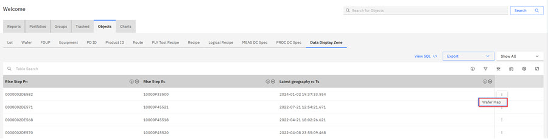
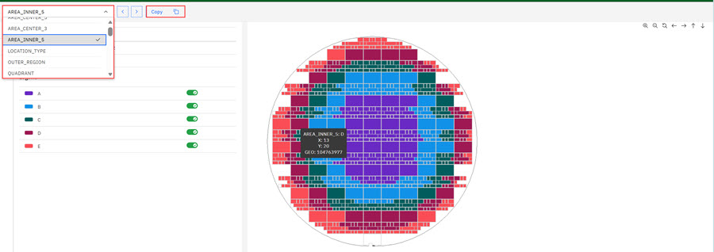
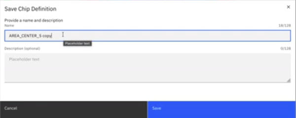
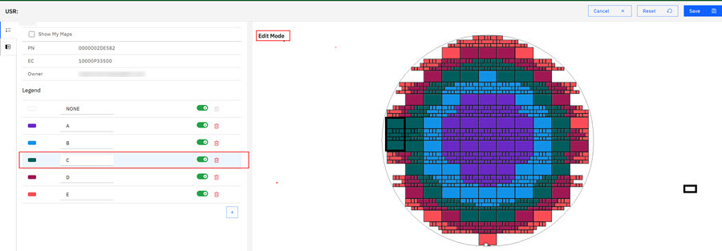
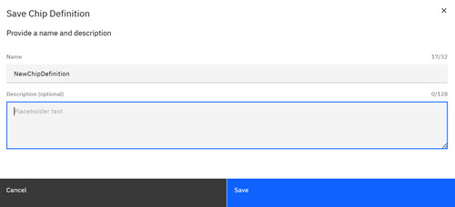
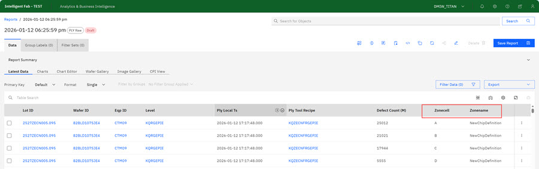
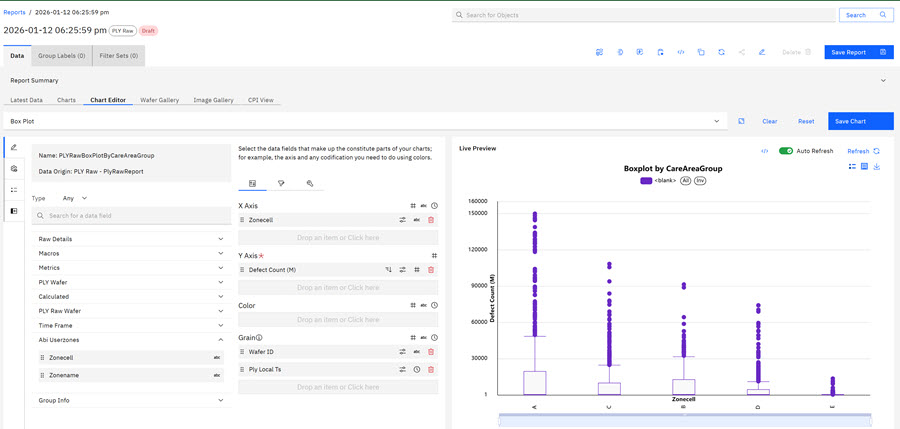

# Defining and Using User-Defined Zones

User-Defined Zones are Object Display Zones on wafers that users can create and copy to customize display zone definitions in wafers. When users created customized object displays, users can then copy the customized User-Defined Zones and use them as filters in other reports and charts. These object display filters give ABI users a visual way to compare and contrast the different manufacturing outcomes of chips in their reports.

This task involves configuration \(formatting\) of Customized User-Defined Zones that are specific views of Wafer dies. Once configured, users can use the Customized User-Defined Zones \(views\) in Reports and Charts.

1.  On the ABI landing page, click the **Object** tab.

2.  Click the **Data Display Zone** within the Object area and in the Time Field click **Show All**.

    

    A list of geography locations displays.

3.  Click the **ellipsis** for the geography location and then click the **Wafer map** pop up that displays to access the wafer map for that location.

    

    The wafer map opens, and colors define each area. A drop-down menu lists the Defined zones in the wafer map. Use the toggle \(off or on\) to view each wafer area location

4.  Click the drop-down menu on the Area Wafer Location wafer map to select the area \(zone\) you want to view. It becomes selected in the wafer map.

    

5.  Click **Copy**. The **Save Chip Definition** modal opens.

     Complete the Name and Description \(optional\) fields.

6.  Click **Save** to save your draft \(customized\) user zone. The page refreshes and the saved wafer location is now in the Area Wafer Location drop down.

7.  Select the saved Area Wafer Location from the Area Wafer Location drop down. Click **Edit**. The Wafer map opens in Edit mode. Select an area and click die locations to add those die locations to your edited Wafer map.

    

8.  Click **Save** to save your newly defined customized User Zone.

    

9.  **Using User Defined Zones in Reports and Charts**
10. On the ABI landing page, click **Create Report** and select the **PLY** \> **PLY Raw Report**. Click **Create with Basis** and accept Basis Defaults.

11. Select the **ABI username** category and select the User-Defined Zones to include in your report. And click **Create** to create the report.

12. Click **Manage Columns** to add new columns to the report. Select the **ABI User Zone** tab and select the available User Zones to add to your report. Click **Save**.

    

    The User-Defined Zones are added to the Ply Raw Report.

    

13. Click the **Charts** tab. Replace the **X-Axis** with one of your User Defind Columns. Click **Refresh**. The User-Defined Zones that are specified now display within the chart. Click **Save**to save your chart. Click **Save Report** to save the report.

    

**Parent topic:**[Reports - Creating and Managing](../ABI_User_Guide/abi_ug_wip_reports.md)

