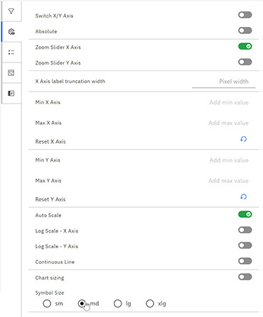
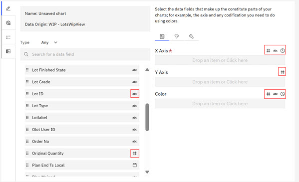
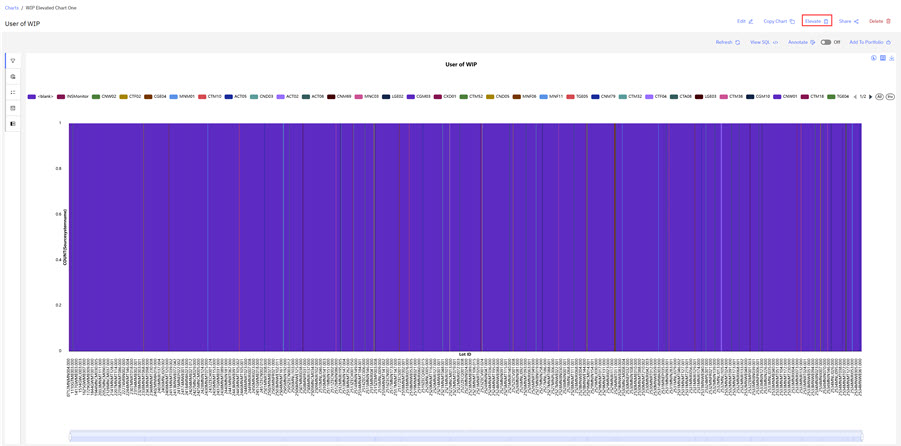
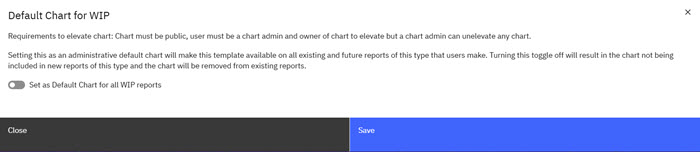

# Elevating Global Customized Chart

ABI users with **Chart Admin** user permission, **Chart Administrators**, and can create and save charts as stand-alone templates or elevate the saved charts as default report charts for expanded use in ABI reports. Use the following steps to create a template for stand-alone use or for elevation.

**Note:** To qualify for elevation, charts must be public and the **Chart Admin** must be the owner of the chart. **Chart Admins** can also remove the elevation any chart.

1.  Click the **Charts** tab on the ABI Landing page.
2.  Click **Create Report**. The Chart Customization page opens.

    **Note:** Selecting a report chart type gives you the option to elevate this chart type as a standard default chart for the selected report type. You can create a report chart for any of the report types in the ABI application by using the vertical scroll bar to select a report type.

    

3.  Select a Report Type for your chart. In the following image, the WIP Report Type is selected. Icons on the left side of the Chart Customization page provides chart editing capabilities as shown in the table following the image.

    

    |Icon|Function|Description|
    |----|--------|-----------|
    ||Authoring|Authoring icon opens the default Chart Customization section.|
    |

|Controls|Opens various chart enhancements controls. You can toggle and off to invert or enable the X and Y axis, control the zoom sliders, set minimum and maximum X and Y axis, adjust symbol size, and enable auto scale, log scale, continuous line, and chart sizing. 

|
    |

|Legend|Opens two sections. **Legends** and a **Live Preview**.|
    ||Data|Opens the chart Data panel, where you can view and search the data used to create the chart.|
    |

|Collapse Control|Opens expanded **Live Preview** section.|

4.  Design your chart by selecting the report attributes that pertain to the information you want to visualize in your chart. If you want to see the status of wafers in lots, you can use the lot, wafer, and status attributes to build your chart. The first column on the Chart Creation page is the report type attributes column that shows the attributes that correspond to the selected report type. In the following screen capture, the WIP report is the report type, and the column shows the attributes that correspond to the data fields in the WIP report. You use the attributes within each data field to create your chart. The second column on the Chart Creation page shows the configuration data fields for the X and Y axis and color chart attributes. You design your chart by selecting attributes for each data field. The third column is the **Live Preview** that shows a live preview of the attributes you configured for your chart when you select **Refresh**. The **Refresh** control is not active if no chart attributes are chosen.
5.  Click the caret to open each data field to select the attributes for each data field of your chart. Each report attribute has a type designation icon that displays in the first column: Alphabetic \(abc\), numeric \(\#\), or time \(time icon\). In the second column on the Chart Creationpage, each chart data field lists a range of attribute type designations that the field accepts. The following screen capture shows that the X-Axis data field accepts alphabetic \(abc\), numeric \(\#\), or time \(time icon\) attributes. The Y-axis data field accepts only numeric \(\#\). The Color data field accepts alphabetic \(abc\), numeric \(\#\), or time \(time icon\) attributes. Selecting the Chart Attributes for the Chart. Select and drag each variable from the attribute list.

    

6.  Click the **Lot ID** attribute and drag it to the X-Axis. Click the **SourceSystemName** attribute and drag it to the Y Axis. When you drag the Count, the Tool Modal opens. Because the data field wants a numeric in the Y Axis, the system prompts you and asks how to aggregate the data because it needs a numeric value. **Select** Aggregate by count \(so the system now recognizes it as a numeric\) and Sort by Ascending. **Click** Apply. The Count aggregates by Count and Sorts by Ascending. Click the Equip ID and drag it to the Color data field. Click **Refresh** to view the Chart result.
7.  Click **Save**. Complete the fields in the Save Chart modal, making sure to save the chart as **Public** to make the chart sharable. The chart refreshes and displays.

    

8.  Click **Elevate** to elevate the chart. The Chart Elevation Modal opens. To make this elevated report a default standard report for WIP reports, toggle the **Set as Default Chart for all WIP Reports** to on.

    

9.  Click **Save.** The Saved Chart displays on the **Chart** tab on the ABI dashboard.

**Parent topic:**[Creating Global Customized Charts](../ABI_User_Guide/abi_ug_top_level_charts.md)

