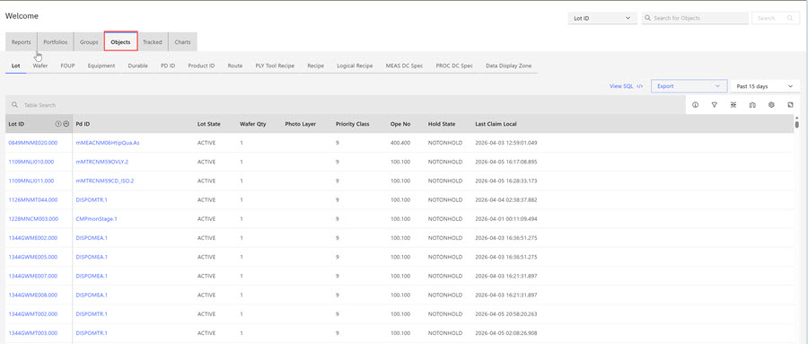
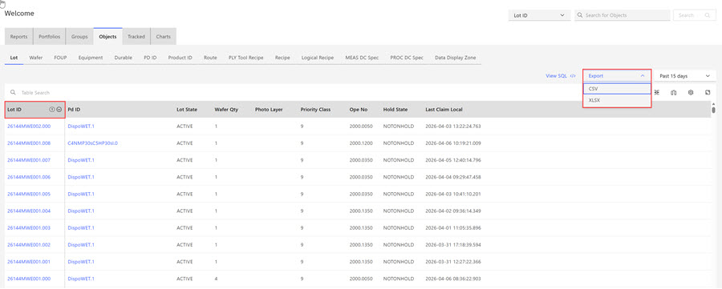
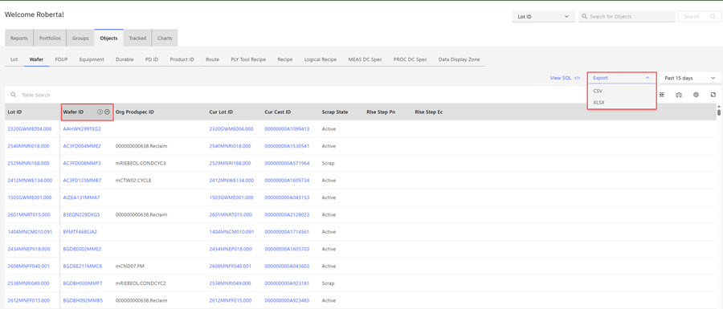
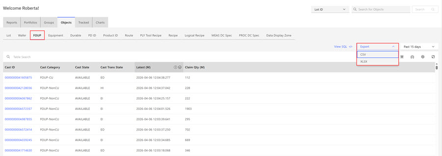

# Exporting Objects

In the ABI application, you can export and download a list of objects from the following object categories: **Lots**, **Wafers**, and **Front Opening Unified Pods \(FOUPs\)**.

When exporting **Objects**, you can select the object's export format. Available formats are .csv, and .xlsx.

1.  Click the **Objects** tab on the ABI landing page to open the Objects landing page.

    

2.  Click the **LOT** column header and then select the export format for the list of LOTS.

    

    The list of LOTS and each LOT's associated parameters are exported and downloaded in .csv format.

3.  Click the **Wafer** column header and then select the export format for the list of Wafers.

    

    The list of Wafers and each Wafer's associated parameters are exported and downloaded in .xlsx format.

4.  Click the **FOUP** column header and then select the export format for the list of FOUPS.

    

    The list of FOUPs and parameters that are associated with each FOUPs are exported and downloaded in .csv format.

**Parent topic:**[Objects](../ABI_User_Guide/abi_ug_objects.md)

