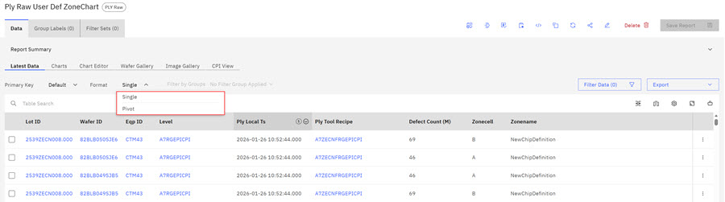
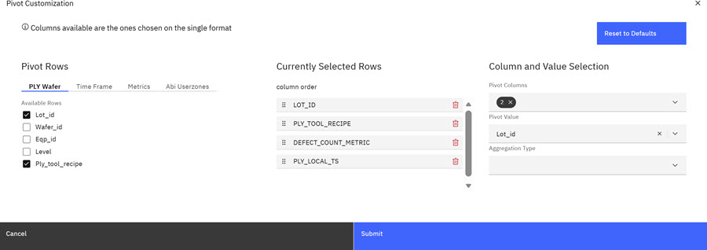
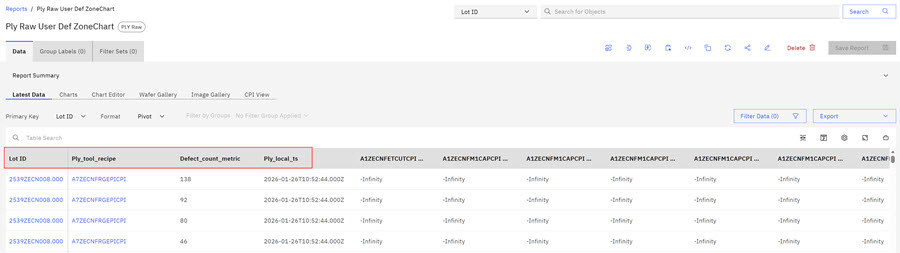
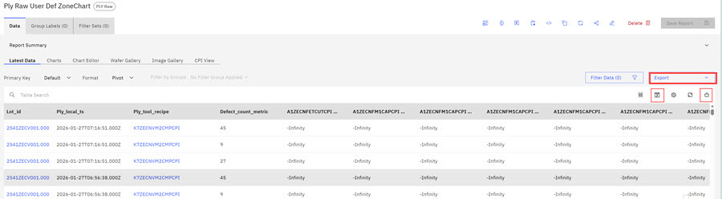

# Pivoting Tables - Enhanced Viewing Options

Available in all report tables, ABI users can configure the pivoting table columns feature to change how data columns display in report tables. User can configure pivoting column views to provide data columns in a side-by-side view. One example that uses the pivot feature might be to configure a view that displays the number of defects per ply recipe in a side-by-side view.

The following example uses a PLY Raw report. User wants a side-by-side view of PLY recipes and PLY defects.

1.  Click the Format drop-down and select **Pivot**. The Single Format is the default option for tables.

    

    The **Pivot Customization** modal opens.

    

2.  Click the check boxes of the Pivot Rows that you want to display in your pivoted table. Selected rows display in the **Currently Selected Rows** the column order. Column order is editable in the modal.

3.  Select the **pivot columns**, **pivot value**, and **aggregate type** if applicable in the third column.

    The **Reset to Defaults** control on the modal returns the table to its default. .

4.  Click **Submit**. The pivoted table displays.

    

5.  Hover over the first icon on the table menu bar **Pivot Info** to view Pivot configuration information. Click the **Manage Pivot Info** icon that displays below the **Export** control to edit pivot table settings. Clicking the icon opens the **Pivot Customization** Modal. You can edit the pivot table settings and click **Submit** to see the edited pivot table. Click **Export** to export

    

6.  Click the **Add to Portfolio** icon to add the pivoted table to a portfolio.

    **Note:** When the pivot table is added to a portfolio, the table displays with the pivoted values. The **Pivot Customization** modal is not available from the portfolio page but the pivot column name, value, and aggregation type is available as a legend. Click the **View Original** control to correctly render the pivoted table.

7.  Click **Export** to export the Pivot table data in either .csv or .xlsx format.

**Parent topic:**[Tables](../ABI_User_Guide/abi_ug_tables_container.md)

