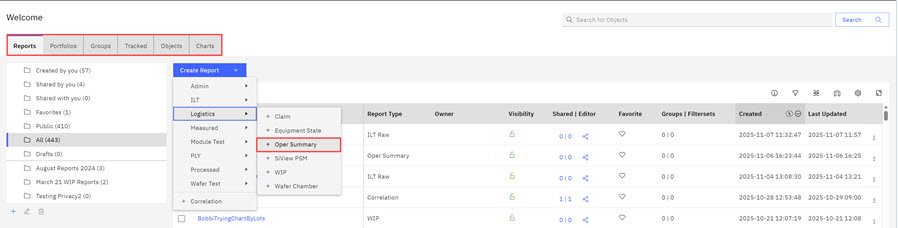
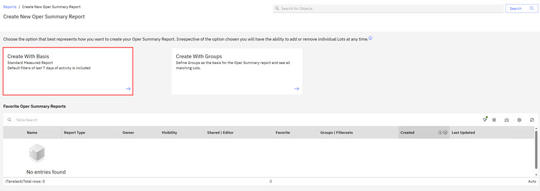
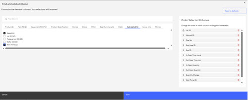
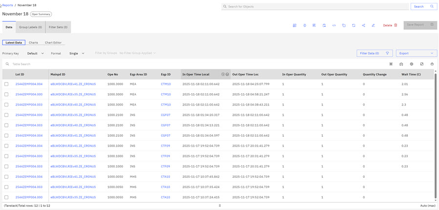
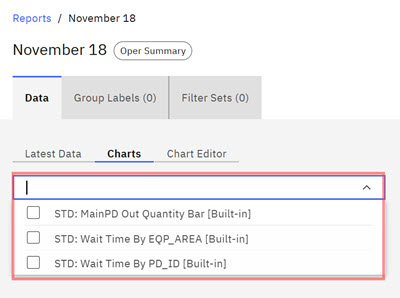
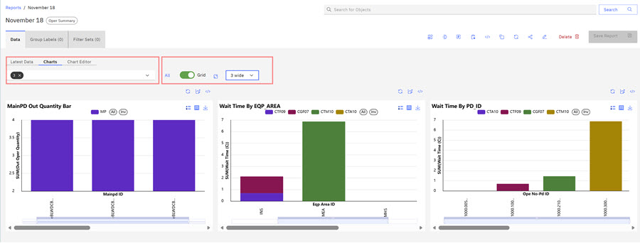

# Creating the Operation Summary - QTime Report

ABI users can use the Operation Summary \(OS\) Report and ABI's **Managed Column** feature to create a Queue Time \(Qtime\) Report. Qtimes are defined as the time limits for a wafer lot to wait between two process steps. In the OS report, ABI users can select the Calculated column, Wait Time to view the Qtime. The Qtime /Wait Time is reported in hour units. The Wait Time \(C\) field can also be used for correlation work where the engineer can analyze if the duration of Wait Time \(C\) affects some measured or recorded parameter value. The Qtime report offers three standard stacked bar charts that display Wait Time by EquipArea, MainPD Output Quantity, and Wait Time by PD\_ID, all reported in hour units. The Operation Summary report now includes a **Quick Link** column to the **Process Details Page**.

1.  Click the **Reports** tab on the ABI Landing page, scroll to **Logistics**, then scroll and click **Operation Summary** report.

    

2.  Select the **Report Definition** option that you want to use to create your report.

    |Report Definition Type|Description|
    |----------------------|-----------|
    |Create with Basis|Use this option to define specific lots and parameters you want to track for this report.|
    |Create with Groups|Use this option to select Groups to add to your report. Click [Creating Groups](abi_ug_creating_groups.md) to learn more about group creation.|

3.  Click **Create with Basis**

    

4.  Complete the Operation Summary parameters. Select the parameters relevant to your workflow. In the following report, these parameters are used in this report.

    1.  In Oper Time Local - Choose the time range.
    2.  In the Product tab, select **Ope No** for the products you are tracking.
    3.  In the Equipment parameter, select **Eqp Area ID** and **Eqp ID**.
    4.  In the OPE Category - select the status.
    5.  In **Lot ID**, select the Lot IDs.
    Basis Summary displays the chosen parameters.

    

5.  Click **View Results** to view the results of the selections.

6.  Click **Hide Results**.

7.  Click the **Manage Column** icon in the report menu. Click the **Calculated** tab and then select the checkbox for **Wait Time**. Click **Save**.

    

8.  Click **View Results** to view the **Wait Time** displaying for each Lot ID.

9.  Click **Save Report**. Complete the fields in the Save Report modal: Report Name, Visibility \(Private or Public\), Folder name, and enter a report description. This chart is saved as **November 18**. The QTime report displays as it did when **View Results** was selected.

    

10. Click the **Chart** tab. The Operations Summary Report has three default standard charts.

    1.  Main PD Quantity Bar
    2.  Wait Time by EQP Area
    3.  Wait Time by PD\_ID
    Click the drop-down arrow to select one or all of the reports.

    

11. Select all three default standard charts and toggle the **Grid** on, and select **3 wide** using the drop-down selector.

    

    **Note:** The Operation Summary report now includes a **Quick Link** column that when clicked leads to the **Process Details Page** where users can view the process details for each report parameter. User can view the SQL for each parameter and export the Process Report in csv or xlsx format.

    

**Parent topic:**[Reports - Creating and Managing](../ABI_User_Guide/abi_ug_wip_reports.md)

