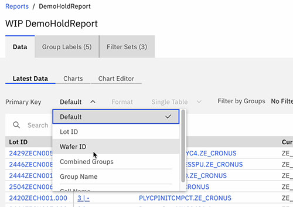
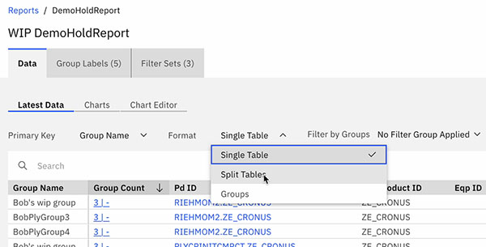
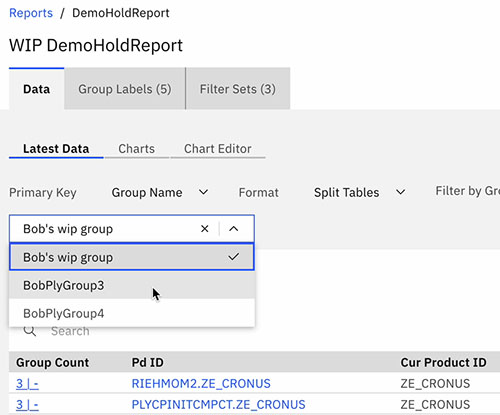
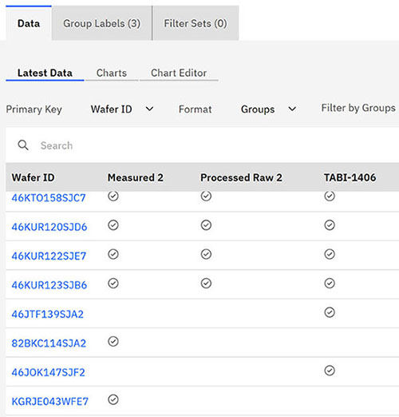

# Formatting Latest Data table in report results

In addition to the universal formatting and sorting object for tables, you can reformat the **Latest Data** table in report results using Primary Keys, and aggregate or summarize data using Split or Group table formats.

Report results tables are sorted by Lot ID by default. To sort data using a different parameter, you can select a Primary Key from the **Primary Key** drop-down menu.

You can select any of the following Primary Keys:

-   Lot ID
-   Wafer ID
-   Combined Groups
-   Group Name
-   Cell Name
-   Family Code
-   Lot Grade
-   Technology
-   Parameter

Columns in the data table are updated based on the Primary Key selected.

## Split and Group Yield tables

You can select **Split Tables** or **Groups** to view data based on the individual Primary Keys of the lot data.

Select **Split Tables** to divide the data into separate tables, one for each unique Primary Key. For example if you select **Split Tables** with a primary key of **Group Name**, you can select to see the data for all lots within a specific group.

Select **Groups** to display the groups to which each lot in the table belongs.

**Parent topic:**[Reports - Creating and Managing](../ABI_User_Guide/abi_ug_wip_reports.md)

