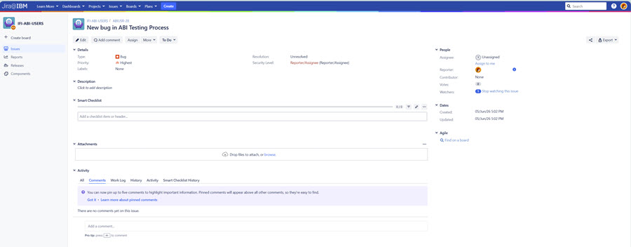

# Reporting Issues in ABI

The ABI application accepts defect alerts \(bugs\) from within the application. All submissions receive a thorough review and due diligence process.

Use the following process to report a defect in the ABI application.

**Note:** Before initiating an ABI Issue Report, validate that there is not an existing or similar reported issue by questioning other SMEs during office hours or in the dedicated slack channel \(abi\_albany\_users-client0\).

1.  On the ABI landing page, click the **Admin User icon** in the ABI application menu bar to open access to the Admin Functions.

    

    The User Menu opens.

    

2.  Click **Important Links**. The Important Links page opens.

    

3.  Log in to JIRA by using your IBM® w3id.

4.  Click **Report a Bug**.

5.  The Create an Issue \(Bug\) page opens. Use this page to describe your bug request using the **Details** tab and the guidelines outlined in the table that follows the image.

    **Note:** Focus only on completing the information in the **Details** tab. The **Planning**, **Business**, **DevOps**, and **Other** tabs are used for processing features requests.

     Page ")

    |Field|Description|
    |-----|-----------|
    |Summary **Required Field**|Enter a concise summary of the bug encountered.|
    |Epic Link|N/A|
    |Description|It is important to describe in detail the issue encountered, including:    -   Problem statement
    -   Steps to reproduce the issue.
    -   Expected result
Click Visual to paste an image into the field. **Do not post images or text that contain sensitive data.**|
    |Assignee|N/A|
    |Priority|Select the drop-down arrow to select a priority. Click the？to view available options in JIRA.|
    |Severity|Select the drop-down arrow to select a severity. Choices are none, blocker, critical, major, moderate, and minor.|
    |Labels|N/A|
    |Reporter|Your name is automatically listed as the reporter.|
    |Contributor|Click the icon to open the User Picker and select User contributors.|
    |Components|N/A|
    |Affects Version|N/A|
    |Fix Version|N/A|
    |Linked Issues|N/A|
    |Issue|N/A|
    |Flagged|N/A|
    |Attachment|Must not contain any sensitive data. Critical to review all attachments to help ensure compliance. Drop files or use browse to select files to add to the request.|
    |Checklist|N/A|
    |Target Process Integration|N/A|

6.  Click **Create**. The new feature request becomes a JIRA and the system opens the JIRA ticket. The feature request initiator becomes the reporter in the JIRA.

    **Note:** For security purposes, the name of the feature requester is not visible.

    

**Parent topic:**[Requesting ABI Improvements](../ABI_User_Guide/requesting_abi_improvements.md)

