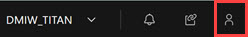
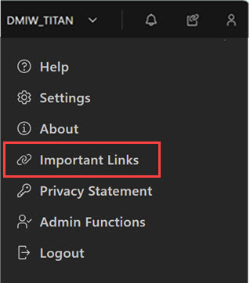
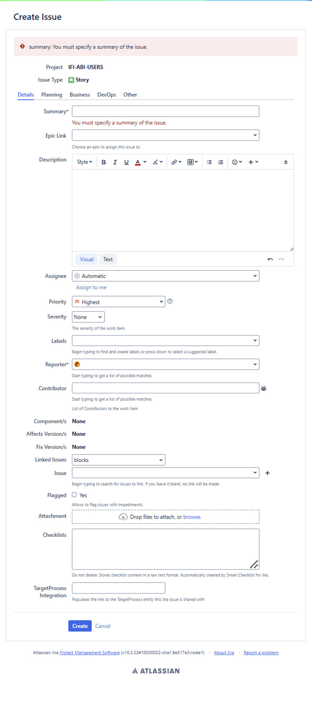
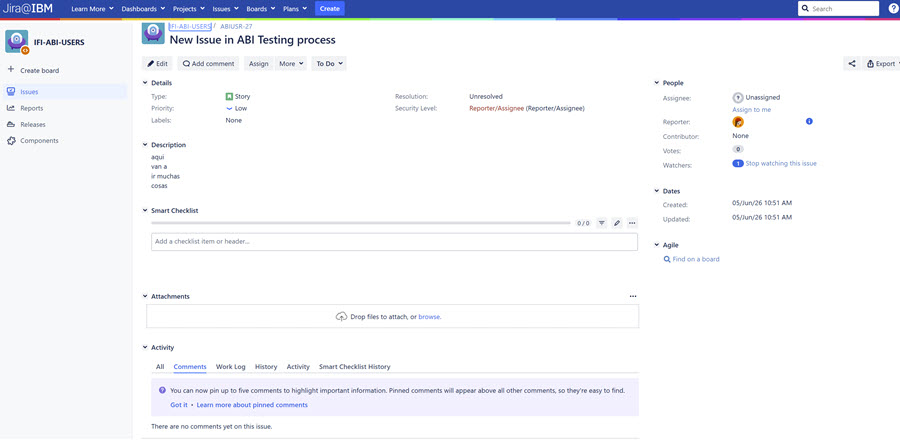

# Requesting New ABI Features

The ABI application accepts requests for new features from within the application. Submission of requests does not guarantee creation of new features, though all submissions receive a thorough review and due diligence process.

Use the following process to submit a feature request.

**Note:** Before initiating an ABI feature request, validate that a similar request does not exist by questioning other SMEs during office hours or in the dedicated slack channel \(abi\_albany\_users-client0\).

1.  On the ABI landing page, click the **Admin User icon** in the ABI application menu bar to open access to the Admin Functions.

    

    The User Menu opens.

    

2.  Click **Important Links**. The Important Links page opens.

    

3.  Log in to JIRA using your IBM® w3id.

4.  Click **Submit a Change Request**. The Create an Issue \(story\) page opens. Use this page to describe your feature request using the **Details** tab and the guidelines outlined in the table that follows the image.

    **Note:** Focus only on completing the information in the **Details** tab. The **Planning**, **Business**, **DevOps**, and **Other** tabs are used for processing features requests.

    

    |Field|Description|
    |-----|-----------|
    |Summary **Required Field**|Enter a concise summary of the feature request.|
    |Epic Link|N/A|
    |Description|It is important to describe in detail the intended outcome of this request. Be specific and provide as much detail as possible. Click Visual to paste an image into the field. **Do not post images or text that contains sensitive data**.|
    |Assignee|Leave the field set to automatic. Selecting a component assigns a default assignee. .|
    |Priority|Select the drop-down arrow to select a priority. Click the？to view available options in JIRA.|
    |Severity|N/A|
    |Labels|N/A|
    |Reporter|Your name is automatically listed as the reporter.|
    |Contributor|Click the icon to open the User Picker and select User contributors.|
    |Components|Select the correct area where the feature is required. Selecting the component assigns a default SME to review the request.|
    |Affects Version|N/A|
    |Fix Version|N/A|
    |Linked Issues|If user is aware of a related issue, identify the Issue ID.|
    |Issue|Selecting the drop down arrow displays a list of recently viewed issues that you can associate with this request. Alternatively, selecting the **+** to open the Issue Selector dialog. Recent Issue radio button retrieves recently viewed or searched issues and an option to select multiple issues. Filter radio button retrieves recent filter values.|
    |Flagged|N/A|
    |Attachment|Must not contain any sensitive data. Critical to review all attachments to help ensure compliance Drop files or use browse to select files to add to the request.|
    |Checklist|N/A|
    |Target Process Integration|N/A|
    | | |

5.  Click **Create**. The new feature request becomes a JIRA and the system opens the JIRA ticket. The feature request initiator becomes the reporter in the JIRA.

    **Note:** For security purposes, the name of the feature requester is not visible.

    

**Parent topic:**[Requesting ABI Improvements](../ABI_User_Guide/requesting_abi_improvements.md)

