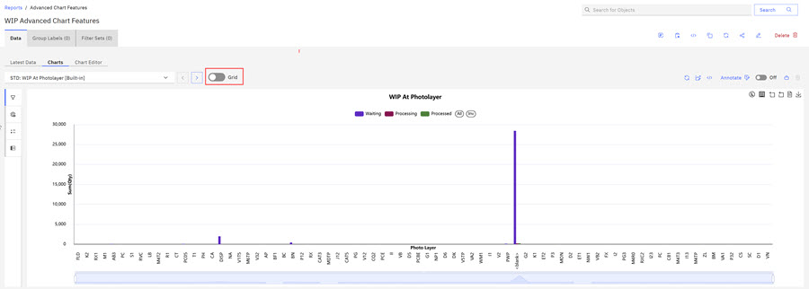
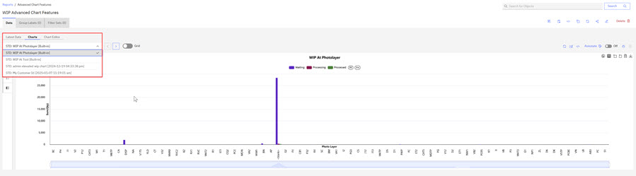
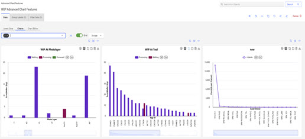
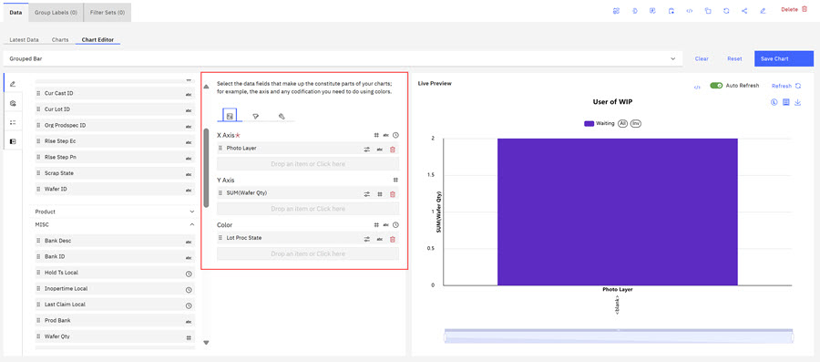
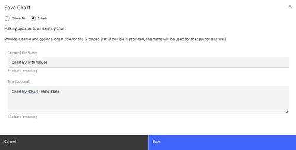
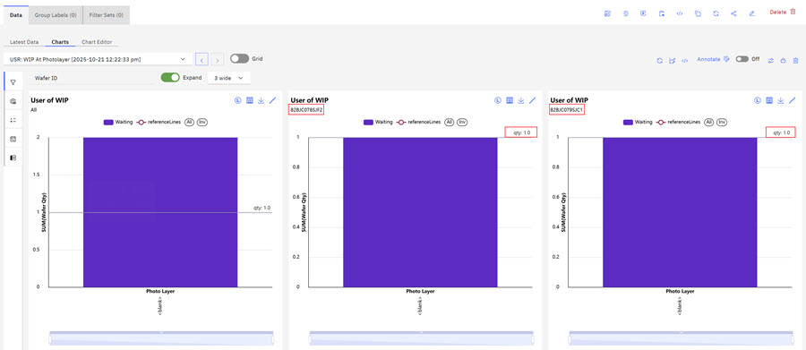
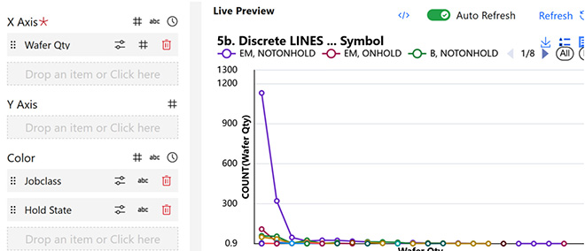
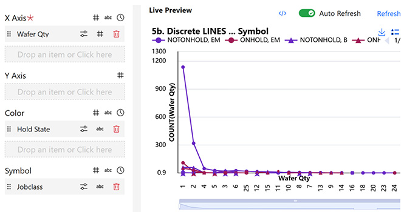
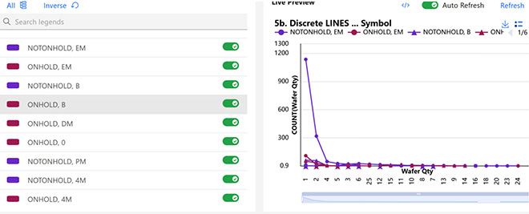

# Viewing Report Charts - Advanced Options

The ABI application offers users advanced chart view options, **Chart Grid**, and **Chart By** for Global Customized Charts and Report Charts.

## Chart Grid

The **Chart Grid** feature gives users the option to view multiple existing report charts simultaneously within an existing report on the chart tab. **Chart Grid** gives users a snapshot of charts that are contained in existing reports.

**Note:** The **Chart Grid** feature can display up to 20 charts simultaneously.

1.  Open an existing report and click the **Charts tab**.

    

2.  Toggle the **Grid** control. Next, use the drop-down arrow to select how many charts you want to view in a horizontal row.

    

3.  Click the drop-down and select the existing charts that you want to view in the grid. Default charts previously configured for this report type display in the drop-down.

    

    The Charts display in grid form.

    

    You can click away from the drop-down selector and view your reports in the UI.

    

    **Note:** You can navigate between the **Chart** and **Chart Editor** tabs and retain Chart Grid content. However, the **Chart Grid** and **Chart By** views are saved with the chart.

## Chart By

The **Chart By** feature gives users the option to compare the status of specific report parameter columns in a report in a side‑by‑side view of multiple report instances. For example, using the **Chart By** feature, a user might want to visualize which wafer IDs are located in different lots within a report. A user can configure a report using the **Wafer ID** as the **Chart By** value \(column\). The resulting **Chart By** chart shows the **Wafer ID** identification numbers within each lot.

1.  Open the existing report that you want to use with **Chart By** feature. Click the **Charts** tab. The current report chart displays that is using an X-Axis of. The following image is of a WIP report.

    

2.  Click the **Chart Editor** tab to view the chart configurations.

    This chart is configured by using: **X Axis of Photo Layer**, **Y Axis of Sum \(Wafer Qty\)**, and **Lot Proc State as Color**.

    

3.  Click the **Gear** icon in the middle column to open the **Chart By** shelf.

    

4.  Click and drag the **Wafer ID** attribute to the **Chart By** shelf. Click and drag the **Wafer Qty** attribute to the **Reference Line** shelf.

    **Note:** Use the search box in the first chart column to find the attribute you want to include in your chart. Type the attribute name in the search box and drag it to add it to the **Chart By** shelf.

    

5.  Click **Save Chart**. The **Save Chart** modal opens. Complete the fields in the modal, the name of the chart and the title of the chart and click **Save**.

    

6.  Click the **Chart** tab. Click the **Expand** toggle to on and set the drop-down menu to select **3 wide** to view the 3 instances of the **Chart By** chart. This chart is using **Wafer ID** as the **Chart By** value and **Median Qty** as the **Reference Line**, values shown outlined in red.

    

    **Note:** When viewing the **Chart By** in an expanded view, if you click Refresh when the **Application Refresh** notification displays, the chart reverts to the original chart. Toggle the **Expand** control to return the **Chart By** Chart to the expanded view.

    Click the **Portfolio** icon above the chart to add the expanded **Chart By** chart to a portfolio. You must be the owner of the chart or a designated editor to add the chart to a portfolio.

## Select series symbols

When creating a chart with multiple series \(for example, a WIP discrete line chart\), you can assign one or more columns to the **Color** control. Each unique combination of these columns defines a separate series.

For instance, if both Hold State and Job Class are placed on the **Color** control, every distinct combination of these two fields appears as its own series. Each series is displayed in a different color, but they all use the same visual marker \(e.g., a hollow circle\).

However, there are cases where you might want to group series visually, rather than treat every combination as completely independent. For example, you might want all values of Hold State to share the same color, while still distinguishing Job Class within each group.

To achieve this, you can use the Symbol control:

-   Assign Hold State to **Color**
-   Assign Job Class to **Symbol**

With this setup:

-   All data points with the same Hold Stat share the same color.
-   Different Job Class values are represented using different marker shapes \(symbols\).

This approach effectively groups series by color while using symbols to differentiate sub-categories within each group, making the chart easier to interpret

**Parent topic:**[Charts Overview](../ABI_User_Guide/abi_ug_charts_overview.md)

