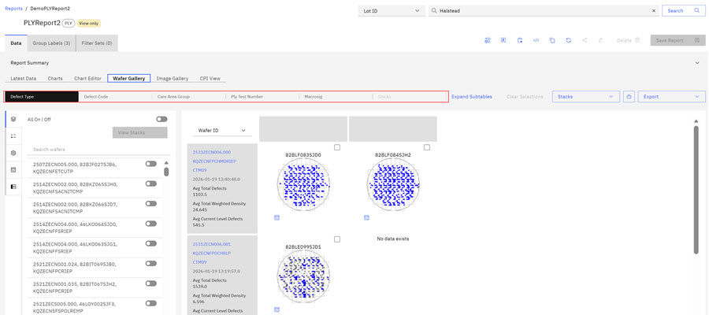
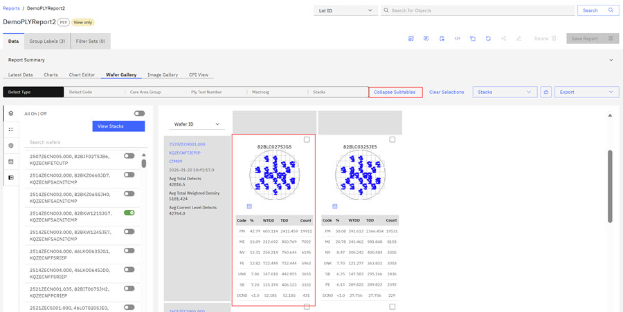
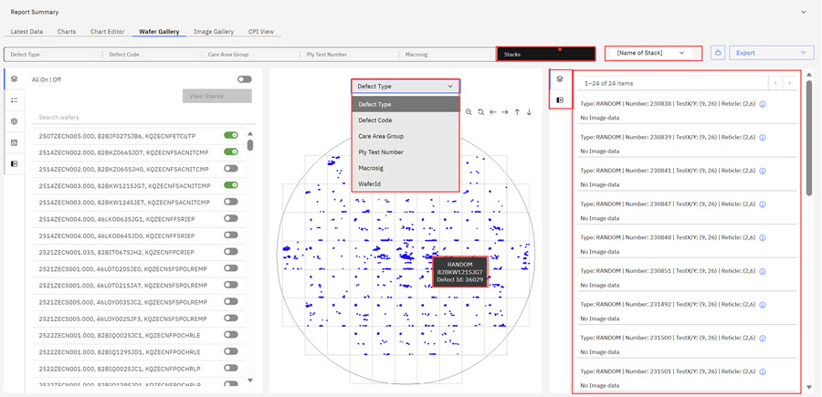
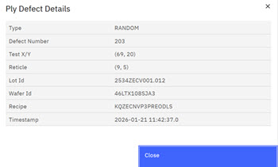
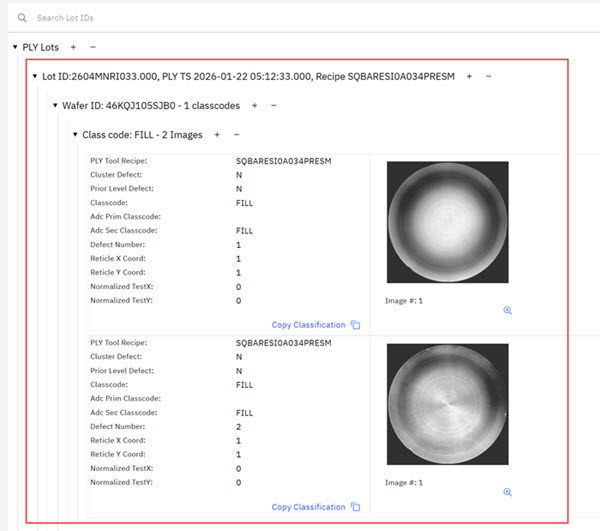

# Viewing Wafer and Image Galleries

ABI Wafer and Image Galleries offer detailed visual representations of wafers, including technical and defect information on an individual wafer. The Image Gallery provides a view into individual defects.

**Note:**

Not all ABI reports contain wafer and image galleries.

Wafer Galleries are available in the reports that are listed here.

-   PLY reports
-   ILT Type Reports
-   WTF Functional Raw Report
-   WMT Sort Report
-   WMT Parameter Type Report
-   Measured Raw Report
-   Processed Raw Report

Image Galleries are available in the reports that are listed here.

-   Measured Raw Report
-   Ply Report

In an ABI report, navigate to the **Wafer Gallery** tab to view the wafer gallery. A menu header above the gallery shows viewing options across the Wafer Gallery. Viewing options are Defect Type, Defect Code, Care Area Group, PLY test number, Macrosig, Stacks \(if configured\).Other action controls in the header are Expand Subtitles \(on wafers in the Gallery\), Clear Selections, Stacks View Drop Down Selector, add to Portfolio icon, and Export \(.png\). Click any of these tabs to view a different visual of the Wafer Gallery.

In the following image, two main columns display.

In the first column under the **Defect Type** header, there is a vertical list of controls, and lists each of the wafers within the wafer gallery. The second column shows the wafers that are present in the gallery. Vertical icons \(controls\) in the first column are active controls to take action on the wafers.

**Overlays**Click the first vertical icon to take action on the overlays in the wafer gallery: Overlays \(Wafer ID and alternative Lot ID are shown within the second column in the Wafer Gallery. Turning off the overlays collapses the first column.

**Legend**Click the second vertical icon to show defect types. Each defect type is a specific color in the gallery. Use the toggle to see what type of defects are in the wafer.

**Settings**Click the third vertical icon to set the Default Point Size, the reticle mode to include images in the gallery, and Apply or Rest Filters.

**Data** Click the forth vertical icon to display a data table for each wafer in the wafer table.

**Show/Hide Sidebar** Click the fifth icon to collapse the first column.

In the second column of the wafer table under the **Defect Type** header, is the Wafer Gallery. In the gallery, use the drop-down selector to select whether to view Wafer IDs or Lot IDs. In this view, select **Expand Subtables** to see more information about each wafer. Alternately, you can then select **Collapse Subtables**.

Using the controls in the first column you can select wafers individually or select all the Wafer IDs and click **Stack** to view the Wafers in stack view.

Within the Stack view, wafer defects display in the stack. An information pop-up displays the defect type and Defect ID when you hover over the defect. A **Defect Type** drop down menu provides defect filtering options.

Clicking an individual defect opens a third column where images display if they are available. If no images are available, the system displays the defects in a list format with a clickable information.

**Note:** Control click is additive. Shift click shows all defects in the same reticle / chip, depending on the mode.

Clicking the information icon brings up a description of the defect. As shown in the following image. From Stack view, you can click **Add to Portfolio** or click the **Export** control to export the Wafer Gallery \(.png format\)

**Image Galleries**

Click the **Image Gallery** tab to open the Image Gallery. The Image Gallery opens displaying all the Lot IDs in the report. Each Lot ID section lists the Lot ID number, the Wafer IDs contained within the section, and a Class Code section that holds the images. carets for each section open and close that section.

Click the caret for the **Class Code** to view the images within that section. The image within each **Class Code** displays technical information that is related to the image.

Tools within each image provide an option to zoom into the image for close inspection and an option to copy the image's classification code.

**Parent topic:**[Reports - Creating and Managing](../ABI_User_Guide/abi_ug_wip_reports.md)

