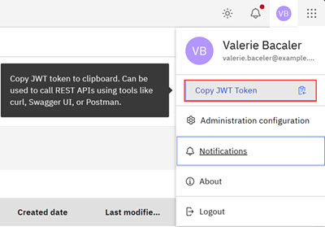

# Accessing APIs Using W3 Authentication

Access to the APIs in the **Intelligent Design** application requires W3 authentication. In instituting API access by using W3 authentication, users copy access tokens based on their W3 authentication. Tokens are assigned per user, service, scope, and role. Authentication access provides a fully traceable history for auditing and security. Each authenticated individual user is assigned a valid unique token that is used to call APIs by using curl, Swagger, or Postman.

1.  **Login** and open the **Intelligent Design** application.

2.  Click the User Avatar Icon in the top menu bar of the application. The User Avatar modal opens.

    **Note:** The User Avatar Icon displays in the menu bar throughout the **Intelligent Design** application.

    

3.  Click **Copy JWT Token** to copy the full JWT token to your clipboard.

4.  Copy the **JWT Token** into the API application your use to send the API call.

**Parent topic:**[Administration Configuration](../id_docs/id_admin_config.md)

