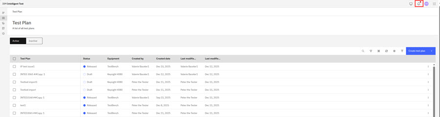
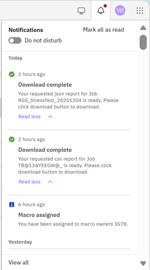
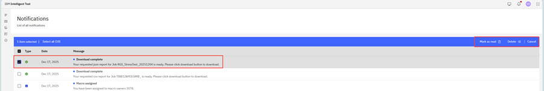

# Accessing the Notification Panel

Within Intelligent Design and Intelligent Test users can access a **Notications Panel** that displays real-time alerts that are related to users' projects, macros, teams, and test plans.

Within each application, users access the **Notification Panel** by clicking the **Bell icon** in the top navigation bar. For Intelligent Design and Intelligent Test the process follows the same steps.

1.  Click the **Bell icon** in the top navigation menu.

    

2.  Clicking the **Bell icon** opens the **notification** drop-down menu.

    Notifications are grouped in chronological order in the drop-down menu and each notification is an information type \(Success, Warning, Error\). Users can use the scroll bar to scroll through the messages, and click **Read More** to view individual message details as shown in the following screenshot.

    

    On the notifications drop-down menu, users can also click **Mark All as Read**, toggle the **Do not disturb** control to on, and click **View all** to open the **Full notification Page**.

    **Full Notification Page** displays all the notifications in a table format with columns that list the message **Type**, **Data**, and **Message** details. Controls below the table on the allow users to adjust the number of items that display per page. The arrow controls on the right below the table allow users to jump to a specific page of notifications.

    

    In the **Full Notification Page**, users can click the checkbox for a message to view and take action on the message - **Mark as Read** and **Delete** - that display in the table menu bar.

    

**Parent topic:**[Notifications in Intelligent Design and Intelligent Test](../id_docs/notifications_in_intelligent_design_and_intelligent_test.md)

