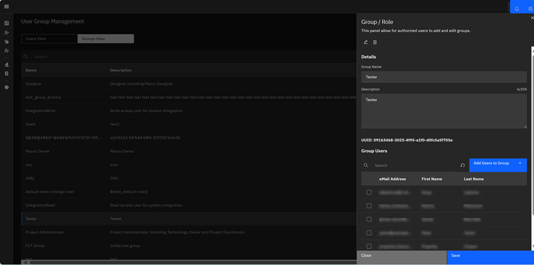
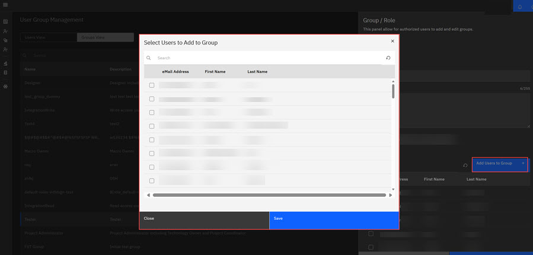

# Adding Users to Groups in ID

Authorization roles \(User Roles\) are categorized in ID by using Groups. Each Group is assigned a role authorization and corresponding features for that role. For example, the Designer User Role \(Group\) can create, edit and delete Macros and Groups. The Designer group contains users and features a Designer needs to fulfill their responsibility. When a new user is assigned to a Designer group, that user inherits the Designer role authorization and features.

The following procedure walks through the process of adding ID users to Group in the ID application. See [User roles](../user_roles.md) for ID role designations.

1.  Click **App Management** in the ID Admin Module menu to open Application Management.

2.  Click the **Group View** tab to view the ID group designations.

3.  Click **Group** where you want to add the user. The Group/Role modal opens.

    

4.  Click the pencil **Add Edit** icon in the modal to display and open the **Add Users to Group** control.

5.  Click the **Add Users to Group** control to open the **Select Users to Add to Group** modal.

6.  Click the checkbox for each user you want to add to the group. Alternatively, you can search for users.

    

7.  Click **Save**. The **Select Users to Add to Group** modal closes.

8.  Click **Save** in the Group/Role modal. The user is saved to the Group/Role group and now inherits the feature permissions for this group.

**Parent topic:**[ID User Management](../../id_docs/admin/user_management.md)

